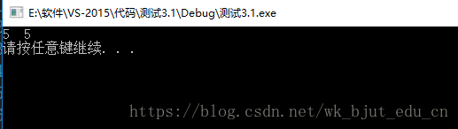
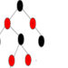

<!DOCTYPE html>
<!-- saved from url=(0483)https://blog.csdn.net/wk_bjut_edu_cn/article/details/80212860?ops_request_misc=%257B%2522request%255Fid%2522%253A%2522165407008316782425111897%2522%252C%2522scm%2522%253A%252220140713.130102334..%2522%257D&request_id=165407008316782425111897&biz_id=0&utm_medium=distribute.pc_search_result.none-task-blog-2~all~baidu_landing_v2~default-1-80212860-null-null.142^v11^control,157^v12^control&utm_term=c%2B%2B%E6%98%BE%E7%A4%BA%E7%B1%BB%E5%9E%8B%E8%BD%AC%E6%8D%A2&spm=1018.2226.3001.4187 -->
<html lang="zh-CN"><head><meta http-equiv="Content-Type" content="text/html; charset=UTF-8">
    
    <link rel="canonical" href="https://blog.csdn.net/wk_bjut_edu_cn/article/details/80212860">
    
    <meta name="renderer" content="webkit">
    <meta name="force-rendering" content="webkit">
    <meta http-equiv="X-UA-Compatible" content="IE=edge,chrome=1">
    <meta name="viewport" content="width=device-width, initial-scale=1.0, minimum-scale=1.0, maximum-scale=1.0, user-scalable=no">
    <meta name="report" content="{&quot;pid&quot;: &quot;blog&quot;, &quot;spm&quot;:&quot;1001.2101&quot;}">
    <meta name="referrer" content="always">
    <meta http-equiv="Cache-Control" content="no-siteapp"><link rel="alternate" media="handheld" href="https://blog.csdn.net/wk_bjut_edu_cn/article/details/80212860?ops_request_misc=%257B%2522request%255Fid%2522%253A%2522165407008316782425111897%2522%252C%2522scm%2522%253A%252220140713.130102334..%2522%257D&amp;request_id=165407008316782425111897&amp;biz_id=0&amp;utm_medium=distribute.pc_search_result.none-task-blog-2~all~baidu_landing_v2~default-1-80212860-null-null.142^v11^control,157^v12^control&amp;utm_term=c%2B%2B%E6%98%BE%E7%A4%BA%E7%B1%BB%E5%9E%8B%E8%BD%AC%E6%8D%A2&amp;spm=1018.2226.3001.4187#">
    <meta name="shenma-site-verification" content="5a59773ab8077d4a62bf469ab966a63b_1497598848">
    <meta name="applicable-device" content="pc">
    <link href="https://g.csdnimg.cn/static/logo/favicon32.ico" rel="shortcut icon" type="image/x-icon">
    <title>(109条消息) C++中的4种显式类型转换_骑猪去兜风..的博客-CSDN博客_c++显示类型转换</title>
    
        <meta name="keywords" content="c++显示类型转换">
        <meta name="csdn-baidu-search" content="{&quot;autorun&quot;:true,&quot;install&quot;:true,&quot;keyword&quot;:&quot;c++显示类型转换&quot;}">
    <meta name="description" content="命名的强制类型转换符号的一般形式如下：cast-name&amp;lt;type&amp;gt;(expression);其中，cast-name为const_cast,static_cast,dynamic_cast和reinterpret_cast之一，type为转换的目标类型，而expression则是被强制转换的表达式。const_castconst_cast只能改变运算对象的底层的con...">
    
        <link rel="stylesheet" type="text/css" href="./cpp显式类型转换_files/detail_enter-17967bba09.min.css">
    
        <link rel="stylesheet" type="text/css" href="./cpp显式类型转换_files/skin-blackboard-3adcc2c475.min.css">
    
    
    
    
    <link rel="stylesheet" type="text/css" href="./cpp显式类型转换_files/sandalstrap.min.css">
    
    
<link rel="stylesheet" type="text/css" href="./cpp显式类型转换_files/csdn-toolbar-default.css"><link rel="stylesheet" type="text/css" href="./cpp显式类型转换_files/user-login.css"><link rel="stylesheet" type="text/css" href="./cpp显式类型转换_files/collection-box.css"><link rel="stylesheet" type="text/css" href="./cpp显式类型转换_files/user-tooltip.css"><link rel="stylesheet" type="text/css" href="./cpp显式类型转换_files/user-medal.css"><meta http-equiv="origin-trial" content="AzoawhTRDevLR66Y6MROu167EDncFPBvcKOaQispTo9ouEt5LvcBjnRFqiAByRT+2cDHG1Yj4dXwpLeIhc98/gIAAACFeyJvcmlnaW4iOiJodHRwczovL2RvdWJsZWNsaWNrLm5ldDo0NDMiLCJmZWF0dXJlIjoiUHJpdmFjeVNhbmRib3hBZHNBUElzIiwiZXhwaXJ5IjoxNjYxMjk5MTk5LCJpc1N1YmRvbWFpbiI6dHJ1ZSwiaXNUaGlyZFBhcnR5Ijp0cnVlfQ=="><meta http-equiv="origin-trial" content="A6+nc62kbJgC46ypOwRsNW6RkDn2x7tgRh0wp7jb3DtFF7oEhu1hhm4rdZHZ6zXvnKZLlYcBlQUImC4d3kKihAcAAACLeyJvcmlnaW4iOiJodHRwczovL2dvb2dsZXN5bmRpY2F0aW9uLmNvbTo0NDMiLCJmZWF0dXJlIjoiUHJpdmFjeVNhbmRib3hBZHNBUElzIiwiZXhwaXJ5IjoxNjYxMjk5MTk5LCJpc1N1YmRvbWFpbiI6dHJ1ZSwiaXNUaGlyZFBhcnR5Ijp0cnVlfQ=="><meta http-equiv="origin-trial" content="A/9La288e7MDEU2ifusFnMg1C2Ij6uoa/Z/ylwJIXSsWfK37oESIPbxbt4IU86OGqDEPnNVruUiMjfKo65H/CQwAAACLeyJvcmlnaW4iOiJodHRwczovL2dvb2dsZXRhZ3NlcnZpY2VzLmNvbTo0NDMiLCJmZWF0dXJlIjoiUHJpdmFjeVNhbmRib3hBZHNBUElzIiwiZXhwaXJ5IjoxNjYxMjk5MTk5LCJpc1N1YmRvbWFpbiI6dHJ1ZSwiaXNUaGlyZFBhcnR5Ijp0cnVlfQ=="><meta http-equiv="origin-trial" content="AzoawhTRDevLR66Y6MROu167EDncFPBvcKOaQispTo9ouEt5LvcBjnRFqiAByRT+2cDHG1Yj4dXwpLeIhc98/gIAAACFeyJvcmlnaW4iOiJodHRwczovL2RvdWJsZWNsaWNrLm5ldDo0NDMiLCJmZWF0dXJlIjoiUHJpdmFjeVNhbmRib3hBZHNBUElzIiwiZXhwaXJ5IjoxNjYxMjk5MTk5LCJpc1N1YmRvbWFpbiI6dHJ1ZSwiaXNUaGlyZFBhcnR5Ijp0cnVlfQ=="><meta http-equiv="origin-trial" content="A6+nc62kbJgC46ypOwRsNW6RkDn2x7tgRh0wp7jb3DtFF7oEhu1hhm4rdZHZ6zXvnKZLlYcBlQUImC4d3kKihAcAAACLeyJvcmlnaW4iOiJodHRwczovL2dvb2dsZXN5bmRpY2F0aW9uLmNvbTo0NDMiLCJmZWF0dXJlIjoiUHJpdmFjeVNhbmRib3hBZHNBUElzIiwiZXhwaXJ5IjoxNjYxMjk5MTk5LCJpc1N1YmRvbWFpbiI6dHJ1ZSwiaXNUaGlyZFBhcnR5Ijp0cnVlfQ=="><meta http-equiv="origin-trial" content="A/9La288e7MDEU2ifusFnMg1C2Ij6uoa/Z/ylwJIXSsWfK37oESIPbxbt4IU86OGqDEPnNVruUiMjfKo65H/CQwAAACLeyJvcmlnaW4iOiJodHRwczovL2dvb2dsZXRhZ3NlcnZpY2VzLmNvbTo0NDMiLCJmZWF0dXJlIjoiUHJpdmFjeVNhbmRib3hBZHNBUElzIiwiZXhwaXJ5IjoxNjYxMjk5MTk5LCJpc1N1YmRvbWFpbiI6dHJ1ZSwiaXNUaGlyZFBhcnR5Ijp0cnVlfQ=="><link rel="stylesheet" type="text/css" href="./cpp显式类型转换_files/user-accusation.css"><link rel="stylesheet" type="text/css" href="./cpp显式类型转换_files/user-ordertip.css"><link rel="stylesheet" type="text/css" href="./cpp显式类型转换_files/order-payment.css"><link rel="stylesheet" type="text/css" href="./cpp显式类型转换_files/side-toolbar.css"><link rel="stylesheet" type="text/css" href="./cpp显式类型转换_files/csdn-footer.css"><link rel="preload" href="./cpp显式类型转换_files/f(6).txt" as="script"></head>
  <body class="nodata " style="position: static;">

                    

                      

                        

                          

                    

                          <ul class="toolbar-menus csdn-toolbar-fl" style="width: auto;"><li class="active " title="阅读深度、前沿文章">
                                <a data-report-click="{&quot;mod&quot;:&quot;popu_336&quot;,&quot;dest&quot;:&quot;https://blog.csdn.net/nav/cloud-native&quot;,&quot;spm&quot;:&quot;3001.4477&quot;}" data-report-query="spm=3001.4477" href="https://blog.csdn.net/nav/cloud-native">
                                  博客
                                  
                                  
                                </a>
                                
                                
                              </li><li class="" title="高价值源码课程分享">
                                <a data-report-click="{&quot;mod&quot;:&quot;popu_336&quot;,&quot;dest&quot;:&quot;https://download.csdn.net/&quot;,&quot;spm&quot;:&quot;3001.6907&quot;}" data-report-query="spm=3001.6907" href="https://download.csdn.net/">
                                  下载·课程
                                  
                                  
                                </a>
                                
                                
                              </li><li class="" title="系统学习·问答·比赛">
                                <a data-report-click="{&quot;mod&quot;:&quot;popu_336&quot;,&quot;dest&quot;:&quot;https://edu.csdn.net/&quot;,&quot;spm&quot;:&quot;3001.4482&quot;}" data-report-query="spm=3001.4482" href="https://edu.csdn.net/">
                                  学习
                                  
                                  
                                </a>
                                
                                
                              </li><li class="" title="找到志同道合的伙伴">
                                <a data-report-click="{&quot;mod&quot;:&quot;popu_336&quot;,&quot;dest&quot;:&quot;https://bbs.csdn.net/&quot;,&quot;spm&quot;:&quot;3001.6068&quot;}" data-report-query="spm=3001.6068" href="https://bbs.csdn.net/">
                                  社区
                                  
                                  
                                </a>
                                
                                
                              </li><li class="" title="认证你的技术能力">
                                <a data-report-click="{&quot;mod&quot;:&quot;popu_336&quot;,&quot;dest&quot;:&quot;https://ac.csdn.net/?short_code=13271b93&quot;,&quot;spm&quot;:&quot;3001.5716&quot;}" data-report-query="spm=3001.5716" href="https://ac.csdn.net/?short_code=13271b93">
                                  认证
                                  
                                  
                                </a>
                                
                                
                              </li><li class="" title="安全快速的代码仓">
                                <a data-report-click="{&quot;mod&quot;:&quot;&quot;,&quot;dest&quot;:&quot;https://mp.csdn.net/mp_others/manage/code?utm_source=csdn_toolbar&quot;,&quot;spm&quot;:&quot;3001.6768&quot;}" data-report-query="spm=3001.6768" href="https://mp.csdn.net/mp_others/manage/code?utm_source=csdn_toolbar">
                                  MyGitHub
                                  
                                  
                                </a>
                                
                                
                              </li><li class="" title="简单高效优惠的云服务">
                                <a data-report-click="{&quot;mod&quot;:&quot;popu_336&quot;,&quot;dest&quot;:&quot;https://bbs.csdn.net/&quot;,&quot;spm&quot;:&quot;3001.8290&quot;}" data-report-query="spm=3001.8290" href="https://dev-portal.csdn.net/welcome?utm_source=toolbar">
                                  云服务
                                  
                                  
                                </a>
                                
                                
                              </li></ul>
                        

                        

                        

                    
                    <input id="toolbar-search-input" autocomplete="off" type="text" value="" placeholder="c  显示类型转换" style="text-indent: 32px;">
                    <button id="toolbar-search-button"><i></i>搜索</button>
                    <input type="password" autocomplete="new-password" readonly="" disabled="true" style="display: none; position:absolute;left:-9999999px;width:0;height:0;">
                  

                        

                          

                      
                      

            

              
              
--

              
            

            

              <a data-report-click="{&quot;spm&quot;: &quot;3001.5347&quot;}" data-report-query="spm=3001.5347" href="https://blog.csdn.net/wyx30948198?type=sub&amp;subType=fans"><i class="csdn-profile-fansCount">--</i>粉丝</a>
              <a data-report-click="{&quot;spm&quot;: &quot;3001.5348&quot;}" data-report-query="spm=3001.5348" href="https://blog.csdn.net/wyx30948198?type=sub"><i class="csdn-profile-followCount">--</i>关注</a>
              <a data-report-click="{&quot;spm&quot;: &quot;3001.5349&quot;}" data-report-query="spm=3001.5349" href="https://blog.csdn.net/wyx30948198"><i class="csdn-profile-likeCount">--</i>获赞</a>
            

            

              <ul class="csdn-border-bottom">
                <li class=""><a href="https://i.csdn.net/#/user-center/profile" data-report-click="{&quot;dest&quot;:&quot;https://i.csdn.net/#/user-center/profile&quot;,&quot;spm&quot;:&quot;3001.5111&quot;}" data-report-query="spm=3001.5111"><i class="csdn-profile-icon csdn-profile-icon-person"></i>个人中心</a></li><li class=""><a href="https://mp.csdn.net/mp_blog/manage/article?spm=1011.2124.3001.5298" data-report-click="{&quot;dest&quot;:&quot;https://mp.csdn.net/mp_blog/manage/article?spm=1011.2124.3001.5298&quot;,&quot;spm&quot;:&quot;3001.5448&quot;}" data-report-query="spm=3001.5448"><i class="csdn-profile-icon csdn-profile-icon-pages"></i>内容管理</a></li><li class=""><a href="https://edu.csdn.net/job/javabe_01?utm_source=edu_txxl_zylx" data-report-click="{&quot;dest&quot;:&quot;https://edu.csdn.net/job/javabe_01?utm_source=edu_txxl_zylx&quot;,&quot;spm&quot;:&quot;3001.5350&quot;}" data-report-query="spm=3001.5350"><i class="csdn-profile-icon csdn-profile-icon-study"></i>我的学习</a></li><li class=""><a href="https://mall.csdn.net/myorder" data-report-click="{&quot;dest&quot;:&quot;https://mall.csdn.net/myorder&quot;,&quot;spm&quot;:&quot;3001.5137&quot;}" data-report-query="spm=3001.5137"><i class="csdn-profile-icon csdn-profile-icon-order"></i>我的订单</a></li><li class=""><a href="https://i.csdn.net/#/wallet/index" data-report-click="{&quot;dest&quot;:&quot;https://i.csdn.net/#/wallet/index&quot;,&quot;spm&quot;:&quot;3001.5136&quot;}" data-report-query="spm=3001.5136"><i class="csdn-profile-icon csdn-profile-icon-wallet"></i>我的钱包</a></li><li class=""><a href="https://dev-portal.csdn.net/welcome?utm_source=toolbar_user_profile" data-report-click="{&quot;dest&quot;:&quot;https://dev-portal.csdn.net/welcome?utm_source=toolbar_user_profile&quot;,&quot;spm&quot;:&quot;3001.7345&quot;}" data-report-query="spm=3001.7345"><i class="csdn-profile-icon csdn-profile-icon-API"></i>我的云服务</a></li><li class="pb-8 csdn-border-bottom"><a href="https://ac.csdn.net/user/myCert.html" data-report-click="{&quot;dest&quot;:&quot;https://ac.csdn.net/user/myCert.html&quot;,&quot;spm&quot;:&quot;3001.7346&quot;}" data-report-query="spm=3001.7346"><i class="csdn-profile-icon csdn-profile-icon-ac"></i>我的认证</a></li><li class="pt-8 pb-8 csdn-border-bottom"><a href="https://i.csdn.net/#/uc/reward" data-report-click="{&quot;dest&quot;:&quot;https://i.csdn.net/#/uc/reward&quot;,&quot;spm&quot;:&quot;3001.5351&quot;}" data-report-query="spm=3001.5351"><i class="csdn-profile-icon csdn-profile-icon-draw"></i>签到抽奖</a></li><li class="pt-8 csdn-profile-logout"><a href="javascript:;" data-report-click="{&quot;spm&quot;:&quot;3001.5139&quot;}" data-report-query="spm=3001.5139"><i class="csdn-profile-icon csdn-profile-icon-logout"></i>退出</a></li>
              </ul>
            

          

                    

                      <a data-report-click="{&quot;mod&quot;:&quot;popu_336&quot;,&quot;dest&quot;:&quot;https://mall.csdn.net/vip&quot;,&quot;spm&quot;:&quot;3001.4496&quot;}" data-report-query="spm=3001.4496" href="https://mall.csdn.net/vip">会员中心 </a>
                      

                    

                      <a data-report-click="{&quot;spm&quot;:&quot;3001.7480&quot;}" data-report-query="spm=3001.7480" href="https://i.csdn.net/#/user-center/collection-list?type=1">足迹</a>
                    

                    
<a data-report-click="{&quot;spm&quot;:&quot;3001.4507&quot;}" data-report-query="spm=3001.4507" href="https://blink.csdn.net/">动态</a>

                    

                        

                          <a data-report-click="{&quot;spm&quot;:&quot;3001.4508&quot;}" data-report-query="spm=3001.4508" id="toolbar-remind" href="https://i.csdn.net/#/msg/index">消息<i class="toolbar-msg-count"></i></a>
                        

                          <a data-type="comment" href="https://i.csdn.net/#/msg/index">评论和@</a>
                          <a data-type="attention" href="https://i.csdn.net/#/msg/attention">新增粉丝</a>         
                          <a data-type="like" href="https://i.csdn.net/#/msg/like">赞和收藏<i></i></a>
                          <a data-type="chat" href="https://im.csdn.net/im/main.html">私信<i></i></a>
                          <a data-type="notice" href="https://i.csdn.net/#/msg/notice">系统通知</a>
                          <a href="https://i.csdn.net/#/msg/setting">消息设置</a>
                     

                        

                      

                    

                    

                        

                      

                    

                  

        
    
    
<link rel="stylesheet" href="./cpp显式类型转换_files/blog_code-01256533b5.min.css">
<link rel="stylesheet" href="./cpp显式类型转换_files/chart-3456820cac.css">

 
    

        
        <main>

        

        

            

                <h1 class="title-article" id="articleContentId">C++中的4种显式类型转换</h1>
            

            

                

                    
                    

                    <a class="follow-nickName " href="https://blog.csdn.net/wk_bjut_edu_cn" target="_blank" rel="noopener">骑猪去兜风..</a>
                    
                    于&nbsp;2018-05-06 14:30:14&nbsp;发布
                    
                    1291
                    <a id="blog_detail_zk_collection" class="un-collection" data-report-click="{&quot;mod&quot;:&quot;popu_823&quot;,&quot;spm&quot;:&quot;1001.2101.3001.4232&quot;,&quot;ab&quot;:&quot;new&quot;}">
                        
                        
                        收藏
                        
                            8
                        
                    </a>
                    

                

                

                    

                            分类专栏：
                                <a class="tag-link" href="https://blog.csdn.net/wk_bjut_edu_cn/category_7401097.html" target="_blank" rel="noopener">C++</a>
                            文章标签：
                                <a data-report-click="{&quot;mod&quot;:&quot;popu_626&quot;,&quot;spm&quot;:&quot;1001.2101.3001.4223&quot;,&quot;strategy&quot;:&quot;类型转换&quot;,&quot;ab&quot;:&quot;new&quot;}" class="tag-link" href="https://so.csdn.net/so/search/s.do?q=%E7%B1%BB%E5%9E%8B%E8%BD%AC%E6%8D%A2&amp;t=blog&amp;o=vip&amp;s=&amp;l=&amp;f=&amp;viparticle=" target="_blank" rel="noopener">类型转换</a>
                                <a data-report-click="{&quot;mod&quot;:&quot;popu_626&quot;,&quot;spm&quot;:&quot;1001.2101.3001.4223&quot;,&quot;strategy&quot;:&quot;C&quot;,&quot;ab&quot;:&quot;new&quot;}" class="tag-link" href="https://so.csdn.net/so/search/s.do?q=C&amp;t=blog&amp;o=vip&amp;s=&amp;l=&amp;f=&amp;viparticle=" target="_blank" rel="noopener">C</a>
                    

                

                

                    

                        

                            版权声明：本文为博主原创文章，遵循<a href="http://creativecommons.org/licenses/by-sa/4.0/" target="_blank" rel="noopener"> CC 4.0 BY-SA </a>版权协议，转载请附上原文出处链接和本声明。
                        

                        

                            本文链接：<a href="https://blog.csdn.net/wk_bjut_edu_cn/article/details/80212860" target="_blank">https://blog.csdn.net/wk_bjut_edu_cn/article/details/80212860</a>
                        

                    

                

                

                    <a class="href-article-edit slide-toggle">版权</a>
                

            

        

    

        

            

                

                    

                        <a class="item-target" href="https://blog.csdn.net/wk_bjut_edu_cn/category_7401097.html" target="_blank" title="C++" data-report-click="{&quot;spm&quot;:&quot;1001.2101.3001.6332&quot;}">
                            
                            
                                
                                C++
                                    专栏收录该内容
                                
                            
                        </a>
                    

                    

                        36 篇文章
                        1 订阅
                    

                    

                            <a class="item-target article-column-bt articleColumnFreeBt" data-id="7401097">订阅专栏</a>
                    

                

            

        

    <article class="baidu_pl">
        

        <link rel="stylesheet" href="./cpp显式类型转换_files/ck_htmledit_views-163de54645.css">
                

                    
<strong>命名的强制类型转换符号的一般形式如下：</strong>
 

<strong>cast-name&lt;type&gt;(expression);</strong>
 

其中，cast-name为const_cast,static_cast,dynamic_cast和reinterpret_cast之一，type为转换的目标类型，而expression则是被强制转换的<a href="https://so.csdn.net/so/search?q=%E8%A1%A8%E8%BE%BE%E5%BC%8F&amp;spm=1001.2101.3001.7020" target="_blank" class="hl hl-1" data-report-click="{&quot;spm&quot;:&quot;1001.2101.3001.7020&quot;,&quot;dest&quot;:&quot;https://so.csdn.net/so/search?q=%E8%A1%A8%E8%BE%BE%E5%BC%8F&amp;spm=1001.2101.3001.7020&quot;}" data-tit="表达式" data-pretit="表达式">表达式</a>。
 
<h2>const_cast</h2> 

const_cast只能改变运算对象的底层的const。底层const表示指针或引用所指的对象是一个常量，顶层const表示指针本身是个常量。对于将常量对象转换成非常量对象的行为，我们一般称其为“去掉const性质”。一旦我们去掉了某个对象的const性质，编译器就不再阻止我们对该对象进行写操作了。
 

比如:
 
<pre class="has" name="code"><code class="language-cpp hljs"><ol class="hljs-ln" style="width:100%"><li>

#include &lt;iostream&gt;

</li><li>

using namespace std;

</li><li>

int main()

</li><li>

{

</li><li>

	int i = 2;

</li><li>

	const int *p=&amp;i;//p是常量指针（指向常量的指针）

</li><li>

	int *q = const_cast&lt;int *&gt;(p);//去掉const性质

</li><li>

	*q = 5;	

</li><li>

	cout &lt;&lt; *p &lt;&lt; "  " &lt;&lt; *q &lt;&lt; endl;

</li><li>

	system("pause");

</li><li>

	return 0;

</li><li>

}

</li></ol></code>

</pre> 

 
<h2>static_cast</h2> 

用法：static_cast &lt; type-id &gt; ( expression )，
 

该运算符把expression转换为type-id类型，但没有运行时类型检查来保证转换的安全性，它主要有如下几种用法：
 

（1）用于基本数据类型之间的转换，如把int转换为char，把int转换成enum，但这种转换的安全性需要开发者自己保证（这可以理解为保证数据的精度，即程序员能不能保证自己想要的程序安全），如在把int转换为char时，如果char没有足够的比特位来存放int的值（int&gt;127或int&lt;-127时），那么static_cast所做的只是简单的截断，及简单地把int的低8位复制到char的8位中，并直接抛弃高位。
 

（2）把空指针转换成目标类型的空指针
 

（3）把任何类型的表达式<a href="https://so.csdn.net/so/search?q=%E7%B1%BB%E5%9E%8B%E8%BD%AC%E6%8D%A2&amp;spm=1001.2101.3001.7020" target="_blank" class="hl hl-1" data-report-click="{&quot;spm&quot;:&quot;1001.2101.3001.7020&quot;,&quot;dest&quot;:&quot;https://so.csdn.net/so/search?q=%E7%B1%BB%E5%9E%8B%E8%BD%AC%E6%8D%A2&amp;spm=1001.2101.3001.7020&quot;}" data-tit="类型转换" data-pretit="类型转换">类型转换</a>成void类型
 

（4）用于类层次结构中父类和子类之间指针和引用的转换。
 

对于以上第（4）点，存在两种形式的转换，即上行转换（子类到父类）和下行转换（父类到子类）。对于static_cast，上行转换时安全的，而下行转换时不安全的，为什么呢？因为static_cast的转换时粗暴的，它仅根据类型转换语句中提供的信息（尖括号中的类型）来进行转换，这种转换方式对于上行转换，由于子类总是包含父类的所有数据成员和函数成员，因此从子类转换到父类的指针对象可以没有任何顾虑的访问其（指父类）的成员。而对于下行转换为什么不安全，是因为static_cast只是在编译时进行类型坚持，没有运行时的类型检查，具体原理在dynamic_cast中说明。
 

<strong>一句话概括：</strong>
 

仅当类型之间可隐式转换时（除类层次间的下行转换以外），static_cast的转换才是合法的，否则将产生错误。
 
<h2>dynamic_cast</h2> 

用法：该运算符把expression转换为type类型的对象。type必须是类的指针、类的引用或者void*。如果type是指针类型，那么expression也必须是一个指针，如果type是一个引用，那么expression也必须是一个引用。
 

<strong>注意</strong>：<strong>static_cast只在编译时进行类型检查，而dynamic_cast是运行时类型检查，则需要视情况而定。</strong>
 

与其他<a href="https://so.csdn.net/so/search?q=%E5%BC%BA%E5%88%B6%E7%B1%BB%E5%9E%8B%E8%BD%AC%E6%8D%A2&amp;spm=1001.2101.3001.7020" target="_blank" class="hl hl-1" data-report-click="{&quot;spm&quot;:&quot;1001.2101.3001.7020&quot;,&quot;dest&quot;:&quot;https://so.csdn.net/so/search?q=%E5%BC%BA%E5%88%B6%E7%B1%BB%E5%9E%8B%E8%BD%AC%E6%8D%A2&amp;spm=1001.2101.3001.7020&quot;}" data-tit="强制类型转换" data-pretit="强制类型转换">强制类型转换</a>不同，dynamic_cast涉及运行时时类型检测。dynamic_cast运行时类型检查需要运行时类型信息，而这个信息存储在类的虚函数表中，只有定义了虚函数的类才会有虚函数表，没有定义虚函数的类是没有虚函数表的，对没有虚函数表的类使用会导致dynamic_cast编译错误。
 

所以dynamic_cast主要用于类层次结构中父类和子类之间指针和引用的转换，由于具有运行时类型检查，因此可以保证下行转换的安全性，何为安全性？即转换成功就返回转换后的正确类型指针，如果转换失败，则返回NULL（如果是转换到月引用类型的dynamic_cast失败，则抛出bad_cast类型的异常），之所以说static_cast在下行转换时不安全，是因为即使转换失败，它也不返回NULL。
 

对于上行转换，dynamic_cast和static_cast是一样的。
 

但是在下行转换中，存在两种情况：
 
<pre class="has" name="code"><code class="language-cpp hljs"><ol class="hljs-ln" style="width:100%"><li>

class Base

</li><li>

{

</li><li>

	virtual void fun() {}

</li><li>

};

</li><li>

class Derived :public Base

</li><li>

{

</li><li>

};

</li></ol></code>

</pre> 

由于需要进行向下转换，因此需要定义一个父类类型的指针Base *p，但是由于子类继承于父类，父类指针可以指向父类对象，也可以指向子类对象，这就是重点所在。如果<strong>P</strong>指向的确实是子类对象，则dynamic_cast和static_cast都可以转换成功，如下所示：
 
<pre class="has" name="code"><code class="language-cpp hljs"><ol class="hljs-ln" style="width:100%"><li>

Base *P = new Derived;

</li><li>

Derived *pd1 = static_cast&lt;Derived *&gt;(P);

</li><li>

Derived *pd2 = dynamic_cast&lt;Derived *&gt;(P);

</li></ol></code>

</pre> 

以上转换都能成功。
 

但是，如果<strong>&nbsp;P&nbsp;</strong>指向的不是子类对象，而是父类对象，如下所示
 
<pre class="has" name="code"><code class="language-cpp hljs"><ol class="hljs-ln" style="width:100%"><li>

Base *P = new Base;

</li><li>

Derived *pd3 = static_cast&lt;Derived *&gt;(P);

</li><li>

Derived *pd4 = dynamic_cast&lt;Derived *&gt;(P);

</li></ol></code>

</pre> 

在以上转换中，static_cast转换在编译时不会报错，也可以返回一个子类对象指针（假想），但是这样是不安全的，在运行时可能会有问题，因为子类中包含父类中没有的数据和函数成员，这里需要理解转换的字面意思，转换是什么？转换就是把对象从一种类型转换到另一种类型，如果这时用 pd3 去访问子类中有但父类中没有的成员，就会出现访问越界的错误，导致程序崩溃。而dynamic_cast由于具有运行时类型检查功能，它能检查P的类型，由于上述转换是不合理的，所以它返回NULL。
 
<h2>reinterpret_cast</h2> 

允许将任何指针转换为任何其他指针类型。 也允许将任何整数类型转换为任何指针类型以及反向转换。看着上面的描述就有种放浪形骸的赶脚。更会让人不寒而栗，太随意！
 
<pre class="has" name="code"><code class="language-cpp hljs"><ol class="hljs-ln" style="width:100%"><li>

int *p;

</li><li>

char *q = reinterpret_cast&lt;char *&gt;(p);

</li></ol></code>

</pre> 
<pre class="has" name="code"><code class="hljs language-cpp"><ol class="hljs-ln" style="width:100%"><li>

int i = 3;

</li><li>

char *c = nullptr;

</li><li>

c = reinterpret_cast&lt;char *&gt;(i);

</li></ol></code>

</pre> 

注意：
 

滥用 reinterpret_cast 运算符可能很容易带来风险。 除非所需转换本身是低级别的，否则应使用其他强制转换运算符之一。

                

        

        
    </article>
  

    

        

            
<a class="profile-href" target="_blank" href="https://blog.csdn.net/wk_bjut_edu_cn">骑猪去兜风..</a>

            

                    <a class="tool-attend tool-bt-button tool-bt-attend" href="javascript:;">关注</a>
                <a class="tool-item-follow active-animation" style="display:none;">关注</a>
            

        

        

        <ul class="toolbox-list">
            <li class="tool-item tool-item-size tool-active is-like" id="is-like">
            <a class="tool-item-href">
                
                
                  
                
                        1
                
            </a>
            
点赞

            </li>
            <li class="tool-item tool-item-size tool-active is-unlike" id="is-unlike">
            <a class="tool-item-href">
                
                
                
            </a>
            
踩

            </li>
            <li class="tool-item tool-item-size tool-active tool-item-comment">
            <a class="tool-item-href" href="https://blog.csdn.net/wk_bjut_edu_cn/article/details/80212860?ops_request_misc=%257B%2522request%255Fid%2522%253A%2522165407008316782425111897%2522%252C%2522scm%2522%253A%252220140713.130102334..%2522%257D&amp;request_id=165407008316782425111897&amp;biz_id=0&amp;utm_medium=distribute.pc_search_result.none-task-blog-2~all~baidu_landing_v2~default-1-80212860-null-null.142^v11^control,157^v12^control&amp;utm_term=c%2B%2B%E6%98%BE%E7%A4%BA%E7%B1%BB%E5%9E%8B%E8%BD%AC%E6%8D%A2&amp;spm=1018.2226.3001.4187#commentBox" data-report-click="{&quot;spm&quot;:&quot;1001.2101.3001.7009&quot;}">
                
                
                    0
                
            </a>
            
评论

            </li>
            <li class="tool-item tool-item-size tool-active is-collection ">
            <a class="tool-item-href" href="javascript:;" data-report-click="{&quot;mod&quot;:&quot;popu_824&quot;,&quot;spm&quot;:&quot;1001.2101.3001.4130&quot;,&quot;ab&quot;:&quot;new&quot;}">
                
                
                
                
                    8
                
            </a>
            
收藏

            </li>
            <li class="tool-item tool-item-size tool-active tool-item-reward">
                <a class="tool-item-href" href="javascript:;" data-report-click="{&quot;mod&quot;:&quot;popu_830&quot;,&quot;spm&quot;:&quot;1001.2101.3001.4237&quot;,&quot;dest&quot;:&quot;&quot;,&quot;ab&quot;:&quot;new&quot;}">
                
                
                </a>
                
打赏

            </li>
            <li class="tool-item tool-item-bar">
            </li>
            <li class="tool-item tool-item-size tool-active tool-QRcode" id="tool-share">
                
                

                    

                    扫一扫，分享内容
                    

                    

                    <a id="copyPosterUrl" class="url" data-report-click="{&quot;spm&quot;:&quot;1001.2101.3001.7493&quot;}" data-report-view="{&quot;spm&quot;:&quot;1001.2101.3001.7493&quot;}">点击复制链接</a>
                

            </li>
        </ul>
        

        

                

                    <a class="bt-columnlist-show" data-id="7401097" data-free="true" data-subscribe="false" data-title="C++" data-img="https://img-blog.csdnimg.cn/20201014180756754.png?x-oss-process=image/resize,m_fixed,h_64,w_64" data-url="https://blog.csdn.net/wk_bjut_edu_cn/category_7401097.html" data-sum="36" data-people="1" data-price="0" data-oldprice="0" data-join="false" data-studyvip="false" data-studysubscribe="false" data-report-click="{&quot;spm&quot;:&quot;1001.2101.3001.6334&quot;,&quot;extend1&quot;:&quot;专栏目录&quot;}">专栏目录</a>
                

        

    
  

                

	

		

			

				<a href="https://blog.csdn.net/iFuMI/article/details/51736872" class="tit" target="_blank" data-report-click="{&quot;ab&quot;:&quot;new&quot;,&quot;spm&quot;:&quot;1001.2101.3001.6661.1&quot;,&quot;mod&quot;:&quot;popu_871&quot;,&quot;extra&quot;:&quot;{\&quot;highlightScore\&quot;:0.0,\&quot;utm_medium\&quot;:\&quot;distribute.pc_relevant_t0.none-task-blog-2~default~CTRLIST~Rate-1-51736872-blog-80212860.pc_relevant_paycolumn_v3\&quot;,\&quot;dist_request_id\&quot;:\&quot;1654070091053_27230\&quot;}&quot;,&quot;dist_request_id&quot;:&quot;1654070091053_27230&quot;,&quot;ab_strategy&quot;:&quot;paycolumn&quot;,&quot;index&quot;:&quot;1&quot;,&quot;strategy&quot;:&quot;2~default~CTRLIST~Rate&quot;,&quot;dest&quot;:&quot;https://blog.csdn.net/iFuMI/article/details/51736872&quot;}" data-report-query="spm=1001.2101.3001.6661.1&amp;utm_medium=distribute.pc_relevant_t0.none-task-blog-2%7Edefault%7ECTRLIST%7ERate-1-51736872-blog-80212860.pc_relevant_paycolumn_v3&amp;depth_1-utm_source=distribute.pc_relevant_t0.none-task-blog-2%7Edefault%7ECTRLIST%7ERate-1-51736872-blog-80212860.pc_relevant_paycolumn_v3&amp;utm_relevant_index=1">
					
<em>C++</em><em>中</em>的<em>显式</em><em>类型转换</em>

				</a>
			

			

				

					<a href="https://blog.csdn.net/iFuMI" target="_blank" data-report-query="spm=1001.2101.3001.6661.1&amp;utm_medium=distribute.pc_relevant_t0.none-task-blog-2%7Edefault%7ECTRLIST%7ERate-1-51736872-blog-80212860.pc_relevant_paycolumn_v3&amp;depth_1-utm_source=distribute.pc_relevant_t0.none-task-blog-2%7Edefault%7ECTRLIST%7ERate-1-51736872-blog-80212860.pc_relevant_paycolumn_v3&amp;utm_relevant_index=1">iFuMI的博客</a>
				

				

					06-22
					
					810
					
				

			

		

		

			<a href="https://blog.csdn.net/iFuMI/article/details/51736872" target="_blank" data-report-click="{&quot;ab&quot;:&quot;new&quot;,&quot;spm&quot;:&quot;1001.2101.3001.6661.1&quot;,&quot;mod&quot;:&quot;popu_871&quot;,&quot;extra&quot;:&quot;{\&quot;highlightScore\&quot;:0.0,\&quot;utm_medium\&quot;:\&quot;distribute.pc_relevant_t0.none-task-blog-2~default~CTRLIST~Rate-1-51736872-blog-80212860.pc_relevant_paycolumn_v3\&quot;,\&quot;dist_request_id\&quot;:\&quot;1654070091053_27230\&quot;}&quot;,&quot;dist_request_id&quot;:&quot;1654070091053_27230&quot;,&quot;ab_strategy&quot;:&quot;paycolumn&quot;,&quot;index&quot;:&quot;1&quot;,&quot;strategy&quot;:&quot;2~default~CTRLIST~Rate&quot;,&quot;dest&quot;:&quot;https://blog.csdn.net/iFuMI/article/details/51736872&quot;}" data-report-query="spm=1001.2101.3001.6661.1&amp;utm_medium=distribute.pc_relevant_t0.none-task-blog-2%7Edefault%7ECTRLIST%7ERate-1-51736872-blog-80212860.pc_relevant_paycolumn_v3&amp;depth_1-utm_source=distribute.pc_relevant_t0.none-task-blog-2%7Edefault%7ECTRLIST%7ERate-1-51736872-blog-80212860.pc_relevant_paycolumn_v3&amp;utm_relevant_index=1">
				
<em>C++</em><em>中</em>类型的转换分位两<em>种</em>：隐式和<em>显式</em>转换；隐式转换发生在不经意间，比如int类型和float类型相加时，int类型会隐式转换为float类型，然后再相加运算。而今天主要介绍标准<em>C++</em><em>中</em>的四个<em>显式</em><em>类型转换</em>运算符：static_cast、dynamic_cast、const_cast和reinterpret_cast。本篇博文转自：果冻想，并做了细微的修改。注意：static_cast和dynamic_cast都可以对类间的类型进行转换，前者在向下转换时不在运行期进行类型检查，后者在运行期进行类型检查，较之安

			</a>
		

	

                

            
            

	

		

			

				<a href="https://blog.csdn.net/luolaihua2018/article/details/111996610" class="tit" target="_blank" data-report-click="{&quot;ab&quot;:&quot;new&quot;,&quot;spm&quot;:&quot;1001.2101.3001.6650.1&quot;,&quot;mod&quot;:&quot;popu_387&quot;,&quot;extra&quot;:&quot;{\&quot;highlightScore\&quot;:0.0,\&quot;utm_medium\&quot;:\&quot;distribute.pc_relevant.none-task-blog-2~default~CTRLIST~Rate-1-111996610-blog-80212860.pc_relevant_paycolumn_v3\&quot;,\&quot;dist_request_id\&quot;:\&quot;1654070091053_27230\&quot;}&quot;,&quot;dist_request_id&quot;:&quot;1654070091053_27230&quot;,&quot;ab_strategy&quot;:&quot;paycolumn&quot;,&quot;index&quot;:&quot;1&quot;,&quot;strategy&quot;:&quot;2~default~CTRLIST~Rate&quot;,&quot;dest&quot;:&quot;https://blog.csdn.net/luolaihua2018/article/details/111996610&quot;}" data-report-query="spm=1001.2101.3001.6650.1&amp;utm_medium=distribute.pc_relevant.none-task-blog-2%7Edefault%7ECTRLIST%7ERate-1-111996610-blog-80212860.pc_relevant_paycolumn_v3&amp;depth_1-utm_source=distribute.pc_relevant.none-task-blog-2%7Edefault%7ECTRLIST%7ERate-1-111996610-blog-80212860.pc_relevant_paycolumn_v3&amp;utm_relevant_index=2">
					
<em>C++</em><em>类型转换</em>：隐式转换和<em>显式</em>转换

				</a>
			

			

				

					<a href="https://blog.csdn.net/luolaihua2018" target="_blank" data-report-query="spm=1001.2101.3001.6650.1&amp;utm_medium=distribute.pc_relevant.none-task-blog-2%7Edefault%7ECTRLIST%7ERate-1-111996610-blog-80212860.pc_relevant_paycolumn_v3&amp;depth_1-utm_source=distribute.pc_relevant.none-task-blog-2%7Edefault%7ECTRLIST%7ERate-1-111996610-blog-80212860.pc_relevant_paycolumn_v3&amp;utm_relevant_index=2">DayDayUp</a>
				

				

					12-30
					
					1346
					
				

			

		

		

			<a href="https://blog.csdn.net/luolaihua2018/article/details/111996610" target="_blank" data-report-click="{&quot;ab&quot;:&quot;new&quot;,&quot;spm&quot;:&quot;1001.2101.3001.6650.1&quot;,&quot;mod&quot;:&quot;popu_387&quot;,&quot;extra&quot;:&quot;{\&quot;highlightScore\&quot;:0.0,\&quot;utm_medium\&quot;:\&quot;distribute.pc_relevant.none-task-blog-2~default~CTRLIST~Rate-1-111996610-blog-80212860.pc_relevant_paycolumn_v3\&quot;,\&quot;dist_request_id\&quot;:\&quot;1654070091053_27230\&quot;}&quot;,&quot;dist_request_id&quot;:&quot;1654070091053_27230&quot;,&quot;ab_strategy&quot;:&quot;paycolumn&quot;,&quot;index&quot;:&quot;1&quot;,&quot;strategy&quot;:&quot;2~default~CTRLIST~Rate&quot;,&quot;dest&quot;:&quot;https://blog.csdn.net/luolaihua2018/article/details/111996610&quot;}" data-report-query="spm=1001.2101.3001.6650.1&amp;utm_medium=distribute.pc_relevant.none-task-blog-2%7Edefault%7ECTRLIST%7ERate-1-111996610-blog-80212860.pc_relevant_paycolumn_v3&amp;depth_1-utm_source=distribute.pc_relevant.none-task-blog-2%7Edefault%7ECTRLIST%7ERate-1-111996610-blog-80212860.pc_relevant_paycolumn_v3&amp;utm_relevant_index=2">
				
隐式转换

当一个值拷贝给另一个兼容类型的值时，隐式转换会自动进行。所谓隐式转换，是指不需要用户干预，编译器私下进行的<em>类型转换</em>行为。

例如：

short a=2000;
int b;
b=a;

在这里，a在没有任何<em>显示</em>操作符的干预下，由short<em>类型转换</em>为int类型。这就是标准转换，标准转换将影响基本数据类型，并允许数字类型之间的转换(short到int, int到float, double到int…)，到bool或从bool，以及一些指针转换。

对于非基本类型，数组和函数隐式地转换为指针，并且指

			</a>
		

	

            

	
参与评论

	

		

			
		

		<form id="commentform">
			
			<textarea class="comment-content" name="comment_content" id="comment_content" placeholder="请发表有价值的评论， 博客评论不欢迎灌水，良好的社区氛围需大家一起维护。" maxlength="1000"></textarea>
			

				

					还能输入<em>1000</em>个字符
				

				

					&nbsp;
				

				

					

						
						插入表情
						

							

						

					

					

						
						代码片
						

							<ul id="commentCode">
								<li><a data-code="html">HTML/XML</a></li>
								<li><a data-code="objc">objective-c</a></li>
								<li><a data-code="ruby">Ruby</a></li>
								<li><a data-code="php">PHP</a></li>
								<li><a data-code="csharp">C</a></li>
								<li><a data-code="cpp">C++</a></li>
								<li><a data-code="javascript">JavaScript</a></li>
								<li><a data-code="python">Python</a></li>
								<li><a data-code="java">Java</a></li>
								<li><a data-code="css">CSS</a></li>
								<li><a data-code="sql">SQL</a></li>
								<li><a data-code="plain">其它</a></li>
							</ul>
						

					

					

						<input type="hidden" id="comment_replyId" name="comment_replyId">
						<input type="hidden" id="article_id" name="article_id" value="80212860">
						<input type="hidden" id="comment_userId" name="comment_userId" value="">
						<input type="hidden" id="commentId" name="commentId" value="">
						<a data-report-click="{&quot;mod&quot;:&quot;1582594662_003&quot;,&quot;spm&quot;:&quot;1001.2101.3001.4227&quot;,&quot;ab&quot;:&quot;new&quot;}"><input type="submit" class="btn-comment btn-comment-input" value="评论"><input type="button" class="btn-comment-input btn-comment-defualt" value="评论"></a>
					

				

			

		</form>
	

	

		

		

		

		

			

		

	

            

                

	                
		                
			                  
				                  <a class="tit" href="https://blog.csdn.net/weixin_42112184/article/details/108829186" target="_blank" data-report-click="{&quot;mod&quot;:&quot;popu_387&quot;,&quot;extra&quot;:&quot;{\&quot;utm_medium\&quot;:\&quot;distribute.pc_relevant.none-task-blog-2~default~baidujs_utm_term~default-0-108829186-blog-80212860.pc_relevant_paycolumn_v3\&quot;,\&quot;dist_request_id\&quot;:\&quot;1654070091053_27230\&quot;,\&quot;parent_index\&quot;:\&quot;0\&quot;}&quot;,&quot;spm&quot;:&quot;1001.2101.3001.4242.1&quot;,&quot;dest&quot;:&quot;https://blog.csdn.net/weixin_42112184/article/details/108829186&quot;,&quot;strategy&quot;:&quot;2~default~baidujs_utm_term~default&quot;,&quot;ab&quot;:&quot;new&quot;,&quot;index&quot;:&quot;0&quot;}" data-report-query="utm_medium=distribute.pc_relevant.none-task-blog-2~default~baidujs_utm_term~default-0-108829186-blog-80212860.pc_relevant_paycolumn_v3&amp;spm=1001.2101.3001.4242.1&amp;utm_relevant_index=3">					                
<em>c++</em>之<em>显示</em><em>类型转换</em>_坐着写代码的博客_<em>c++</em><em>显示</em><em>类型转换</em>
				                  </a>			                  
                    
                      
                        3-19                      
                    
                  
                  
                    <a href="https://blog.csdn.net/weixin_42112184/article/details/108829186" target="_blank" data-report-click="{&quot;mod&quot;:&quot;popu_387&quot;,&quot;extra&quot;:&quot;{\&quot;utm_medium\&quot;:\&quot;distribute.pc_relevant.none-task-blog-2~default~baidujs_utm_term~default-0-108829186-blog-80212860.pc_relevant_paycolumn_v3\&quot;,\&quot;dist_request_id\&quot;:\&quot;1654070091053_27230\&quot;,\&quot;parent_index\&quot;:\&quot;0\&quot;}&quot;,&quot;spm&quot;:&quot;1001.2101.3001.4242.1&quot;,&quot;dest&quot;:&quot;https://blog.csdn.net/weixin_42112184/article/details/108829186&quot;,&quot;strategy&quot;:&quot;2~default~baidujs_utm_term~default&quot;,&quot;ab&quot;:&quot;new&quot;,&quot;index&quot;:&quot;0&quot;}" data-report-query="utm_medium=distribute.pc_relevant.none-task-blog-2~default~baidujs_utm_term~default-0-108829186-blog-80212860.pc_relevant_paycolumn_v3&amp;spm=1001.2101.3001.4242.1&amp;utm_relevant_index=3">                      
<em>c++</em>之<em>显示</em><em>类型转换</em> 在c<em>中</em>隐式<em>类型转换</em>是指编译器帮助你转换类型 <em>显示</em><em>类型转换</em>(强转)是指强制转换,格式是(目标类型)源类型变量。 e.g: int i; float a; float a = (float) i; 以下罗列几<em>种</em><em>类型转换</em>:...
                    </a>                  
                
              

	                
		                
			                  
				                  <a class="tit" href="https://blog.csdn.net/zhuo_wang/article/details/8029544" target="_blank" data-report-click="{&quot;mod&quot;:&quot;popu_387&quot;,&quot;extra&quot;:&quot;{\&quot;utm_medium\&quot;:\&quot;distribute.pc_relevant.none-task-blog-2~default~baidujs_utm_term~default-1-8029544-blog-80212860.pc_relevant_paycolumn_v3\&quot;,\&quot;dist_request_id\&quot;:\&quot;1654070091053_27230\&quot;,\&quot;parent_index\&quot;:\&quot;0\&quot;}&quot;,&quot;spm&quot;:&quot;1001.2101.3001.4242.2&quot;,&quot;dest&quot;:&quot;https://blog.csdn.net/zhuo_wang/article/details/8029544&quot;,&quot;strategy&quot;:&quot;2~default~baidujs_utm_term~default&quot;,&quot;ab&quot;:&quot;new&quot;,&quot;index&quot;:&quot;1&quot;}" data-report-query="utm_medium=distribute.pc_relevant.none-task-blog-2~default~baidujs_utm_term~default-1-8029544-blog-80212860.pc_relevant_paycolumn_v3&amp;spm=1001.2101.3001.4242.2&amp;utm_relevant_index=4">					                
<em>C++</em><em>中</em><em>显示</em>的<em>类型转换</em>_zhuo_wang的博客
				                  </a>			                  
                    
                      
                        3-31                      
                    
                  
                  
                    <a href="https://blog.csdn.net/zhuo_wang/article/details/8029544" target="_blank" data-report-click="{&quot;mod&quot;:&quot;popu_387&quot;,&quot;extra&quot;:&quot;{\&quot;utm_medium\&quot;:\&quot;distribute.pc_relevant.none-task-blog-2~default~baidujs_utm_term~default-1-8029544-blog-80212860.pc_relevant_paycolumn_v3\&quot;,\&quot;dist_request_id\&quot;:\&quot;1654070091053_27230\&quot;,\&quot;parent_index\&quot;:\&quot;0\&quot;}&quot;,&quot;spm&quot;:&quot;1001.2101.3001.4242.2&quot;,&quot;dest&quot;:&quot;https://blog.csdn.net/zhuo_wang/article/details/8029544&quot;,&quot;strategy&quot;:&quot;2~default~baidujs_utm_term~default&quot;,&quot;ab&quot;:&quot;new&quot;,&quot;index&quot;:&quot;1&quot;}" data-report-query="utm_medium=distribute.pc_relevant.none-task-blog-2~default~baidujs_utm_term~default-1-8029544-blog-80212860.pc_relevant_paycolumn_v3&amp;spm=1001.2101.3001.4242.2&amp;utm_relevant_index=4">                      
<em>C++</em>是希望用户能够尽最大的定义正确的类型,而少用<em>显示</em>的<em>类型转换</em>,以致不用<em>显示</em>的<em>类型转换</em> /* *<em>C++</em><em>显示</em>的强制<em>类型转换</em>,区别与C *static_cast --- 数值类型之间、有一方是void* 的指针类型之间 ...
                    </a>                  
                
              

	

		

			

				<a href="https://blog.csdn.net/mijian1207mijian/article/details/50322877" class="tit" target="_blank" data-report-click="{&quot;ab&quot;:&quot;new&quot;,&quot;spm&quot;:&quot;1001.2101.3001.6650.2&quot;,&quot;mod&quot;:&quot;popu_387&quot;,&quot;extra&quot;:&quot;{\&quot;highlightScore\&quot;:0.0,\&quot;utm_medium\&quot;:\&quot;distribute.pc_relevant.none-task-blog-2~default~BlogCommendFromBaidu~Rate-2-50322877-blog-80212860.pc_relevant_paycolumn_v3\&quot;,\&quot;dist_request_id\&quot;:\&quot;1654070091053_27230\&quot;}&quot;,&quot;dist_request_id&quot;:&quot;1654070091053_27230&quot;,&quot;ab_strategy&quot;:&quot;paycolumn&quot;,&quot;index&quot;:&quot;2&quot;,&quot;strategy&quot;:&quot;2~default~BlogCommendFromBaidu~Rate&quot;,&quot;dest&quot;:&quot;https://blog.csdn.net/mijian1207mijian/article/details/50322877&quot;}" data-report-query="spm=1001.2101.3001.6650.2&amp;utm_medium=distribute.pc_relevant.none-task-blog-2%7Edefault%7EBlogCommendFromBaidu%7ERate-2-50322877-blog-80212860.pc_relevant_paycolumn_v3&amp;depth_1-utm_source=distribute.pc_relevant.none-task-blog-2%7Edefault%7EBlogCommendFromBaidu%7ERate-2-50322877-blog-80212860.pc_relevant_paycolumn_v3&amp;utm_relevant_index=5">
					
STL_3: 类别转换操作符

				</a>
			

			

				

					<a href="https://blog.csdn.net/mijian1207mijian" target="_blank" data-report-query="spm=1001.2101.3001.6650.2&amp;utm_medium=distribute.pc_relevant.none-task-blog-2%7Edefault%7EBlogCommendFromBaidu%7ERate-2-50322877-blog-80212860.pc_relevant_paycolumn_v3&amp;depth_1-utm_source=distribute.pc_relevant.none-task-blog-2%7Edefault%7EBlogCommendFromBaidu%7ERate-2-50322877-blog-80212860.pc_relevant_paycolumn_v3&amp;utm_relevant_index=5">LandscapeMi</a>
				

				

					12-16
					
					213
					
				

			

		

		

			<a href="https://blog.csdn.net/mijian1207mijian/article/details/50322877" target="_blank" data-report-click="{&quot;ab&quot;:&quot;new&quot;,&quot;spm&quot;:&quot;1001.2101.3001.6650.2&quot;,&quot;mod&quot;:&quot;popu_387&quot;,&quot;extra&quot;:&quot;{\&quot;highlightScore\&quot;:0.0,\&quot;utm_medium\&quot;:\&quot;distribute.pc_relevant.none-task-blog-2~default~BlogCommendFromBaidu~Rate-2-50322877-blog-80212860.pc_relevant_paycolumn_v3\&quot;,\&quot;dist_request_id\&quot;:\&quot;1654070091053_27230\&quot;}&quot;,&quot;dist_request_id&quot;:&quot;1654070091053_27230&quot;,&quot;ab_strategy&quot;:&quot;paycolumn&quot;,&quot;index&quot;:&quot;2&quot;,&quot;strategy&quot;:&quot;2~default~BlogCommendFromBaidu~Rate&quot;,&quot;dest&quot;:&quot;https://blog.csdn.net/mijian1207mijian/article/details/50322877&quot;}" data-report-query="spm=1001.2101.3001.6650.2&amp;utm_medium=distribute.pc_relevant.none-task-blog-2%7Edefault%7EBlogCommendFromBaidu%7ERate-2-50322877-blog-80212860.pc_relevant_paycolumn_v3&amp;depth_1-utm_source=distribute.pc_relevant.none-task-blog-2%7Edefault%7EBlogCommendFromBaidu%7ERate-2-50322877-blog-80212860.pc_relevant_paycolumn_v3&amp;utm_relevant_index=5">
				
http://www.cnblogs.com/BeyondAnyTime/archive/2012/08/23/2652696.htmlstatic_cast
最常用的<em>类型转换</em>符，在正常状况下的<em>类型转换</em>，如把int转换为float，如
int i;
float f;
f=(float)i;
或者
f=static_cast&lt;float&gt;(i)const_cast
用于取出const属性，把const

			</a>
		

	

	

		

			

				<a href="https://blog.csdn.net/Nire_Yeyu/article/details/100805047" class="tit" target="_blank" data-report-click="{&quot;ab&quot;:&quot;new&quot;,&quot;spm&quot;:&quot;1001.2101.3001.6650.3&quot;,&quot;mod&quot;:&quot;popu_387&quot;,&quot;extra&quot;:&quot;{\&quot;highlightScore\&quot;:0.0,\&quot;utm_medium\&quot;:\&quot;distribute.pc_relevant.none-task-blog-2~default~BlogCommendFromBaidu~Rate-3-100805047-blog-80212860.pc_relevant_paycolumn_v3\&quot;,\&quot;dist_request_id\&quot;:\&quot;1654070091053_27230\&quot;}&quot;,&quot;dist_request_id&quot;:&quot;1654070091053_27230&quot;,&quot;ab_strategy&quot;:&quot;paycolumn&quot;,&quot;index&quot;:&quot;3&quot;,&quot;strategy&quot;:&quot;2~default~BlogCommendFromBaidu~Rate&quot;,&quot;dest&quot;:&quot;https://blog.csdn.net/Nire_Yeyu/article/details/100805047&quot;}" data-report-query="spm=1001.2101.3001.6650.3&amp;utm_medium=distribute.pc_relevant.none-task-blog-2%7Edefault%7EBlogCommendFromBaidu%7ERate-3-100805047-blog-80212860.pc_relevant_paycolumn_v3&amp;depth_1-utm_source=distribute.pc_relevant.none-task-blog-2%7Edefault%7EBlogCommendFromBaidu%7ERate-3-100805047-blog-80212860.pc_relevant_paycolumn_v3&amp;utm_relevant_index=6">
					
<em>C++</em><em>中</em>的<em>显示</em><em>类型转换</em>

				</a>
			

			

				

					<a href="https://blog.csdn.net/Nire_Yeyu" target="_blank" data-report-query="spm=1001.2101.3001.6650.3&amp;utm_medium=distribute.pc_relevant.none-task-blog-2%7Edefault%7EBlogCommendFromBaidu%7ERate-3-100805047-blog-80212860.pc_relevant_paycolumn_v3&amp;depth_1-utm_source=distribute.pc_relevant.none-task-blog-2%7Edefault%7EBlogCommendFromBaidu%7ERate-3-100805047-blog-80212860.pc_relevant_paycolumn_v3&amp;utm_relevant_index=6">Nire_Yeyu的博客</a>
				

				

					09-13
					
					1069
					
				

			

		

		

			<a href="https://blog.csdn.net/Nire_Yeyu/article/details/100805047" target="_blank" data-report-click="{&quot;ab&quot;:&quot;new&quot;,&quot;spm&quot;:&quot;1001.2101.3001.6650.3&quot;,&quot;mod&quot;:&quot;popu_387&quot;,&quot;extra&quot;:&quot;{\&quot;highlightScore\&quot;:0.0,\&quot;utm_medium\&quot;:\&quot;distribute.pc_relevant.none-task-blog-2~default~BlogCommendFromBaidu~Rate-3-100805047-blog-80212860.pc_relevant_paycolumn_v3\&quot;,\&quot;dist_request_id\&quot;:\&quot;1654070091053_27230\&quot;}&quot;,&quot;dist_request_id&quot;:&quot;1654070091053_27230&quot;,&quot;ab_strategy&quot;:&quot;paycolumn&quot;,&quot;index&quot;:&quot;3&quot;,&quot;strategy&quot;:&quot;2~default~BlogCommendFromBaidu~Rate&quot;,&quot;dest&quot;:&quot;https://blog.csdn.net/Nire_Yeyu/article/details/100805047&quot;}" data-report-query="spm=1001.2101.3001.6650.3&amp;utm_medium=distribute.pc_relevant.none-task-blog-2%7Edefault%7EBlogCommendFromBaidu%7ERate-3-100805047-blog-80212860.pc_relevant_paycolumn_v3&amp;depth_1-utm_source=distribute.pc_relevant.none-task-blog-2%7Edefault%7EBlogCommendFromBaidu%7ERate-3-100805047-blog-80212860.pc_relevant_paycolumn_v3&amp;utm_relevant_index=6">
				
一、静态<em>类型转换</em>
目标类型 变量 = static_cast&lt;目标类型&gt;(源对象)
使用场合：
如果源对象和目标类型对象任何一方可以进行隐式<em>类型转换</em>，那么两边都可以进行静态<em>类型转换</em>
例如：char  可以隐式转换成  int；int* 可以隐式转换成  void*
则：这两者可使用静态<em>类型转换</em>
#include &lt;iostream&gt;
using namespace std;...

			</a>
		

	

	                
		                
			                  
				                  <a class="tit" href="https://blog.csdn.net/qq_28256407/article/details/119879828" target="_blank" data-report-click="{&quot;mod&quot;:&quot;popu_387&quot;,&quot;extra&quot;:&quot;{\&quot;utm_medium\&quot;:\&quot;distribute.pc_relevant.none-task-blog-2~default~baidujs_utm_term~default-4-119879828-blog-80212860.pc_relevant_paycolumn_v3\&quot;,\&quot;dist_request_id\&quot;:\&quot;1654070091053_27230\&quot;,\&quot;parent_index\&quot;:\&quot;3\&quot;}&quot;,&quot;spm&quot;:&quot;1001.2101.3001.4242.3&quot;,&quot;dest&quot;:&quot;https://blog.csdn.net/qq_28256407/article/details/119879828&quot;,&quot;strategy&quot;:&quot;2~default~baidujs_utm_term~default&quot;,&quot;ab&quot;:&quot;new&quot;,&quot;index&quot;:&quot;4&quot;}" data-report-query="utm_medium=distribute.pc_relevant.none-task-blog-2~default~baidujs_utm_term~default-4-119879828-blog-80212860.pc_relevant_paycolumn_v3&amp;spm=1001.2101.3001.4242.3&amp;utm_relevant_index=7">					                
<em>C++</em><em>中</em>的<em>显示</em>转换_休息一下接着来的博客_<em>c++</em><em>显示</em>转换
				                  </a>			                  
                    
                      
                        5-8                      
                    
                  
                  
                    <a href="https://blog.csdn.net/qq_28256407/article/details/119879828" target="_blank" data-report-click="{&quot;mod&quot;:&quot;popu_387&quot;,&quot;extra&quot;:&quot;{\&quot;utm_medium\&quot;:\&quot;distribute.pc_relevant.none-task-blog-2~default~baidujs_utm_term~default-4-119879828-blog-80212860.pc_relevant_paycolumn_v3\&quot;,\&quot;dist_request_id\&quot;:\&quot;1654070091053_27230\&quot;,\&quot;parent_index\&quot;:\&quot;3\&quot;}&quot;,&quot;spm&quot;:&quot;1001.2101.3001.4242.3&quot;,&quot;dest&quot;:&quot;https://blog.csdn.net/qq_28256407/article/details/119879828&quot;,&quot;strategy&quot;:&quot;2~default~baidujs_utm_term~default&quot;,&quot;ab&quot;:&quot;new&quot;,&quot;index&quot;:&quot;4&quot;}" data-report-query="utm_medium=distribute.pc_relevant.none-task-blog-2~default~baidujs_utm_term~default-4-119879828-blog-80212860.pc_relevant_paycolumn_v3&amp;spm=1001.2101.3001.4242.3&amp;utm_relevant_index=7">                      
type是强制转换的类型,expression是强制转换的值。如果type是引用类型,则结果是左值。case-name是<em>C++</em>四<em>种</em>转换类型static_cast、dynamic_cast、const_cast和reinterpret_cast的一<em>种</em>。 static_cast 
                    </a>                  
                
              

	                
		                
			                  
				                  <a class="tit" href="https://blog.csdn.net/dlmu2001/article/details/6004613" target="_blank" data-report-click="{&quot;mod&quot;:&quot;popu_387&quot;,&quot;extra&quot;:&quot;{\&quot;utm_medium\&quot;:\&quot;distribute.pc_relevant.none-task-blog-2~default~baidujs_utm_term~default-5-6004613-blog-80212860.pc_relevant_paycolumn_v3\&quot;,\&quot;dist_request_id\&quot;:\&quot;1654070091053_27230\&quot;,\&quot;parent_index\&quot;:\&quot;3\&quot;}&quot;,&quot;spm&quot;:&quot;1001.2101.3001.4242.4&quot;,&quot;dest&quot;:&quot;https://blog.csdn.net/dlmu2001/article/details/6004613&quot;,&quot;strategy&quot;:&quot;2~default~baidujs_utm_term~default&quot;,&quot;ab&quot;:&quot;new&quot;,&quot;index&quot;:&quot;5&quot;}" data-report-query="utm_medium=distribute.pc_relevant.none-task-blog-2~default~baidujs_utm_term~default-5-6004613-blog-80212860.pc_relevant_paycolumn_v3&amp;spm=1001.2101.3001.4242.4&amp;utm_relevant_index=8">					                
<em>C++</em><em>显示</em><em>类型转换</em>_红心地瓜的博客_<em>c++</em><em>显示</em><em>类型转换</em>
				                  </a>			                  
                    
                      
                        3-17                      
                    
                  
                  
                    <a href="https://blog.csdn.net/dlmu2001/article/details/6004613" target="_blank" data-report-click="{&quot;mod&quot;:&quot;popu_387&quot;,&quot;extra&quot;:&quot;{\&quot;utm_medium\&quot;:\&quot;distribute.pc_relevant.none-task-blog-2~default~baidujs_utm_term~default-5-6004613-blog-80212860.pc_relevant_paycolumn_v3\&quot;,\&quot;dist_request_id\&quot;:\&quot;1654070091053_27230\&quot;,\&quot;parent_index\&quot;:\&quot;3\&quot;}&quot;,&quot;spm&quot;:&quot;1001.2101.3001.4242.4&quot;,&quot;dest&quot;:&quot;https://blog.csdn.net/dlmu2001/article/details/6004613&quot;,&quot;strategy&quot;:&quot;2~default~baidujs_utm_term~default&quot;,&quot;ab&quot;:&quot;new&quot;,&quot;index&quot;:&quot;5&quot;}" data-report-query="utm_medium=distribute.pc_relevant.none-task-blog-2~default~baidujs_utm_term~default-5-6004613-blog-80212860.pc_relevant_paycolumn_v3&amp;spm=1001.2101.3001.4242.4&amp;utm_relevant_index=8">                      
<em>C++</em><em>显示</em><em>类型转换</em> tomorrow.cyz@gmai.com 过去几年,我更多的是在同C语言打交道,在C语言<em>中</em>,强制<em>类型转换</em>非常简单。 double pi=3.1<em>4</em>; int piInt=(int)pi; 这个强制<em>类型转换</em>会丢失部分数据(.1<em>4</em>),所以如果不加(int)做强制转换,严检查...
                    </a>                  
                
              

		

	

		

			

				<a href="https://blog.csdn.net/qq_44664843/article/details/112610123" class="tit" target="_blank" data-report-click="{&quot;ab&quot;:&quot;new&quot;,&quot;spm&quot;:&quot;1001.2101.3001.6650.4&quot;,&quot;mod&quot;:&quot;popu_387&quot;,&quot;extra&quot;:&quot;{\&quot;highlightScore\&quot;:0.0,\&quot;utm_medium\&quot;:\&quot;distribute.pc_relevant.none-task-blog-2~default~BlogCommendFromBaidu~Rate-4-112610123-blog-80212860.pc_relevant_paycolumn_v3\&quot;,\&quot;dist_request_id\&quot;:\&quot;1654070091053_27230\&quot;}&quot;,&quot;dist_request_id&quot;:&quot;1654070091053_27230&quot;,&quot;ab_strategy&quot;:&quot;paycolumn&quot;,&quot;index&quot;:&quot;4&quot;,&quot;strategy&quot;:&quot;2~default~BlogCommendFromBaidu~Rate&quot;,&quot;dest&quot;:&quot;https://blog.csdn.net/qq_44664843/article/details/112610123&quot;}" data-report-query="spm=1001.2101.3001.6650.4&amp;utm_medium=distribute.pc_relevant.none-task-blog-2%7Edefault%7EBlogCommendFromBaidu%7ERate-4-112610123-blog-80212860.pc_relevant_paycolumn_v3&amp;depth_1-utm_source=distribute.pc_relevant.none-task-blog-2%7Edefault%7EBlogCommendFromBaidu%7ERate-4-112610123-blog-80212860.pc_relevant_paycolumn_v3&amp;utm_relevant_index=9">
					
<em>C++</em>学习笔记----<em>显示</em><em>类型转换</em>

				</a>
			

			

				

					<a href="https://blog.csdn.net/qq_44664843" target="_blank" data-report-query="spm=1001.2101.3001.6650.4&amp;utm_medium=distribute.pc_relevant.none-task-blog-2%7Edefault%7EBlogCommendFromBaidu%7ERate-4-112610123-blog-80212860.pc_relevant_paycolumn_v3&amp;depth_1-utm_source=distribute.pc_relevant.none-task-blog-2%7Edefault%7EBlogCommendFromBaidu%7ERate-4-112610123-blog-80212860.pc_relevant_paycolumn_v3&amp;utm_relevant_index=9">qq_44664843的博客</a>
				

				

					01-14
					
					170
					
				

			

		

		

			<a href="https://blog.csdn.net/qq_44664843/article/details/112610123" target="_blank" data-report-click="{&quot;ab&quot;:&quot;new&quot;,&quot;spm&quot;:&quot;1001.2101.3001.6650.4&quot;,&quot;mod&quot;:&quot;popu_387&quot;,&quot;extra&quot;:&quot;{\&quot;highlightScore\&quot;:0.0,\&quot;utm_medium\&quot;:\&quot;distribute.pc_relevant.none-task-blog-2~default~BlogCommendFromBaidu~Rate-4-112610123-blog-80212860.pc_relevant_paycolumn_v3\&quot;,\&quot;dist_request_id\&quot;:\&quot;1654070091053_27230\&quot;}&quot;,&quot;dist_request_id&quot;:&quot;1654070091053_27230&quot;,&quot;ab_strategy&quot;:&quot;paycolumn&quot;,&quot;index&quot;:&quot;4&quot;,&quot;strategy&quot;:&quot;2~default~BlogCommendFromBaidu~Rate&quot;,&quot;dest&quot;:&quot;https://blog.csdn.net/qq_44664843/article/details/112610123&quot;}" data-report-query="spm=1001.2101.3001.6650.4&amp;utm_medium=distribute.pc_relevant.none-task-blog-2%7Edefault%7EBlogCommendFromBaidu%7ERate-4-112610123-blog-80212860.pc_relevant_paycolumn_v3&amp;depth_1-utm_source=distribute.pc_relevant.none-task-blog-2%7Edefault%7EBlogCommendFromBaidu%7ERate-4-112610123-blog-80212860.pc_relevant_paycolumn_v3&amp;utm_relevant_index=9">
				
文章目录1.<em>显示</em><em>类型转换</em>方式1.static_cast2.const_cast3.reinterpret_cast<em>4</em>.dynamic_cast
<em>类型转换</em>有两<em>种</em>，一<em>种</em>是隐式<em>类型转换</em>另一<em>种</em>时<em>显示</em><em>类型转换</em>。
一般隐式<em>类型转换</em>发生在以下几<em>种</em>情况

算数表达式计算时转换
初始化时声名的类型和赋值类型不同
函数传参时以及函数返回值的转换

<em>C++</em><em>中</em>的<em>显式</em><em>类型转换</em>比较比较危险，使用时应该极为小心。
1.<em>显示</em><em>类型转换</em>方式
强制<em>类型转换</em>具有如下形式：
cast-name&lt;type&gt;(expression)
typ

			</a>
		

	

	

		

			

				<a href="https://blog.csdn.net/qhu1600417010/article/details/122929168" class="tit" target="_blank" data-report-click="{&quot;ab&quot;:&quot;new&quot;,&quot;spm&quot;:&quot;1001.2101.3001.6650.5&quot;,&quot;mod&quot;:&quot;popu_387&quot;,&quot;extra&quot;:&quot;{\&quot;highlightScore\&quot;:0.0,\&quot;utm_medium\&quot;:\&quot;distribute.pc_relevant.none-task-blog-2~default~BlogCommendFromBaidu~Rate-5-122929168-blog-80212860.pc_relevant_paycolumn_v3\&quot;,\&quot;dist_request_id\&quot;:\&quot;1654070091053_27230\&quot;}&quot;,&quot;dist_request_id&quot;:&quot;1654070091053_27230&quot;,&quot;ab_strategy&quot;:&quot;paycolumn&quot;,&quot;index&quot;:&quot;5&quot;,&quot;strategy&quot;:&quot;2~default~BlogCommendFromBaidu~Rate&quot;,&quot;dest&quot;:&quot;https://blog.csdn.net/qhu1600417010/article/details/122929168&quot;}" data-report-query="spm=1001.2101.3001.6650.5&amp;utm_medium=distribute.pc_relevant.none-task-blog-2%7Edefault%7EBlogCommendFromBaidu%7ERate-5-122929168-blog-80212860.pc_relevant_paycolumn_v3&amp;depth_1-utm_source=distribute.pc_relevant.none-task-blog-2%7Edefault%7EBlogCommendFromBaidu%7ERate-5-122929168-blog-80212860.pc_relevant_paycolumn_v3&amp;utm_relevant_index=10">
					
<em>c++</em><em>显式</em>数据<em>类型转换</em>

				</a>
			

			

				

					<a href="https://blog.csdn.net/qhu1600417010" target="_blank" data-report-query="spm=1001.2101.3001.6650.5&amp;utm_medium=distribute.pc_relevant.none-task-blog-2%7Edefault%7EBlogCommendFromBaidu%7ERate-5-122929168-blog-80212860.pc_relevant_paycolumn_v3&amp;depth_1-utm_source=distribute.pc_relevant.none-task-blog-2%7Edefault%7EBlogCommendFromBaidu%7ERate-5-122929168-blog-80212860.pc_relevant_paycolumn_v3&amp;utm_relevant_index=10">qhu1600417010的博客</a>
				

				

					02-14
					
					110
					
				

			

		

		

			<a href="https://blog.csdn.net/qhu1600417010/article/details/122929168" target="_blank" data-report-click="{&quot;ab&quot;:&quot;new&quot;,&quot;spm&quot;:&quot;1001.2101.3001.6650.5&quot;,&quot;mod&quot;:&quot;popu_387&quot;,&quot;extra&quot;:&quot;{\&quot;highlightScore\&quot;:0.0,\&quot;utm_medium\&quot;:\&quot;distribute.pc_relevant.none-task-blog-2~default~BlogCommendFromBaidu~Rate-5-122929168-blog-80212860.pc_relevant_paycolumn_v3\&quot;,\&quot;dist_request_id\&quot;:\&quot;1654070091053_27230\&quot;}&quot;,&quot;dist_request_id&quot;:&quot;1654070091053_27230&quot;,&quot;ab_strategy&quot;:&quot;paycolumn&quot;,&quot;index&quot;:&quot;5&quot;,&quot;strategy&quot;:&quot;2~default~BlogCommendFromBaidu~Rate&quot;,&quot;dest&quot;:&quot;https://blog.csdn.net/qhu1600417010/article/details/122929168&quot;}" data-report-query="spm=1001.2101.3001.6650.5&amp;utm_medium=distribute.pc_relevant.none-task-blog-2%7Edefault%7EBlogCommendFromBaidu%7ERate-5-122929168-blog-80212860.pc_relevant_paycolumn_v3&amp;depth_1-utm_source=distribute.pc_relevant.none-task-blog-2%7Edefault%7EBlogCommendFromBaidu%7ERate-5-122929168-blog-80212860.pc_relevant_paycolumn_v3&amp;utm_relevant_index=10">
				
<em>c++</em>数据<em>类型转换</em>：static_cast,const_cast,dynamic_cast,reinterpert_cast

隐性转换

	3+0.5;

<em>显式</em>转换static_cast在编译器完成类型的转化；dynamic_cast会在运行期执行，与类关系比较紧密；

	auto b = static_cast&lt;double&gt;(3) + 0.5;
	#int<em>类型转换</em>为整型,b为double
	audo b = static_cast&lt;double&gt;(3/<em>4</em>);#b=0
	#b的

			</a>
		

	

	

		

			

				<a href="https://blog.csdn.net/dhvdhd/article/details/123376956" class="tit" target="_blank" data-report-click="{&quot;ab&quot;:&quot;new&quot;,&quot;spm&quot;:&quot;1001.2101.3001.6650.6&quot;,&quot;mod&quot;:&quot;popu_387&quot;,&quot;extra&quot;:&quot;{\&quot;highlightScore\&quot;:0.0,\&quot;utm_medium\&quot;:\&quot;distribute.pc_relevant.none-task-blog-2~default~BlogCommendFromBaidu~Rate-6-123376956-blog-80212860.pc_relevant_paycolumn_v3\&quot;,\&quot;dist_request_id\&quot;:\&quot;1654070091053_27230\&quot;}&quot;,&quot;dist_request_id&quot;:&quot;1654070091053_27230&quot;,&quot;ab_strategy&quot;:&quot;paycolumn&quot;,&quot;index&quot;:&quot;6&quot;,&quot;strategy&quot;:&quot;2~default~BlogCommendFromBaidu~Rate&quot;,&quot;dest&quot;:&quot;https://blog.csdn.net/dhvdhd/article/details/123376956&quot;}" data-report-query="spm=1001.2101.3001.6650.6&amp;utm_medium=distribute.pc_relevant.none-task-blog-2%7Edefault%7EBlogCommendFromBaidu%7ERate-6-123376956-blog-80212860.pc_relevant_paycolumn_v3&amp;depth_1-utm_source=distribute.pc_relevant.none-task-blog-2%7Edefault%7EBlogCommendFromBaidu%7ERate-6-123376956-blog-80212860.pc_relevant_paycolumn_v3&amp;utm_relevant_index=11">
					
<em>C++</em>的<em>显式</em><em>类型转换</em> Qt的<em>显式</em><em>类型转换</em>

					
最新发布

				</a>
			

			

				

					<a href="https://blog.csdn.net/dhvdhd" target="_blank" data-report-query="spm=1001.2101.3001.6650.6&amp;utm_medium=distribute.pc_relevant.none-task-blog-2%7Edefault%7EBlogCommendFromBaidu%7ERate-6-123376956-blog-80212860.pc_relevant_paycolumn_v3&amp;depth_1-utm_source=distribute.pc_relevant.none-task-blog-2%7Edefault%7EBlogCommendFromBaidu%7ERate-6-123376956-blog-80212860.pc_relevant_paycolumn_v3&amp;utm_relevant_index=11">mouze的博客</a>
				

				

					03-09
					
					796
					
				

			

		

		

			<a href="https://blog.csdn.net/dhvdhd/article/details/123376956" target="_blank" data-report-click="{&quot;ab&quot;:&quot;new&quot;,&quot;spm&quot;:&quot;1001.2101.3001.6650.6&quot;,&quot;mod&quot;:&quot;popu_387&quot;,&quot;extra&quot;:&quot;{\&quot;highlightScore\&quot;:0.0,\&quot;utm_medium\&quot;:\&quot;distribute.pc_relevant.none-task-blog-2~default~BlogCommendFromBaidu~Rate-6-123376956-blog-80212860.pc_relevant_paycolumn_v3\&quot;,\&quot;dist_request_id\&quot;:\&quot;1654070091053_27230\&quot;}&quot;,&quot;dist_request_id&quot;:&quot;1654070091053_27230&quot;,&quot;ab_strategy&quot;:&quot;paycolumn&quot;,&quot;index&quot;:&quot;6&quot;,&quot;strategy&quot;:&quot;2~default~BlogCommendFromBaidu~Rate&quot;,&quot;dest&quot;:&quot;https://blog.csdn.net/dhvdhd/article/details/123376956&quot;}" data-report-query="spm=1001.2101.3001.6650.6&amp;utm_medium=distribute.pc_relevant.none-task-blog-2%7Edefault%7EBlogCommendFromBaidu%7ERate-6-123376956-blog-80212860.pc_relevant_paycolumn_v3&amp;depth_1-utm_source=distribute.pc_relevant.none-task-blog-2%7Edefault%7EBlogCommendFromBaidu%7ERate-6-123376956-blog-80212860.pc_relevant_paycolumn_v3&amp;utm_relevant_index=11">
				
<em>C++</em>的<em>显式</em><em>类型转换</em>，Qt的<em>显式</em><em>类型转换</em>。

			</a>
		

	

	

		

			

				<a href="https://blog.csdn.net/HITXuQin/article/details/12617735" class="tit" target="_blank" data-report-click="{&quot;ab&quot;:&quot;new&quot;,&quot;spm&quot;:&quot;1001.2101.3001.6650.7&quot;,&quot;mod&quot;:&quot;popu_387&quot;,&quot;extra&quot;:&quot;{\&quot;highlightScore\&quot;:0.0,\&quot;utm_medium\&quot;:\&quot;distribute.pc_relevant.none-task-blog-2~default~BlogCommendFromBaidu~Rate-7-12617735-blog-80212860.pc_relevant_paycolumn_v3\&quot;,\&quot;dist_request_id\&quot;:\&quot;1654070091053_27230\&quot;}&quot;,&quot;dist_request_id&quot;:&quot;1654070091053_27230&quot;,&quot;ab_strategy&quot;:&quot;paycolumn&quot;,&quot;index&quot;:&quot;7&quot;,&quot;strategy&quot;:&quot;2~default~BlogCommendFromBaidu~Rate&quot;,&quot;dest&quot;:&quot;https://blog.csdn.net/HITXuQin/article/details/12617735&quot;}" data-report-query="spm=1001.2101.3001.6650.7&amp;utm_medium=distribute.pc_relevant.none-task-blog-2%7Edefault%7EBlogCommendFromBaidu%7ERate-7-12617735-blog-80212860.pc_relevant_paycolumn_v3&amp;depth_1-utm_source=distribute.pc_relevant.none-task-blog-2%7Edefault%7EBlogCommendFromBaidu%7ERate-7-12617735-blog-80212860.pc_relevant_paycolumn_v3&amp;utm_relevant_index=12">
					
<em>C++</em> <em>显式</em><em>类型转换</em>

				</a>
			

			

				

					<a href="https://blog.csdn.net/HITXuQin" target="_blank" data-report-query="spm=1001.2101.3001.6650.7&amp;utm_medium=distribute.pc_relevant.none-task-blog-2%7Edefault%7EBlogCommendFromBaidu%7ERate-7-12617735-blog-80212860.pc_relevant_paycolumn_v3&amp;depth_1-utm_source=distribute.pc_relevant.none-task-blog-2%7Edefault%7EBlogCommendFromBaidu%7ERate-7-12617735-blog-80212860.pc_relevant_paycolumn_v3&amp;utm_relevant_index=12">HITXuQin的专栏</a>
				

				

					10-11
					
					635
					
				

			

		

		

			<a href="https://blog.csdn.net/HITXuQin/article/details/12617735" target="_blank" data-report-click="{&quot;ab&quot;:&quot;new&quot;,&quot;spm&quot;:&quot;1001.2101.3001.6650.7&quot;,&quot;mod&quot;:&quot;popu_387&quot;,&quot;extra&quot;:&quot;{\&quot;highlightScore\&quot;:0.0,\&quot;utm_medium\&quot;:\&quot;distribute.pc_relevant.none-task-blog-2~default~BlogCommendFromBaidu~Rate-7-12617735-blog-80212860.pc_relevant_paycolumn_v3\&quot;,\&quot;dist_request_id\&quot;:\&quot;1654070091053_27230\&quot;}&quot;,&quot;dist_request_id&quot;:&quot;1654070091053_27230&quot;,&quot;ab_strategy&quot;:&quot;paycolumn&quot;,&quot;index&quot;:&quot;7&quot;,&quot;strategy&quot;:&quot;2~default~BlogCommendFromBaidu~Rate&quot;,&quot;dest&quot;:&quot;https://blog.csdn.net/HITXuQin/article/details/12617735&quot;}" data-report-query="spm=1001.2101.3001.6650.7&amp;utm_medium=distribute.pc_relevant.none-task-blog-2%7Edefault%7EBlogCommendFromBaidu%7ERate-7-12617735-blog-80212860.pc_relevant_paycolumn_v3&amp;depth_1-utm_source=distribute.pc_relevant.none-task-blog-2%7Edefault%7EBlogCommendFromBaidu%7ERate-7-12617735-blog-80212860.pc_relevant_paycolumn_v3&amp;utm_relevant_index=12">
				
对于<em>类型转换</em>，我在查资料的时候看到了一<em>种</em>很有意思的解释，我们可以这样理解<em>类型转换</em>：

某块内存<em>中</em>的数据是不变的，而类型就是我们戴上的眼镜，当我们戴上一<em>种</em>眼镜后，我们就会用对应的类型来解释内存<em>中</em>的数据，这样不同的解释就得到了不同的信息。

所谓强制<em>类型转换</em>实际上就是换上另一副眼镜后再来看同样的那块内存数据。

&nbsp; &nbsp; <em>C++</em><em>中</em>有以下四<em>种</em><em>显式</em><em>类型转换</em>：

			</a>
		

	

	

		

			

				<a href="https://blog.csdn.net/hopegrace/article/details/104114476" class="tit" target="_blank" data-report-click="{&quot;ab&quot;:&quot;new&quot;,&quot;spm&quot;:&quot;1001.2101.3001.6650.8&quot;,&quot;mod&quot;:&quot;popu_387&quot;,&quot;extra&quot;:&quot;{\&quot;highlightScore\&quot;:0.0,\&quot;utm_medium\&quot;:\&quot;distribute.pc_relevant.none-task-blog-2~default~BlogCommendFromBaidu~Rate-8-104114476-blog-80212860.pc_relevant_paycolumn_v3\&quot;,\&quot;dist_request_id\&quot;:\&quot;1654070091053_27230\&quot;}&quot;,&quot;dist_request_id&quot;:&quot;1654070091053_27230&quot;,&quot;ab_strategy&quot;:&quot;paycolumn&quot;,&quot;index&quot;:&quot;8&quot;,&quot;strategy&quot;:&quot;2~default~BlogCommendFromBaidu~Rate&quot;,&quot;dest&quot;:&quot;https://blog.csdn.net/hopegrace/article/details/104114476&quot;}" data-report-query="spm=1001.2101.3001.6650.8&amp;utm_medium=distribute.pc_relevant.none-task-blog-2%7Edefault%7EBlogCommendFromBaidu%7ERate-8-104114476-blog-80212860.pc_relevant_paycolumn_v3&amp;depth_1-utm_source=distribute.pc_relevant.none-task-blog-2%7Edefault%7EBlogCommendFromBaidu%7ERate-8-104114476-blog-80212860.pc_relevant_paycolumn_v3&amp;utm_relevant_index=13">
					
<em>C++</em>的<em>显式</em>转换

				</a>
			

			

				

					<a href="https://blog.csdn.net/hopegrace" target="_blank" data-report-query="spm=1001.2101.3001.6650.8&amp;utm_medium=distribute.pc_relevant.none-task-blog-2%7Edefault%7EBlogCommendFromBaidu%7ERate-8-104114476-blog-80212860.pc_relevant_paycolumn_v3&amp;depth_1-utm_source=distribute.pc_relevant.none-task-blog-2%7Edefault%7EBlogCommendFromBaidu%7ERate-8-104114476-blog-80212860.pc_relevant_paycolumn_v3&amp;utm_relevant_index=13">hopegrace的博客</a>
				

				

					01-30
					
					206
					
				

			

		

		

			<a href="https://blog.csdn.net/hopegrace/article/details/104114476" target="_blank" data-report-click="{&quot;ab&quot;:&quot;new&quot;,&quot;spm&quot;:&quot;1001.2101.3001.6650.8&quot;,&quot;mod&quot;:&quot;popu_387&quot;,&quot;extra&quot;:&quot;{\&quot;highlightScore\&quot;:0.0,\&quot;utm_medium\&quot;:\&quot;distribute.pc_relevant.none-task-blog-2~default~BlogCommendFromBaidu~Rate-8-104114476-blog-80212860.pc_relevant_paycolumn_v3\&quot;,\&quot;dist_request_id\&quot;:\&quot;1654070091053_27230\&quot;}&quot;,&quot;dist_request_id&quot;:&quot;1654070091053_27230&quot;,&quot;ab_strategy&quot;:&quot;paycolumn&quot;,&quot;index&quot;:&quot;8&quot;,&quot;strategy&quot;:&quot;2~default~BlogCommendFromBaidu~Rate&quot;,&quot;dest&quot;:&quot;https://blog.csdn.net/hopegrace/article/details/104114476&quot;}" data-report-query="spm=1001.2101.3001.6650.8&amp;utm_medium=distribute.pc_relevant.none-task-blog-2%7Edefault%7EBlogCommendFromBaidu%7ERate-8-104114476-blog-80212860.pc_relevant_paycolumn_v3&amp;depth_1-utm_source=distribute.pc_relevant.none-task-blog-2%7Edefault%7EBlogCommendFromBaidu%7ERate-8-104114476-blog-80212860.pc_relevant_paycolumn_v3&amp;utm_relevant_index=13">
				
<em>C++</em>的<em>显式</em>转换

<em>C++</em>除了支持C语言<em>中</em>的隐式<em>类型转换</em>，还提供了如上四<em>种</em><em>显式</em>的<em>类型转换</em>。

1、reinterpret_cast

<em>类型转换</em>函数将一个类型的指针，转换为另一个类型的指针。这<em>种</em>转换不需要修改指针变量值数据存放格式，只需在编译时重新编译解释指针的类型就可。

doubled=9.3;

double*pd=&amp;d;

int*pi=reinterpret_...

			</a>
		

	

	

		

			

				<a href="https://blog.csdn.net/qq_36946274/article/details/80836960" class="tit" target="_blank" data-report-click="{&quot;ab&quot;:&quot;new&quot;,&quot;spm&quot;:&quot;1001.2101.3001.6650.9&quot;,&quot;mod&quot;:&quot;popu_387&quot;,&quot;extra&quot;:&quot;{\&quot;highlightScore\&quot;:0.0,\&quot;utm_medium\&quot;:\&quot;distribute.pc_relevant.none-task-blog-2~default~BlogCommendFromBaidu~Rate-9-80836960-blog-80212860.pc_relevant_paycolumn_v3\&quot;,\&quot;dist_request_id\&quot;:\&quot;1654070091053_27230\&quot;}&quot;,&quot;dist_request_id&quot;:&quot;1654070091053_27230&quot;,&quot;ab_strategy&quot;:&quot;paycolumn&quot;,&quot;index&quot;:&quot;9&quot;,&quot;strategy&quot;:&quot;2~default~BlogCommendFromBaidu~Rate&quot;,&quot;dest&quot;:&quot;https://blog.csdn.net/qq_36946274/article/details/80836960&quot;}" data-report-query="spm=1001.2101.3001.6650.9&amp;utm_medium=distribute.pc_relevant.none-task-blog-2%7Edefault%7EBlogCommendFromBaidu%7ERate-9-80836960-blog-80212860.pc_relevant_paycolumn_v3&amp;depth_1-utm_source=distribute.pc_relevant.none-task-blog-2%7Edefault%7EBlogCommendFromBaidu%7ERate-9-80836960-blog-80212860.pc_relevant_paycolumn_v3&amp;utm_relevant_index=14">
					
<em>C++</em>的<em>显式</em><em>类型转换</em>

				</a>
			

			

				

					<a href="https://blog.csdn.net/qq_36946274" target="_blank" data-report-query="spm=1001.2101.3001.6650.9&amp;utm_medium=distribute.pc_relevant.none-task-blog-2%7Edefault%7EBlogCommendFromBaidu%7ERate-9-80836960-blog-80212860.pc_relevant_paycolumn_v3&amp;depth_1-utm_source=distribute.pc_relevant.none-task-blog-2%7Edefault%7EBlogCommendFromBaidu%7ERate-9-80836960-blog-80212860.pc_relevant_paycolumn_v3&amp;utm_relevant_index=14">NL的博客</a>
				

				

					06-28
					
					277
					
				

			

		

		

			<a href="https://blog.csdn.net/qq_36946274/article/details/80836960" target="_blank" data-report-click="{&quot;ab&quot;:&quot;new&quot;,&quot;spm&quot;:&quot;1001.2101.3001.6650.9&quot;,&quot;mod&quot;:&quot;popu_387&quot;,&quot;extra&quot;:&quot;{\&quot;highlightScore\&quot;:0.0,\&quot;utm_medium\&quot;:\&quot;distribute.pc_relevant.none-task-blog-2~default~BlogCommendFromBaidu~Rate-9-80836960-blog-80212860.pc_relevant_paycolumn_v3\&quot;,\&quot;dist_request_id\&quot;:\&quot;1654070091053_27230\&quot;}&quot;,&quot;dist_request_id&quot;:&quot;1654070091053_27230&quot;,&quot;ab_strategy&quot;:&quot;paycolumn&quot;,&quot;index&quot;:&quot;9&quot;,&quot;strategy&quot;:&quot;2~default~BlogCommendFromBaidu~Rate&quot;,&quot;dest&quot;:&quot;https://blog.csdn.net/qq_36946274/article/details/80836960&quot;}" data-report-query="spm=1001.2101.3001.6650.9&amp;utm_medium=distribute.pc_relevant.none-task-blog-2%7Edefault%7EBlogCommendFromBaidu%7ERate-9-80836960-blog-80212860.pc_relevant_paycolumn_v3&amp;depth_1-utm_source=distribute.pc_relevant.none-task-blog-2%7Edefault%7EBlogCommendFromBaidu%7ERate-9-80836960-blog-80212860.pc_relevant_paycolumn_v3&amp;utm_relevant_index=14">
				
<em>C++</em>的<em>显式</em><em>类型转换</em>共分为四<em>种</em>： 
static_cast 
任何具有明确定义的<em>类型转换</em>，只要不包含底层const，都可以使用static_cast

int i=10;
double f=static_cast&amp;lt;float&amp;gt;(i);
int *p=&amp;amp;i;
double *q=static_cast&amp;lt;float*&amp;gt;(p);

其他的<em>类型转换</em>类似了，只要不是转换底层c...

			</a>
		

	

	

		

			

				<a href="https://blog.csdn.net/u011499425/article/details/53188233" class="tit" target="_blank" data-report-click="{&quot;ab&quot;:&quot;new&quot;,&quot;spm&quot;:&quot;1001.2101.3001.6650.10&quot;,&quot;mod&quot;:&quot;popu_387&quot;,&quot;extra&quot;:&quot;{\&quot;highlightScore\&quot;:0.0,\&quot;utm_medium\&quot;:\&quot;distribute.pc_relevant.none-task-blog-2~default~BlogCommendFromBaidu~Rate-10-53188233-blog-80212860.pc_relevant_paycolumn_v3\&quot;,\&quot;dist_request_id\&quot;:\&quot;1654070091053_27230\&quot;}&quot;,&quot;dist_request_id&quot;:&quot;1654070091053_27230&quot;,&quot;ab_strategy&quot;:&quot;paycolumn&quot;,&quot;index&quot;:&quot;10&quot;,&quot;strategy&quot;:&quot;2~default~BlogCommendFromBaidu~Rate&quot;,&quot;dest&quot;:&quot;https://blog.csdn.net/u011499425/article/details/53188233&quot;}" data-report-query="spm=1001.2101.3001.6650.10&amp;utm_medium=distribute.pc_relevant.none-task-blog-2%7Edefault%7EBlogCommendFromBaidu%7ERate-10-53188233-blog-80212860.pc_relevant_paycolumn_v3&amp;depth_1-utm_source=distribute.pc_relevant.none-task-blog-2%7Edefault%7EBlogCommendFromBaidu%7ERate-10-53188233-blog-80212860.pc_relevant_paycolumn_v3&amp;utm_relevant_index=15">
					
<em>c++</em><em>中</em>的<em>4</em><em>种</em><em>显式</em>类型的转换

				</a>
			

			

				

					<a href="https://blog.csdn.net/u011499425" target="_blank" data-report-query="spm=1001.2101.3001.6650.10&amp;utm_medium=distribute.pc_relevant.none-task-blog-2%7Edefault%7EBlogCommendFromBaidu%7ERate-10-53188233-blog-80212860.pc_relevant_paycolumn_v3&amp;depth_1-utm_source=distribute.pc_relevant.none-task-blog-2%7Edefault%7EBlogCommendFromBaidu%7ERate-10-53188233-blog-80212860.pc_relevant_paycolumn_v3&amp;utm_relevant_index=15">Ethan的博客</a>
				

				

					11-16
					
					1718
					
				

			

		

		

			<a href="https://blog.csdn.net/u011499425/article/details/53188233" target="_blank" data-report-click="{&quot;ab&quot;:&quot;new&quot;,&quot;spm&quot;:&quot;1001.2101.3001.6650.10&quot;,&quot;mod&quot;:&quot;popu_387&quot;,&quot;extra&quot;:&quot;{\&quot;highlightScore\&quot;:0.0,\&quot;utm_medium\&quot;:\&quot;distribute.pc_relevant.none-task-blog-2~default~BlogCommendFromBaidu~Rate-10-53188233-blog-80212860.pc_relevant_paycolumn_v3\&quot;,\&quot;dist_request_id\&quot;:\&quot;1654070091053_27230\&quot;}&quot;,&quot;dist_request_id&quot;:&quot;1654070091053_27230&quot;,&quot;ab_strategy&quot;:&quot;paycolumn&quot;,&quot;index&quot;:&quot;10&quot;,&quot;strategy&quot;:&quot;2~default~BlogCommendFromBaidu~Rate&quot;,&quot;dest&quot;:&quot;https://blog.csdn.net/u011499425/article/details/53188233&quot;}" data-report-query="spm=1001.2101.3001.6650.10&amp;utm_medium=distribute.pc_relevant.none-task-blog-2%7Edefault%7EBlogCommendFromBaidu%7ERate-10-53188233-blog-80212860.pc_relevant_paycolumn_v3&amp;depth_1-utm_source=distribute.pc_relevant.none-task-blog-2%7Edefault%7EBlogCommendFromBaidu%7ERate-10-53188233-blog-80212860.pc_relevant_paycolumn_v3&amp;utm_relevant_index=15">
				
文章转载自http://m.jb51.net/article/<em>4</em>8615.htm
1.概述

tatic_cast：用于“良性”和“适度良性”的转换，包括不用强制转换

const_cast：用于“const”和/或“volatile”进行转换

reinterpret_cast：转换为完全不同的意思。为了安全的使用它，关键必须转换回原来的类型。转换成的类型一般只能用于位操作，否

			</a>
		

	

	

		

			

				<a href="https://blog.csdn.net/sinat_36304757/article/details/107429195" class="tit" target="_blank" data-report-click="{&quot;ab&quot;:&quot;new&quot;,&quot;spm&quot;:&quot;1001.2101.3001.6650.11&quot;,&quot;mod&quot;:&quot;popu_387&quot;,&quot;extra&quot;:&quot;{\&quot;highlightScore\&quot;:0.0,\&quot;utm_medium\&quot;:\&quot;distribute.pc_relevant.none-task-blog-2~default~BlogCommendFromBaidu~Rate-11-107429195-blog-80212860.pc_relevant_paycolumn_v3\&quot;,\&quot;dist_request_id\&quot;:\&quot;1654070091053_27230\&quot;}&quot;,&quot;dist_request_id&quot;:&quot;1654070091053_27230&quot;,&quot;ab_strategy&quot;:&quot;paycolumn&quot;,&quot;index&quot;:&quot;11&quot;,&quot;strategy&quot;:&quot;2~default~BlogCommendFromBaidu~Rate&quot;,&quot;dest&quot;:&quot;https://blog.csdn.net/sinat_36304757/article/details/107429195&quot;}" data-report-query="spm=1001.2101.3001.6650.11&amp;utm_medium=distribute.pc_relevant.none-task-blog-2%7Edefault%7EBlogCommendFromBaidu%7ERate-11-107429195-blog-80212860.pc_relevant_paycolumn_v3&amp;depth_1-utm_source=distribute.pc_relevant.none-task-blog-2%7Edefault%7EBlogCommendFromBaidu%7ERate-11-107429195-blog-80212860.pc_relevant_paycolumn_v3&amp;utm_relevant_index=16">
					
<em>c++</em><em>显示</em><em>类型转换</em>

				</a>
			

			

				

					<a href="https://blog.csdn.net/sinat_36304757" target="_blank" data-report-query="spm=1001.2101.3001.6650.11&amp;utm_medium=distribute.pc_relevant.none-task-blog-2%7Edefault%7EBlogCommendFromBaidu%7ERate-11-107429195-blog-80212860.pc_relevant_paycolumn_v3&amp;depth_1-utm_source=distribute.pc_relevant.none-task-blog-2%7Edefault%7EBlogCommendFromBaidu%7ERate-11-107429195-blog-80212860.pc_relevant_paycolumn_v3&amp;utm_relevant_index=16">我的博客</a>
				

				

					10-08
					
					85
					
				

			

		

		

			<a href="https://blog.csdn.net/sinat_36304757/article/details/107429195" target="_blank" data-report-click="{&quot;ab&quot;:&quot;new&quot;,&quot;spm&quot;:&quot;1001.2101.3001.6650.11&quot;,&quot;mod&quot;:&quot;popu_387&quot;,&quot;extra&quot;:&quot;{\&quot;highlightScore\&quot;:0.0,\&quot;utm_medium\&quot;:\&quot;distribute.pc_relevant.none-task-blog-2~default~BlogCommendFromBaidu~Rate-11-107429195-blog-80212860.pc_relevant_paycolumn_v3\&quot;,\&quot;dist_request_id\&quot;:\&quot;1654070091053_27230\&quot;}&quot;,&quot;dist_request_id&quot;:&quot;1654070091053_27230&quot;,&quot;ab_strategy&quot;:&quot;paycolumn&quot;,&quot;index&quot;:&quot;11&quot;,&quot;strategy&quot;:&quot;2~default~BlogCommendFromBaidu~Rate&quot;,&quot;dest&quot;:&quot;https://blog.csdn.net/sinat_36304757/article/details/107429195&quot;}" data-report-query="spm=1001.2101.3001.6650.11&amp;utm_medium=distribute.pc_relevant.none-task-blog-2%7Edefault%7EBlogCommendFromBaidu%7ERate-11-107429195-blog-80212860.pc_relevant_paycolumn_v3&amp;depth_1-utm_source=distribute.pc_relevant.none-task-blog-2%7Edefault%7EBlogCommendFromBaidu%7ERate-11-107429195-blog-80212860.pc_relevant_paycolumn_v3&amp;utm_relevant_index=16">
				
转自：https://www.cnblogs.com/logchen/p/10166677.html
//############################################################################
/*
 * <em>显式</em><em>类型转换</em>
 *
 * <em>类型转换</em>
 *    1. 隐式
 *    2. <em>显式</em> - Casting
 */

/*
 * 1. static_cast
 */
int i = 9;
float f = static_cast&lt;fl

			</a>
		

	

	

		

			

				<a href="https://blog.csdn.net/Ameir_yang/article/details/78159260" class="tit" target="_blank" data-report-click="{&quot;ab&quot;:&quot;new&quot;,&quot;spm&quot;:&quot;1001.2101.3001.6650.12&quot;,&quot;mod&quot;:&quot;popu_387&quot;,&quot;extra&quot;:&quot;{\&quot;highlightScore\&quot;:0.0,\&quot;utm_medium\&quot;:\&quot;distribute.pc_relevant.none-task-blog-2~default~BlogCommendFromBaidu~Rate-12-78159260-blog-80212860.pc_relevant_paycolumn_v3\&quot;,\&quot;dist_request_id\&quot;:\&quot;1654070091053_27230\&quot;}&quot;,&quot;dist_request_id&quot;:&quot;1654070091053_27230&quot;,&quot;ab_strategy&quot;:&quot;paycolumn&quot;,&quot;index&quot;:&quot;12&quot;,&quot;strategy&quot;:&quot;2~default~BlogCommendFromBaidu~Rate&quot;,&quot;dest&quot;:&quot;https://blog.csdn.net/Ameir_yang/article/details/78159260&quot;}" data-report-query="spm=1001.2101.3001.6650.12&amp;utm_medium=distribute.pc_relevant.none-task-blog-2%7Edefault%7EBlogCommendFromBaidu%7ERate-12-78159260-blog-80212860.pc_relevant_paycolumn_v3&amp;depth_1-utm_source=distribute.pc_relevant.none-task-blog-2%7Edefault%7EBlogCommendFromBaidu%7ERate-12-78159260-blog-80212860.pc_relevant_paycolumn_v3&amp;utm_relevant_index=17">
					
<em>显式</em><em>类型转换</em>

				</a>
			

			

				

					<a href="https://blog.csdn.net/Ameir_yang" target="_blank" data-report-query="spm=1001.2101.3001.6650.12&amp;utm_medium=distribute.pc_relevant.none-task-blog-2%7Edefault%7EBlogCommendFromBaidu%7ERate-12-78159260-blog-80212860.pc_relevant_paycolumn_v3&amp;depth_1-utm_source=distribute.pc_relevant.none-task-blog-2%7Edefault%7EBlogCommendFromBaidu%7ERate-12-78159260-blog-80212860.pc_relevant_paycolumn_v3&amp;utm_relevant_index=17">努力努力再努力</a>
				

				

					10-04
					
					661
					
				

			

		

		

			<a href="https://blog.csdn.net/Ameir_yang/article/details/78159260" target="_blank" data-report-click="{&quot;ab&quot;:&quot;new&quot;,&quot;spm&quot;:&quot;1001.2101.3001.6650.12&quot;,&quot;mod&quot;:&quot;popu_387&quot;,&quot;extra&quot;:&quot;{\&quot;highlightScore\&quot;:0.0,\&quot;utm_medium\&quot;:\&quot;distribute.pc_relevant.none-task-blog-2~default~BlogCommendFromBaidu~Rate-12-78159260-blog-80212860.pc_relevant_paycolumn_v3\&quot;,\&quot;dist_request_id\&quot;:\&quot;1654070091053_27230\&quot;}&quot;,&quot;dist_request_id&quot;:&quot;1654070091053_27230&quot;,&quot;ab_strategy&quot;:&quot;paycolumn&quot;,&quot;index&quot;:&quot;12&quot;,&quot;strategy&quot;:&quot;2~default~BlogCommendFromBaidu~Rate&quot;,&quot;dest&quot;:&quot;https://blog.csdn.net/Ameir_yang/article/details/78159260&quot;}" data-report-query="spm=1001.2101.3001.6650.12&amp;utm_medium=distribute.pc_relevant.none-task-blog-2%7Edefault%7EBlogCommendFromBaidu%7ERate-12-78159260-blog-80212860.pc_relevant_paycolumn_v3&amp;depth_1-utm_source=distribute.pc_relevant.none-task-blog-2%7Edefault%7EBlogCommendFromBaidu%7ERate-12-78159260-blog-80212860.pc_relevant_paycolumn_v3&amp;utm_relevant_index=17">
				
1.大精度转换成小精度：可能会有精度缺失，因为大精度的数据类型随随便便可以包含小精度的数据类型。当大精度的数据值大于小精度的数值域，那么就会发生精度缺失和溢出。
&nbsp;
2.所以想要大转小就必须进行强制转换。
&nbsp;&nbsp;
（运行查看）
public class Hello
{
publicstatic void main(String[] args)
{
doublenum1 = 3.1<em>4</em>

			</a>
		

	

	

		

			

				<a href="https://blog.csdn.net/m0_62163079/article/details/120794387" class="tit" target="_blank" data-report-click="{&quot;ab&quot;:&quot;new&quot;,&quot;spm&quot;:&quot;1001.2101.3001.6650.13&quot;,&quot;mod&quot;:&quot;popu_387&quot;,&quot;extra&quot;:&quot;{\&quot;highlightScore\&quot;:0.0,\&quot;utm_medium\&quot;:\&quot;distribute.pc_relevant.none-task-blog-2~default~BlogCommendFromBaidu~Rate-13-120794387-blog-80212860.pc_relevant_paycolumn_v3\&quot;,\&quot;dist_request_id\&quot;:\&quot;1654070091053_27230\&quot;}&quot;,&quot;dist_request_id&quot;:&quot;1654070091053_27230&quot;,&quot;ab_strategy&quot;:&quot;paycolumn&quot;,&quot;index&quot;:&quot;13&quot;,&quot;strategy&quot;:&quot;2~default~BlogCommendFromBaidu~Rate&quot;,&quot;dest&quot;:&quot;https://blog.csdn.net/m0_62163079/article/details/120794387&quot;}" data-report-query="spm=1001.2101.3001.6650.13&amp;utm_medium=distribute.pc_relevant.none-task-blog-2%7Edefault%7EBlogCommendFromBaidu%7ERate-13-120794387-blog-80212860.pc_relevant_paycolumn_v3&amp;depth_1-utm_source=distribute.pc_relevant.none-task-blog-2%7Edefault%7EBlogCommendFromBaidu%7ERate-13-120794387-blog-80212860.pc_relevant_paycolumn_v3&amp;utm_relevant_index=18">
					
关于<em>显式</em><em>类型转换</em>以及隐式<em>类型转换</em>

				</a>
			

			

				

					<a href="https://blog.csdn.net/m0_62163079" target="_blank" data-report-query="spm=1001.2101.3001.6650.13&amp;utm_medium=distribute.pc_relevant.none-task-blog-2%7Edefault%7EBlogCommendFromBaidu%7ERate-13-120794387-blog-80212860.pc_relevant_paycolumn_v3&amp;depth_1-utm_source=distribute.pc_relevant.none-task-blog-2%7Edefault%7EBlogCommendFromBaidu%7ERate-13-120794387-blog-80212860.pc_relevant_paycolumn_v3&amp;utm_relevant_index=18">m0_62163079的博客</a>
				

				

					10-16
					
					177
					
				

			

		

		

			<a href="https://blog.csdn.net/m0_62163079/article/details/120794387" target="_blank" data-report-click="{&quot;ab&quot;:&quot;new&quot;,&quot;spm&quot;:&quot;1001.2101.3001.6650.13&quot;,&quot;mod&quot;:&quot;popu_387&quot;,&quot;extra&quot;:&quot;{\&quot;highlightScore\&quot;:0.0,\&quot;utm_medium\&quot;:\&quot;distribute.pc_relevant.none-task-blog-2~default~BlogCommendFromBaidu~Rate-13-120794387-blog-80212860.pc_relevant_paycolumn_v3\&quot;,\&quot;dist_request_id\&quot;:\&quot;1654070091053_27230\&quot;}&quot;,&quot;dist_request_id&quot;:&quot;1654070091053_27230&quot;,&quot;ab_strategy&quot;:&quot;paycolumn&quot;,&quot;index&quot;:&quot;13&quot;,&quot;strategy&quot;:&quot;2~default~BlogCommendFromBaidu~Rate&quot;,&quot;dest&quot;:&quot;https://blog.csdn.net/m0_62163079/article/details/120794387&quot;}" data-report-query="spm=1001.2101.3001.6650.13&amp;utm_medium=distribute.pc_relevant.none-task-blog-2%7Edefault%7EBlogCommendFromBaidu%7ERate-13-120794387-blog-80212860.pc_relevant_paycolumn_v3&amp;depth_1-utm_source=distribute.pc_relevant.none-task-blog-2%7Edefault%7EBlogCommendFromBaidu%7ERate-13-120794387-blog-80212860.pc_relevant_paycolumn_v3&amp;utm_relevant_index=18">
				
哈喽嗷，铁汁们，咱们又见面了。是我嗷，一个不正经楼主。

首先提出一点，关于这个小细节专栏，看了绝对没好处（滑稽）

咳咳，咱们言归正传。

目录

隐式<em>类型转换</em>

①算术运算<em>中</em>的隐式转换

规则一：字符和整数的整型提升

规则二：寻常算术转换

规则三：无符号与有符号<em>类型转换</em>

②赋值表达式<em>中</em>的隐式转换。

③函数调用<em>中</em>的隐式转换

④函数返回类型的隐式转换

<em>显式</em><em>类型转换</em>

顺便说一句：天冷了

隐式<em>类型转换</em>

c语言<em>中</em>存在以下<em>4</em><em>种</em>隐式<em>类型转换</em>：

①算术运算<em>中</em>，低类型将转换...

			</a>
		

	

	

		

			

				<a href="https://blog.csdn.net/qq_16268979/article/details/114629247" class="tit" target="_blank" data-report-click="{&quot;ab&quot;:&quot;new&quot;,&quot;spm&quot;:&quot;1001.2101.3001.6650.14&quot;,&quot;mod&quot;:&quot;popu_387&quot;,&quot;extra&quot;:&quot;{\&quot;highlightScore\&quot;:0.0,\&quot;utm_medium\&quot;:\&quot;distribute.pc_relevant.none-task-blog-2~default~BlogCommendFromBaidu~Rate-14-114629247-blog-80212860.pc_relevant_paycolumn_v3\&quot;,\&quot;dist_request_id\&quot;:\&quot;1654070091053_27230\&quot;}&quot;,&quot;dist_request_id&quot;:&quot;1654070091053_27230&quot;,&quot;ab_strategy&quot;:&quot;paycolumn&quot;,&quot;index&quot;:&quot;14&quot;,&quot;strategy&quot;:&quot;2~default~BlogCommendFromBaidu~Rate&quot;,&quot;dest&quot;:&quot;https://blog.csdn.net/qq_16268979/article/details/114629247&quot;}" data-report-query="spm=1001.2101.3001.6650.14&amp;utm_medium=distribute.pc_relevant.none-task-blog-2%7Edefault%7EBlogCommendFromBaidu%7ERate-14-114629247-blog-80212860.pc_relevant_paycolumn_v3&amp;depth_1-utm_source=distribute.pc_relevant.none-task-blog-2%7Edefault%7EBlogCommendFromBaidu%7ERate-14-114629247-blog-80212860.pc_relevant_paycolumn_v3&amp;utm_relevant_index=19">
					
Java<em>中</em>的隐式<em>类型转换</em>和<em>显式</em><em>类型转换</em>

				</a>
			

			

				

					<a href="https://blog.csdn.net/qq_16268979" target="_blank" data-report-query="spm=1001.2101.3001.6650.14&amp;utm_medium=distribute.pc_relevant.none-task-blog-2%7Edefault%7EBlogCommendFromBaidu%7ERate-14-114629247-blog-80212860.pc_relevant_paycolumn_v3&amp;depth_1-utm_source=distribute.pc_relevant.none-task-blog-2%7Edefault%7EBlogCommendFromBaidu%7ERate-14-114629247-blog-80212860.pc_relevant_paycolumn_v3&amp;utm_relevant_index=19">qq_16268979的博客</a>
				

				

					03-10
					
					2796
					
				

			

		

		

			<a href="https://blog.csdn.net/qq_16268979/article/details/114629247" target="_blank" data-report-click="{&quot;ab&quot;:&quot;new&quot;,&quot;spm&quot;:&quot;1001.2101.3001.6650.14&quot;,&quot;mod&quot;:&quot;popu_387&quot;,&quot;extra&quot;:&quot;{\&quot;highlightScore\&quot;:0.0,\&quot;utm_medium\&quot;:\&quot;distribute.pc_relevant.none-task-blog-2~default~BlogCommendFromBaidu~Rate-14-114629247-blog-80212860.pc_relevant_paycolumn_v3\&quot;,\&quot;dist_request_id\&quot;:\&quot;1654070091053_27230\&quot;}&quot;,&quot;dist_request_id&quot;:&quot;1654070091053_27230&quot;,&quot;ab_strategy&quot;:&quot;paycolumn&quot;,&quot;index&quot;:&quot;14&quot;,&quot;strategy&quot;:&quot;2~default~BlogCommendFromBaidu~Rate&quot;,&quot;dest&quot;:&quot;https://blog.csdn.net/qq_16268979/article/details/114629247&quot;}" data-report-query="spm=1001.2101.3001.6650.14&amp;utm_medium=distribute.pc_relevant.none-task-blog-2%7Edefault%7EBlogCommendFromBaidu%7ERate-14-114629247-blog-80212860.pc_relevant_paycolumn_v3&amp;depth_1-utm_source=distribute.pc_relevant.none-task-blog-2%7Edefault%7EBlogCommendFromBaidu%7ERate-14-114629247-blog-80212860.pc_relevant_paycolumn_v3&amp;utm_relevant_index=19">
				
一、隐式<em>类型转换</em>
隐式<em>类型转换</em>也叫做自动<em>类型转换</em>。
1、规则：
从存储范围小的类型到存储范围大的类型。
2、转换方向：
byte→short(char)→int→long→float→double（这里指的是只有前面的数据类型能随便转换成后面的）
—实际开发<em>中</em>这样的<em>类型转换</em>很多，但没有为这<em>种</em>转换提供专门的语法，都是由虚拟机自动完成。
3、例子：
byte b = 10;short sh = b;这里在赋值时，JVM首先将b的值转换为short类型，然后再赋值给sh。
二、<em>显式</em><em>类型转换</em>
<em>显式</em><em>类型转换</em>也叫做强制

			</a>
		

	

	

		

			

				<a href="https://blog.csdn.net/lgl2322/article/details/50133835" class="tit" target="_blank" data-report-click="{&quot;ab&quot;:&quot;new&quot;,&quot;spm&quot;:&quot;1001.2101.3001.6650.15&quot;,&quot;mod&quot;:&quot;popu_387&quot;,&quot;extra&quot;:&quot;{\&quot;highlightScore\&quot;:0.0,\&quot;utm_medium\&quot;:\&quot;distribute.pc_relevant.none-task-blog-2~default~BlogCommendFromBaidu~Rate-15-50133835-blog-80212860.pc_relevant_paycolumn_v3\&quot;,\&quot;dist_request_id\&quot;:\&quot;1654070091053_27230\&quot;}&quot;,&quot;dist_request_id&quot;:&quot;1654070091053_27230&quot;,&quot;ab_strategy&quot;:&quot;paycolumn&quot;,&quot;index&quot;:&quot;15&quot;,&quot;strategy&quot;:&quot;2~default~BlogCommendFromBaidu~Rate&quot;,&quot;dest&quot;:&quot;https://blog.csdn.net/lgl2322/article/details/50133835&quot;}" data-report-query="spm=1001.2101.3001.6650.15&amp;utm_medium=distribute.pc_relevant.none-task-blog-2%7Edefault%7EBlogCommendFromBaidu%7ERate-15-50133835-blog-80212860.pc_relevant_paycolumn_v3&amp;depth_1-utm_source=distribute.pc_relevant.none-task-blog-2%7Edefault%7EBlogCommendFromBaidu%7ERate-15-50133835-blog-80212860.pc_relevant_paycolumn_v3&amp;utm_relevant_index=20">
					
<em>C++</em>显性转换

				</a>
			

			

				

					<a href="https://blog.csdn.net/lgl2322" target="_blank" data-report-query="spm=1001.2101.3001.6650.15&amp;utm_medium=distribute.pc_relevant.none-task-blog-2%7Edefault%7EBlogCommendFromBaidu%7ERate-15-50133835-blog-80212860.pc_relevant_paycolumn_v3&amp;depth_1-utm_source=distribute.pc_relevant.none-task-blog-2%7Edefault%7EBlogCommendFromBaidu%7ERate-15-50133835-blog-80212860.pc_relevant_paycolumn_v3&amp;utm_relevant_index=20">lgl2322的博客</a>
				

				

					12-01
					
					445
					
				

			

		

		

			<a href="https://blog.csdn.net/lgl2322/article/details/50133835" target="_blank" data-report-click="{&quot;ab&quot;:&quot;new&quot;,&quot;spm&quot;:&quot;1001.2101.3001.6650.15&quot;,&quot;mod&quot;:&quot;popu_387&quot;,&quot;extra&quot;:&quot;{\&quot;highlightScore\&quot;:0.0,\&quot;utm_medium\&quot;:\&quot;distribute.pc_relevant.none-task-blog-2~default~BlogCommendFromBaidu~Rate-15-50133835-blog-80212860.pc_relevant_paycolumn_v3\&quot;,\&quot;dist_request_id\&quot;:\&quot;1654070091053_27230\&quot;}&quot;,&quot;dist_request_id&quot;:&quot;1654070091053_27230&quot;,&quot;ab_strategy&quot;:&quot;paycolumn&quot;,&quot;index&quot;:&quot;15&quot;,&quot;strategy&quot;:&quot;2~default~BlogCommendFromBaidu~Rate&quot;,&quot;dest&quot;:&quot;https://blog.csdn.net/lgl2322/article/details/50133835&quot;}" data-report-query="spm=1001.2101.3001.6650.15&amp;utm_medium=distribute.pc_relevant.none-task-blog-2%7Edefault%7EBlogCommendFromBaidu%7ERate-15-50133835-blog-80212860.pc_relevant_paycolumn_v3&amp;depth_1-utm_source=distribute.pc_relevant.none-task-blog-2%7Edefault%7EBlogCommendFromBaidu%7ERate-15-50133835-blog-80212860.pc_relevant_paycolumn_v3&amp;utm_relevant_index=20">
				
<em>C++</em>有四<em>种</em>显性强制<em>类型转换</em>：
1.static_cast
任何具有明确定义的<em>类型转换</em>，只要不包含底层const，都可以使用static_cast. 如基本类型之间的转换、将放在void*<em>中</em>的指针转换回原来的类型（要保证转换后的类型就是指针所指的类型）、指向基类的指针与指向子类的指针之间的转换。
2.const_cast
去掉运算对象的底层const
将常量指针转化为非常量指针，将常量引

			</a>
		

	

	

		

			

				<a href="https://blog.csdn.net/u010193457/article/details/49466075" class="tit" target="_blank" data-report-click="{&quot;ab&quot;:&quot;new&quot;,&quot;spm&quot;:&quot;1001.2101.3001.6650.16&quot;,&quot;mod&quot;:&quot;popu_387&quot;,&quot;extra&quot;:&quot;{\&quot;highlightScore\&quot;:0.0,\&quot;utm_medium\&quot;:\&quot;distribute.pc_relevant.none-task-blog-2~default~BlogCommendFromBaidu~Rate-16-49466075-blog-80212860.pc_relevant_paycolumn_v3\&quot;,\&quot;dist_request_id\&quot;:\&quot;1654070091053_27230\&quot;}&quot;,&quot;dist_request_id&quot;:&quot;1654070091053_27230&quot;,&quot;ab_strategy&quot;:&quot;paycolumn&quot;,&quot;index&quot;:&quot;16&quot;,&quot;strategy&quot;:&quot;2~default~BlogCommendFromBaidu~Rate&quot;,&quot;dest&quot;:&quot;https://blog.csdn.net/u010193457/article/details/49466075&quot;}" data-report-query="spm=1001.2101.3001.6650.16&amp;utm_medium=distribute.pc_relevant.none-task-blog-2%7Edefault%7EBlogCommendFromBaidu%7ERate-16-49466075-blog-80212860.pc_relevant_paycolumn_v3&amp;depth_1-utm_source=distribute.pc_relevant.none-task-blog-2%7Edefault%7EBlogCommendFromBaidu%7ERate-16-49466075-blog-80212860.pc_relevant_paycolumn_v3&amp;utm_relevant_index=21">
					
<em>C++</em>【<em>显示</em><em>类型转换</em>】

				</a>
			

			

				

					<a href="https://blog.csdn.net/u010193457" target="_blank" data-report-query="spm=1001.2101.3001.6650.16&amp;utm_medium=distribute.pc_relevant.none-task-blog-2%7Edefault%7EBlogCommendFromBaidu%7ERate-16-49466075-blog-80212860.pc_relevant_paycolumn_v3&amp;depth_1-utm_source=distribute.pc_relevant.none-task-blog-2%7Edefault%7EBlogCommendFromBaidu%7ERate-16-49466075-blog-80212860.pc_relevant_paycolumn_v3&amp;utm_relevant_index=21">志存高远</a>
				

				

					10-28
					
					600
					
				

			

		

		

			<a href="https://blog.csdn.net/u010193457/article/details/49466075" target="_blank" data-report-click="{&quot;ab&quot;:&quot;new&quot;,&quot;spm&quot;:&quot;1001.2101.3001.6650.16&quot;,&quot;mod&quot;:&quot;popu_387&quot;,&quot;extra&quot;:&quot;{\&quot;highlightScore\&quot;:0.0,\&quot;utm_medium\&quot;:\&quot;distribute.pc_relevant.none-task-blog-2~default~BlogCommendFromBaidu~Rate-16-49466075-blog-80212860.pc_relevant_paycolumn_v3\&quot;,\&quot;dist_request_id\&quot;:\&quot;1654070091053_27230\&quot;}&quot;,&quot;dist_request_id&quot;:&quot;1654070091053_27230&quot;,&quot;ab_strategy&quot;:&quot;paycolumn&quot;,&quot;index&quot;:&quot;16&quot;,&quot;strategy&quot;:&quot;2~default~BlogCommendFromBaidu~Rate&quot;,&quot;dest&quot;:&quot;https://blog.csdn.net/u010193457/article/details/49466075&quot;}" data-report-query="spm=1001.2101.3001.6650.16&amp;utm_medium=distribute.pc_relevant.none-task-blog-2%7Edefault%7EBlogCommendFromBaidu%7ERate-16-49466075-blog-80212860.pc_relevant_paycolumn_v3&amp;depth_1-utm_source=distribute.pc_relevant.none-task-blog-2%7Edefault%7EBlogCommendFromBaidu%7ERate-16-49466075-blog-80212860.pc_relevant_paycolumn_v3&amp;utm_relevant_index=21">
				
<em>显示</em><em>类型转换</em> 
C：目标类型变量 = (目标类型)源类型变量; 
int n; 
char c; 
c = (char)n; 
<em>C++</em>：五<em>种</em>转换形式 
1.C风格的另一<em>种</em>写法 
目标类型变量 = 目标类型 (源类型变量); 
int n; 
char c; 
c = char (n); 
2.静态<em>类型转换</em>：static_cast&lt;目标类型&gt; 
int n; 
char c; 
c = static_

			</a>
		

	

	

		

			

				<a href="https://blog.csdn.net/weixin_30908649/article/details/96169694" class="tit" target="_blank" data-report-click="{&quot;ab&quot;:&quot;new&quot;,&quot;spm&quot;:&quot;1001.2101.3001.6650.17&quot;,&quot;mod&quot;:&quot;popu_387&quot;,&quot;extra&quot;:&quot;{\&quot;highlightScore\&quot;:0.0,\&quot;utm_medium\&quot;:\&quot;distribute.pc_relevant.none-task-blog-2~default~BlogCommendFromBaidu~Rate-17-96169694-blog-80212860.pc_relevant_paycolumn_v3\&quot;,\&quot;dist_request_id\&quot;:\&quot;1654070091053_27230\&quot;}&quot;,&quot;dist_request_id&quot;:&quot;1654070091053_27230&quot;,&quot;ab_strategy&quot;:&quot;paycolumn&quot;,&quot;index&quot;:&quot;17&quot;,&quot;strategy&quot;:&quot;2~default~BlogCommendFromBaidu~Rate&quot;,&quot;dest&quot;:&quot;https://blog.csdn.net/weixin_30908649/article/details/96169694&quot;}" data-report-query="spm=1001.2101.3001.6650.17&amp;utm_medium=distribute.pc_relevant.none-task-blog-2%7Edefault%7EBlogCommendFromBaidu%7ERate-17-96169694-blog-80212860.pc_relevant_paycolumn_v3&amp;depth_1-utm_source=distribute.pc_relevant.none-task-blog-2%7Edefault%7EBlogCommendFromBaidu%7ERate-17-96169694-blog-80212860.pc_relevant_paycolumn_v3&amp;utm_relevant_index=22">
					
<em>C++</em><em>显式</em>转换

				</a>
			

			

				

					<a href="https://blog.csdn.net/weixin_30908649" target="_blank" data-report-query="spm=1001.2101.3001.6650.17&amp;utm_medium=distribute.pc_relevant.none-task-blog-2%7Edefault%7EBlogCommendFromBaidu%7ERate-17-96169694-blog-80212860.pc_relevant_paycolumn_v3&amp;depth_1-utm_source=distribute.pc_relevant.none-task-blog-2%7Edefault%7EBlogCommendFromBaidu%7ERate-17-96169694-blog-80212860.pc_relevant_paycolumn_v3&amp;utm_relevant_index=22">weixin_30908649的博客</a>
				

				

					10-08
					
					30
					
				

			

		

		

			<a href="https://blog.csdn.net/weixin_30908649/article/details/96169694" target="_blank" data-report-click="{&quot;ab&quot;:&quot;new&quot;,&quot;spm&quot;:&quot;1001.2101.3001.6650.17&quot;,&quot;mod&quot;:&quot;popu_387&quot;,&quot;extra&quot;:&quot;{\&quot;highlightScore\&quot;:0.0,\&quot;utm_medium\&quot;:\&quot;distribute.pc_relevant.none-task-blog-2~default~BlogCommendFromBaidu~Rate-17-96169694-blog-80212860.pc_relevant_paycolumn_v3\&quot;,\&quot;dist_request_id\&quot;:\&quot;1654070091053_27230\&quot;}&quot;,&quot;dist_request_id&quot;:&quot;1654070091053_27230&quot;,&quot;ab_strategy&quot;:&quot;paycolumn&quot;,&quot;index&quot;:&quot;17&quot;,&quot;strategy&quot;:&quot;2~default~BlogCommendFromBaidu~Rate&quot;,&quot;dest&quot;:&quot;https://blog.csdn.net/weixin_30908649/article/details/96169694&quot;}" data-report-query="spm=1001.2101.3001.6650.17&amp;utm_medium=distribute.pc_relevant.none-task-blog-2%7Edefault%7EBlogCommendFromBaidu%7ERate-17-96169694-blog-80212860.pc_relevant_paycolumn_v3&amp;depth_1-utm_source=distribute.pc_relevant.none-task-blog-2%7Edefault%7EBlogCommendFromBaidu%7ERate-17-96169694-blog-80212860.pc_relevant_paycolumn_v3&amp;utm_relevant_index=22">
				
<em>C++</em><em>中</em>，<em>显式</em>转换也称为强制<em>类型转换</em>（cast）。包括下列名字命名的强制<em>类型转换</em>操作符：static_cast、dynamic_cast、const_cast和reinterpret_cast。

用法

cast-name&lt;type&gt;(expression)

cast-name就是强制<em>类型转换</em>操作符，type是转换的目标类型，expression则是被强制转换的表达式...

			</a>
		

	

	

		

			

				<a href="https://blog.csdn.net/weixin_30263073/article/details/96815706" class="tit" target="_blank" data-report-click="{&quot;ab&quot;:&quot;new&quot;,&quot;spm&quot;:&quot;1001.2101.3001.6650.18&quot;,&quot;mod&quot;:&quot;popu_387&quot;,&quot;extra&quot;:&quot;{\&quot;highlightScore\&quot;:0.0,\&quot;utm_medium\&quot;:\&quot;distribute.pc_relevant.none-task-blog-2~default~BlogCommendFromBaidu~Rate-18-96815706-blog-80212860.pc_relevant_paycolumn_v3\&quot;,\&quot;dist_request_id\&quot;:\&quot;1654070091053_27230\&quot;}&quot;,&quot;dist_request_id&quot;:&quot;1654070091053_27230&quot;,&quot;ab_strategy&quot;:&quot;paycolumn&quot;,&quot;index&quot;:&quot;18&quot;,&quot;strategy&quot;:&quot;2~default~BlogCommendFromBaidu~Rate&quot;,&quot;dest&quot;:&quot;https://blog.csdn.net/weixin_30263073/article/details/96815706&quot;}" data-report-query="spm=1001.2101.3001.6650.18&amp;utm_medium=distribute.pc_relevant.none-task-blog-2%7Edefault%7EBlogCommendFromBaidu%7ERate-18-96815706-blog-80212860.pc_relevant_paycolumn_v3&amp;depth_1-utm_source=distribute.pc_relevant.none-task-blog-2%7Edefault%7EBlogCommendFromBaidu%7ERate-18-96815706-blog-80212860.pc_relevant_paycolumn_v3&amp;utm_relevant_index=23">
					
static_cast, dynamic_cast, const_cast探讨

				</a>
			

			

				

					<a href="https://blog.csdn.net/weixin_30263073" target="_blank" data-report-query="spm=1001.2101.3001.6650.18&amp;utm_medium=distribute.pc_relevant.none-task-blog-2%7Edefault%7EBlogCommendFromBaidu%7ERate-18-96815706-blog-80212860.pc_relevant_paycolumn_v3&amp;depth_1-utm_source=distribute.pc_relevant.none-task-blog-2%7Edefault%7EBlogCommendFromBaidu%7ERate-18-96815706-blog-80212860.pc_relevant_paycolumn_v3&amp;utm_relevant_index=23">weixin_30263073的博客</a>
				

				

					06-03
					
					1154
					
				

			

		

		

			<a href="https://blog.csdn.net/weixin_30263073/article/details/96815706" target="_blank" data-report-click="{&quot;ab&quot;:&quot;new&quot;,&quot;spm&quot;:&quot;1001.2101.3001.6650.18&quot;,&quot;mod&quot;:&quot;popu_387&quot;,&quot;extra&quot;:&quot;{\&quot;highlightScore\&quot;:0.0,\&quot;utm_medium\&quot;:\&quot;distribute.pc_relevant.none-task-blog-2~default~BlogCommendFromBaidu~Rate-18-96815706-blog-80212860.pc_relevant_paycolumn_v3\&quot;,\&quot;dist_request_id\&quot;:\&quot;1654070091053_27230\&quot;}&quot;,&quot;dist_request_id&quot;:&quot;1654070091053_27230&quot;,&quot;ab_strategy&quot;:&quot;paycolumn&quot;,&quot;index&quot;:&quot;18&quot;,&quot;strategy&quot;:&quot;2~default~BlogCommendFromBaidu~Rate&quot;,&quot;dest&quot;:&quot;https://blog.csdn.net/weixin_30263073/article/details/96815706&quot;}" data-report-query="spm=1001.2101.3001.6650.18&amp;utm_medium=distribute.pc_relevant.none-task-blog-2%7Edefault%7EBlogCommendFromBaidu%7ERate-18-96815706-blog-80212860.pc_relevant_paycolumn_v3&amp;depth_1-utm_source=distribute.pc_relevant.none-task-blog-2%7Edefault%7EBlogCommendFromBaidu%7ERate-18-96815706-blog-80212860.pc_relevant_paycolumn_v3&amp;utm_relevant_index=23">
				
<em>C++</em><em>类型转换</em>分为：隐式<em>类型转换</em>和<em>显式</em><em>类型转换</em>
第1部分.隐式<em>类型转换</em>

又称为“标准转换”，包括以下几<em>种</em>情况：1) 算术转换(Arithmetic conversion) : 在混合类型的算术表达式<em>中</em>, 最宽的数据类型成为目标转换类型。

intival=3;doubledval=3.1<em>4</em>159;ival+dval;//ival被提升为double类型
2)一<em>种</em>类...

			</a>
		

	

            

  <h3 class="aside-title">“相关推荐”对你有帮助么？</h3>
  

      <ul class="newnps-list">
          <li class="newnps-item" data-type="非常没帮助">
              

                  
                  
              

              
非常没帮助

          </li>
          <li class="newnps-item" data-type="没帮助">
              

                  
                  
              

              
没帮助

          </li>
          <li class="newnps-item" data-type="一般">
              

                  
                  
              

              
一般

          </li>
          <li class="newnps-item" data-type="有帮助">
              

                  
                  
              

              
有帮助

          </li>
          <li class="newnps-item" data-type="非常有帮助">
              

                  
                  
              

              
非常有帮助

          </li>
      </ul>
      

      

          <input type="text" placeholder="请输入建议或反馈后点击提交" class="newnps-input">
          提交
      

      

  

            

                ©️2022 CSDN
                皮肤主题：技术黑板
                 设计师：CSDN官方博客
                
                    <a href="https://blog.csdn.net/" class="back-home c-blue c-blue-hover c-blue-focus">返回首页</a>
                
            

        

          

            <ul class="footer-column-t">
            <li>
              <a href="https://www.csdn.net/company/index.html#about" target="_blank">关于我们</a>
            </li>
            <li>
              <a href="https://www.csdn.net/company/index.html#recruit" target="_blank">招贤纳士</a>
            </li>
            <li><a href="https://marketing.csdn.net/questions/Q2202181741262323995" target="_blank">商务合作</a></li>
            <li><a href="https://marketing.csdn.net/questions/Q2202181748074189855" target="_blank">寻求报道</a></li>
            <li>
              
              400-660-0108
            </li>
            <li>
              
              <a href="mailto:webmaster@csdn.net" target="_blank">kefu@csdn.net</a>
            </li>
            <li>
              
              <a href="https://csdn.s2.udesk.cn/im_client/?web_plugin_id=29181" target="_blank">在线客服</a>
            </li>
            <li>
              工作时间&nbsp;8:30-22:00
            </li>
          </ul>
            <ul class="footer-column-b">
            <li><a href="http://www.beian.gov.cn/portal/registerSystemInfo?recordcode=11010502030143" rel="noreferrer" target="_blank">公安备案号11010502030143</a></li>
            <li><a href="http://beian.miit.gov.cn/publish/query/indexFirst.action" rel="noreferrer" target="_blank">京ICP备19004658号</a></li>
            <li><a href="https://csdnimg.cn/release/live_fe/culture_license.png" rel="noreferrer" target="_blank">京网文〔2020〕1039-165号</a></li>
            <li><a href="https://csdnimg.cn/cdn/content-toolbar/csdn-ICP.png" target="_blank">经营性网站备案信息</a></li>
            <li><a href="http://www.bjjubao.org/" target="_blank">北京互联网违法和不良信息举报中心</a></li>
            <li><a href="https://download.csdn.net/tutelage/home" target="_blank">家长监护</a></li>
            <li><a href="http://www.cyberpolice.cn/" target="_blank">网络110报警服务</a></li>
            <li><a href="http://www.12377.cn/" target="_blank">中国互联网举报中心</a></li>
            <li><a href="https://chrome.google.com/webstore/detail/csdn%E5%BC%80%E5%8F%91%E8%80%85%E5%8A%A9%E6%89%8B/kfkdboecolemdjodhmhmcibjocfopejo?hl=zh-CN" target="_blank">Chrome商店下载</a></li>
            <li>©1999-2022北京创新乐知网络技术有限公司</li>
            <li><a href="https://www.csdn.net/company/index.html#statement" target="_blank">版权与免责声明</a></li>
            <li><a href="https://blog.csdn.net/blogdevteam/article/details/90369522" target="_blank">版权申诉</a></li>
            <li><a href="https://img-home.csdnimg.cn/images/20210414021151.jpg" target="_blank">出版物许可证</a></li>
            <li><a href="https://img-home.csdnimg.cn/images/20210414021142.jpg" target="_blank">营业执照</a></li>
          </ul>
          

        

      

        </main>
<aside class="blog_container_aside">

    

        

            
        

        

            

                <a href="https://blog.csdn.net/wk_bjut_edu_cn" target="_blank" class="" id="uid" title="骑猪去兜风.." data-report-click="{&quot;mod&quot;:&quot;popu_379&quot;,&quot;spm&quot;:&quot;1001.2101.3001.4122&quot;,&quot;dest&quot;:&quot;https://blog.csdn.net/wk_bjut_edu_cn&quot;,&quot;ab&quot;:&quot;new&quot;}">
                    骑猪去兜风..
                </a>
                
                
                
                CSDN认证博客专家
                
                
                CSDN认证企业博客
                
            

            

                码龄5年
                    
                    <a class="personal-home-certification" href="https://i.csdn.net/#/uc/profile?utm_source=14998968" target="_blank" title="暂无认证">
                    
                    暂无认证
                    </a>
                    
            

        

    

    

        <dl class="text-center" title="162">
            <a href="https://blog.csdn.net/wk_bjut_edu_cn" data-report-click="{&quot;mod&quot;:&quot;1598321000_001&quot;,&quot;spm&quot;:&quot;1001.2101.3001.4310&quot;}" data-report-query="t=1">  
                <dt>162</dt>
                <dd class="font">原创</dd>
            </a>
        </dl>
        <dl class="text-center" data-report-click="{&quot;mod&quot;:&quot;1598321000_002&quot;,&quot;spm&quot;:&quot;1001.2101.3001.4311&quot;}" title="93657">
            <a href="https://blog.csdn.net/rank/list/weekly" target="_blank">
                <dt>9万+</dt>
                <dd class="font">周排名</dd>
            </a>
        </dl>
        <dl class="text-center" title="803444">
            <a href="https://blog.csdn.net/rank/list/total" data-report-click="{&quot;mod&quot;:&quot;1598321000_003&quot;,&quot;spm&quot;:&quot;1001.2101.3001.4312&quot;}" target="_blank">
                <dt>80万+</dt>
                <dd class="font">总排名</dd>
            </a>
        </dl>
        <dl class="text-center" style="min-width:58px" title="209248">  
            <dt>20万+</dt>
            <dd>访问</dd>
        </dl>
        <dl class="text-center" title="5级,点击查看等级说明">
            <dt>
            </dt>
            <dd>等级</dd>
        </dl>
    

    

    

        <dl class="text-center" title="3667">
            <dt>3667</dt>
            <dd>积分</dd>
        </dl>
         <dl class="text-center" id="fanBox" title="72">
            <dt>72</dt>
            <dd>粉丝</dd>
        </dl>
        <dl class="text-center" title="176">
            <dt>176</dt>
            <dd>获赞</dd>
        </dl>
        <dl class="text-center" title="31">
            <dt>31</dt>
            <dd>评论</dd>
        </dl>
        <dl class="text-center" title="612">
            <dt>612</dt>
            <dd>收藏</dd>
        </dl>
    

    

        

            

                

                    

                        
                    

                

                

                    

                        
                    

                

                

                    

                        
                    

                

                

                    

                        
                    

                

            

        

    

    

        

        <a class="bt-button personal-letter" href="https://im.csdn.net/chat/wk_bjut_edu_cn" target="_blank" rel="noopener">私信</a>
        

        
 
            <a class="personal-watch bt-button" id="btnAttent">关注</a>  
        

    

 

	

    
         
        <input type="text" class="input-serch-blog" name="" autocomplete="off" value="" id="search-blog-words" placeholder="搜博主文章">
        
    

    

	<h3 class="aside-title">热门文章</h3>
	

		<ul class="hotArticle-list">
			<li>
				<a href="https://blog.csdn.net/wk_bjut_edu_cn/article/details/89512226" target="_blank" data-report-click="{&quot;mod&quot;:&quot;popu_541&quot;,&quot;spm&quot;:&quot;1001.2101.3001.4139&quot;,&quot;dest&quot;:&quot;https://blog.csdn.net/wk_bjut_edu_cn/article/details/89512226&quot;,&quot;ab&quot;:&quot;new&quot;}">
				网络常用测试工具
					
					18992
                </a>
			</li>
			<li>
				<a href="https://blog.csdn.net/wk_bjut_edu_cn/article/details/82343939" target="_blank" data-report-click="{&quot;mod&quot;:&quot;popu_541&quot;,&quot;spm&quot;:&quot;1001.2101.3001.4139&quot;,&quot;dest&quot;:&quot;https://blog.csdn.net/wk_bjut_edu_cn/article/details/82343939&quot;,&quot;ab&quot;:&quot;new&quot;}">
				TCP11种状态
					
					17432
                </a>
			</li>
			<li>
				<a href="https://blog.csdn.net/wk_bjut_edu_cn/article/details/80314780" target="_blank" data-report-click="{&quot;mod&quot;:&quot;popu_541&quot;,&quot;spm&quot;:&quot;1001.2101.3001.4139&quot;,&quot;dest&quot;:&quot;https://blog.csdn.net/wk_bjut_edu_cn/article/details/80314780&quot;,&quot;ab&quot;:&quot;new&quot;}">
				C语言中的read()、write()、fputs()、fgets()
					
					12280
                </a>
			</li>
			<li>
				<a href="https://blog.csdn.net/wk_bjut_edu_cn/article/details/82887221" target="_blank" data-report-click="{&quot;mod&quot;:&quot;popu_541&quot;,&quot;spm&quot;:&quot;1001.2101.3001.4139&quot;,&quot;dest&quot;:&quot;https://blog.csdn.net/wk_bjut_edu_cn/article/details/82887221&quot;,&quot;ab&quot;:&quot;new&quot;}">
				常见的应用层协议
					
					10342
                </a>
			</li>
			<li>
				<a href="https://blog.csdn.net/wk_bjut_edu_cn/article/details/79059596" target="_blank" data-report-click="{&quot;mod&quot;:&quot;popu_541&quot;,&quot;spm&quot;:&quot;1001.2101.3001.4139&quot;,&quot;dest&quot;:&quot;https://blog.csdn.net/wk_bjut_edu_cn/article/details/79059596&quot;,&quot;ab&quot;:&quot;new&quot;}">
				C++中string结尾部分是否包含'\0'
					
					9452
                </a>
			</li>
		</ul>
	

    <h3 class="aside-title">分类专栏</h3>
    

        <ul>
            <li>
                <a class="clearfix special-column-name" target="_blank" href="https://blog.csdn.net/wk_bjut_edu_cn/category_7693544.html" data-report-click="{&quot;mod&quot;:&quot;popu_537&quot;,&quot;spm&quot;:&quot;1001.2101.3001.4137&quot;,&quot;strategy&quot;:&quot;pc付费专栏左侧入口&quot;,&quot;dest&quot;:&quot;https://blog.csdn.net/wk_bjut_edu_cn/category_7693544.html&quot;,&quot;ab&quot;:&quot;new&quot;}">
                    

                    
                    
                        Linux系统编程
                    
                </a>
                10篇
            </li>
            <li>
                <a class="clearfix special-column-name" target="_blank" href="https://blog.csdn.net/wk_bjut_edu_cn/category_7676601.html" data-report-click="{&quot;mod&quot;:&quot;popu_537&quot;,&quot;spm&quot;:&quot;1001.2101.3001.4137&quot;,&quot;strategy&quot;:&quot;pc付费专栏左侧入口&quot;,&quot;dest&quot;:&quot;https://blog.csdn.net/wk_bjut_edu_cn/category_7676601.html&quot;,&quot;ab&quot;:&quot;new&quot;}">
                    

                    
                    
                        socket编程
                    
                </a>
                11篇
            </li>
            <li>
                <a class="clearfix special-column-name" target="_blank" href="https://blog.csdn.net/wk_bjut_edu_cn/category_7401097.html" data-report-click="{&quot;mod&quot;:&quot;popu_537&quot;,&quot;spm&quot;:&quot;1001.2101.3001.4137&quot;,&quot;strategy&quot;:&quot;pc付费专栏左侧入口&quot;,&quot;dest&quot;:&quot;https://blog.csdn.net/wk_bjut_edu_cn/category_7401097.html&quot;,&quot;ab&quot;:&quot;new&quot;}">
                    

                    
                    
                        C++
                    
                </a>
                36篇
            </li>
            <li>
                <a class="clearfix special-column-name" target="_blank" href="https://blog.csdn.net/wk_bjut_edu_cn/category_7401099.html" data-report-click="{&quot;mod&quot;:&quot;popu_537&quot;,&quot;spm&quot;:&quot;1001.2101.3001.4137&quot;,&quot;strategy&quot;:&quot;pc付费专栏左侧入口&quot;,&quot;dest&quot;:&quot;https://blog.csdn.net/wk_bjut_edu_cn/category_7401099.html&quot;,&quot;ab&quot;:&quot;new&quot;}">
                    

                    
                    
                        Linux
                    
                </a>
                6篇
            </li>
            <li>
                <a class="clearfix special-column-name" target="_blank" href="https://blog.csdn.net/wk_bjut_edu_cn/category_7401101.html" data-report-click="{&quot;mod&quot;:&quot;popu_537&quot;,&quot;spm&quot;:&quot;1001.2101.3001.4137&quot;,&quot;strategy&quot;:&quot;pc付费专栏左侧入口&quot;,&quot;dest&quot;:&quot;https://blog.csdn.net/wk_bjut_edu_cn/category_7401101.html&quot;,&quot;ab&quot;:&quot;new&quot;}">
                    

                    
                    
                        算法
                    
                </a>
                24篇
            </li>
            <li>
                <a class="clearfix special-column-name" target="_blank" href="https://blog.csdn.net/wk_bjut_edu_cn/category_7401102.html" data-report-click="{&quot;mod&quot;:&quot;popu_537&quot;,&quot;spm&quot;:&quot;1001.2101.3001.4137&quot;,&quot;strategy&quot;:&quot;pc付费专栏左侧入口&quot;,&quot;dest&quot;:&quot;https://blog.csdn.net/wk_bjut_edu_cn/category_7401102.html&quot;,&quot;ab&quot;:&quot;new&quot;}">
                    

                    
                    
                        计算机网络
                    
                </a>
                3篇
            </li>
            <li>
                <a class="clearfix special-column-name" target="_blank" href="https://blog.csdn.net/wk_bjut_edu_cn/category_7401104.html" data-report-click="{&quot;mod&quot;:&quot;popu_537&quot;,&quot;spm&quot;:&quot;1001.2101.3001.4137&quot;,&quot;strategy&quot;:&quot;pc付费专栏左侧入口&quot;,&quot;dest&quot;:&quot;https://blog.csdn.net/wk_bjut_edu_cn/category_7401104.html&quot;,&quot;ab&quot;:&quot;new&quot;}">
                    

                    
                    
                        操作系统
                    
                </a>
            </li>
            <li>
                <a class="clearfix special-column-name" target="_blank" href="https://blog.csdn.net/wk_bjut_edu_cn/category_7568267.html" data-report-click="{&quot;mod&quot;:&quot;popu_537&quot;,&quot;spm&quot;:&quot;1001.2101.3001.4137&quot;,&quot;strategy&quot;:&quot;pc付费专栏左侧入口&quot;,&quot;dest&quot;:&quot;https://blog.csdn.net/wk_bjut_edu_cn/category_7568267.html&quot;,&quot;ab&quot;:&quot;new&quot;}">
                    

                    
                    
                        STL
                    
                </a>
                16篇
            </li>
            <li>
                <a class="clearfix special-column-name" target="_blank" href="https://blog.csdn.net/wk_bjut_edu_cn/category_7664343.html" data-report-click="{&quot;mod&quot;:&quot;popu_537&quot;,&quot;spm&quot;:&quot;1001.2101.3001.4137&quot;,&quot;strategy&quot;:&quot;pc付费专栏左侧入口&quot;,&quot;dest&quot;:&quot;https://blog.csdn.net/wk_bjut_edu_cn/category_7664343.html&quot;,&quot;ab&quot;:&quot;new&quot;}">
                    

                    
                    
                        C
                    
                </a>
                2篇
            </li>
            <li>
                <a class="clearfix special-column-name" target="_blank" href="https://blog.csdn.net/wk_bjut_edu_cn/category_7620592.html" data-report-click="{&quot;mod&quot;:&quot;popu_537&quot;,&quot;spm&quot;:&quot;1001.2101.3001.4137&quot;,&quot;strategy&quot;:&quot;pc付费专栏左侧入口&quot;,&quot;dest&quot;:&quot;https://blog.csdn.net/wk_bjut_edu_cn/category_7620592.html&quot;,&quot;ab&quot;:&quot;new&quot;}">
                    

                    
                    
                        Inside C++ object model
                    
                </a>
                6篇
            </li>
            <li>
                <a class="clearfix special-column-name" target="_blank" href="https://blog.csdn.net/wk_bjut_edu_cn/category_7699254.html" data-report-click="{&quot;mod&quot;:&quot;popu_537&quot;,&quot;spm&quot;:&quot;1001.2101.3001.4137&quot;,&quot;strategy&quot;:&quot;pc付费专栏左侧入口&quot;,&quot;dest&quot;:&quot;https://blog.csdn.net/wk_bjut_edu_cn/category_7699254.html&quot;,&quot;ab&quot;:&quot;new&quot;}">
                    

                    
                    
                        进程/线程通信
                    
                </a>
                11篇
            </li>
            <li>
                <a class="clearfix special-column-name" target="_blank" href="https://blog.csdn.net/wk_bjut_edu_cn/category_7749096.html" data-report-click="{&quot;mod&quot;:&quot;popu_537&quot;,&quot;spm&quot;:&quot;1001.2101.3001.4137&quot;,&quot;strategy&quot;:&quot;pc付费专栏左侧入口&quot;,&quot;dest&quot;:&quot;https://blog.csdn.net/wk_bjut_edu_cn/category_7749096.html&quot;,&quot;ab&quot;:&quot;new&quot;}">
                    

                    
                    
                        数据结构
                    
                </a>
                3篇
            </li>
            <li>
                <a class="clearfix special-column-name" target="_blank" href="https://blog.csdn.net/wk_bjut_edu_cn/category_7764745.html" data-report-click="{&quot;mod&quot;:&quot;popu_537&quot;,&quot;spm&quot;:&quot;1001.2101.3001.4137&quot;,&quot;strategy&quot;:&quot;pc付费专栏左侧入口&quot;,&quot;dest&quot;:&quot;https://blog.csdn.net/wk_bjut_edu_cn/category_7764745.html&quot;,&quot;ab&quot;:&quot;new&quot;}">
                    

                    
                    
                        muduo源码
                    
                </a>
                10篇
            </li>
            <li>
                <a class="clearfix special-column-name" target="_blank" href="https://blog.csdn.net/wk_bjut_edu_cn/category_7790585.html" data-report-click="{&quot;mod&quot;:&quot;popu_537&quot;,&quot;spm&quot;:&quot;1001.2101.3001.4137&quot;,&quot;strategy&quot;:&quot;pc付费专栏左侧入口&quot;,&quot;dest&quot;:&quot;https://blog.csdn.net/wk_bjut_edu_cn/category_7790585.html&quot;,&quot;ab&quot;:&quot;new&quot;}">
                    

                    
                    
                        Effective C++
                    
                </a>
                3篇
            </li>
            <li>
                <a class="clearfix special-column-name" target="_blank" href="https://blog.csdn.net/wk_bjut_edu_cn/category_7813621.html" data-report-click="{&quot;mod&quot;:&quot;popu_537&quot;,&quot;spm&quot;:&quot;1001.2101.3001.4137&quot;,&quot;strategy&quot;:&quot;pc付费专栏左侧入口&quot;,&quot;dest&quot;:&quot;https://blog.csdn.net/wk_bjut_edu_cn/category_7813621.html&quot;,&quot;ab&quot;:&quot;new&quot;}">
                    

                    
                    
                        FTP
                    
                </a>
                7篇
            </li>
            <li>
                <a class="clearfix special-column-name" target="_blank" href="https://blog.csdn.net/wk_bjut_edu_cn/category_7994261.html" data-report-click="{&quot;mod&quot;:&quot;popu_537&quot;,&quot;spm&quot;:&quot;1001.2101.3001.4137&quot;,&quot;strategy&quot;:&quot;pc付费专栏左侧入口&quot;,&quot;dest&quot;:&quot;https://blog.csdn.net/wk_bjut_edu_cn/category_7994261.html&quot;,&quot;ab&quot;:&quot;new&quot;}">
                    

                    
                    
                        设计模式
                    
                </a>
                7篇
            </li>
            <li>
                <a class="clearfix special-column-name" target="_blank" href="https://blog.csdn.net/wk_bjut_edu_cn/category_8011203.html" data-report-click="{&quot;mod&quot;:&quot;popu_537&quot;,&quot;spm&quot;:&quot;1001.2101.3001.4137&quot;,&quot;strategy&quot;:&quot;pc付费专栏左侧入口&quot;,&quot;dest&quot;:&quot;https://blog.csdn.net/wk_bjut_edu_cn/category_8011203.html&quot;,&quot;ab&quot;:&quot;new&quot;}">
                    

                    
                    
                        面试
                    
                </a>
            </li>
            <li>
                <a class="clearfix special-column-name" target="_blank" href="https://blog.csdn.net/wk_bjut_edu_cn/category_8077454.html" data-report-click="{&quot;mod&quot;:&quot;popu_537&quot;,&quot;spm&quot;:&quot;1001.2101.3001.4137&quot;,&quot;strategy&quot;:&quot;pc付费专栏左侧入口&quot;,&quot;dest&quot;:&quot;https://blog.csdn.net/wk_bjut_edu_cn/category_8077454.html&quot;,&quot;ab&quot;:&quot;new&quot;}">
                    

                    
                    
                        高性能服务器编程
                    
                </a>
                2篇
            </li>
            <li>
                <a class="clearfix special-column-name" target="_blank" href="https://blog.csdn.net/wk_bjut_edu_cn/category_8081551.html" data-report-click="{&quot;mod&quot;:&quot;popu_537&quot;,&quot;spm&quot;:&quot;1001.2101.3001.4137&quot;,&quot;strategy&quot;:&quot;pc付费专栏左侧入口&quot;,&quot;dest&quot;:&quot;https://blog.csdn.net/wk_bjut_edu_cn/category_8081551.html&quot;,&quot;ab&quot;:&quot;new&quot;}">
                    

                    
                    
                        linux内核
                    
                </a>
                1篇
            </li>
            <li>
                <a class="clearfix special-column-name" target="_blank" href="https://blog.csdn.net/wk_bjut_edu_cn/category_8785990.html" data-report-click="{&quot;mod&quot;:&quot;popu_537&quot;,&quot;spm&quot;:&quot;1001.2101.3001.4137&quot;,&quot;strategy&quot;:&quot;pc付费专栏左侧入口&quot;,&quot;dest&quot;:&quot;https://blog.csdn.net/wk_bjut_edu_cn/category_8785990.html&quot;,&quot;ab&quot;:&quot;new&quot;}">
                    

                    
                    
                        装饰模式
                    
                </a>
            </li>
            <li>
                <a class="clearfix special-column-name" target="_blank" href="https://blog.csdn.net/wk_bjut_edu_cn/category_8879356.html" data-report-click="{&quot;mod&quot;:&quot;popu_537&quot;,&quot;spm&quot;:&quot;1001.2101.3001.4137&quot;,&quot;strategy&quot;:&quot;pc付费专栏左侧入口&quot;,&quot;dest&quot;:&quot;https://blog.csdn.net/wk_bjut_edu_cn/category_8879356.html&quot;,&quot;ab&quot;:&quot;new&quot;}">
                    

                    
                    
                        日常总结
                    
                </a>
                3篇
            </li>
        </ul>
    

    

        
    

    <h3 class="aside-title">最新评论</h3>
    

        <ul class="newcomment-list">
            <li>
                <a class="title text-truncate" target="_blank" href="https://blog.csdn.net/wk_bjut_edu_cn/article/details/79918077#comments_18715261" data-report-click="{&quot;mod&quot;:&quot;popu_542&quot;,&quot;spm&quot;:&quot;1001.2101.3001.4231&quot;,&quot;dest&quot;:&quot;https://blog.csdn.net/wk_bjut_edu_cn/article/details/79918077#comments_18715261&quot;,&quot;ab&quot;:&quot;new&quot;}">堆的实现代码详解</a>
                

                    <a href="https://knife.blog.csdn.net/" class="user-name" target="_blank">IT利刃出鞘: </a>
                    千淘万漉虽辛苦，吹尽黄沙始到金。很棒呀，给力！
                

            </li>
            <li>
                <a class="title text-truncate" target="_blank" href="https://blog.csdn.net/wk_bjut_edu_cn/article/details/80980592#comments_17345677" data-report-click="{&quot;mod&quot;:&quot;popu_542&quot;,&quot;spm&quot;:&quot;1001.2101.3001.4231&quot;,&quot;dest&quot;:&quot;https://blog.csdn.net/wk_bjut_edu_cn/article/details/80980592#comments_17345677&quot;,&quot;ab&quot;:&quot;new&quot;}">C++初始化类的常量数据成员、静态数据成员、常量静态数据成员</a>
                

                    <a href="https://blog.csdn.net/lyh_one" class="user-name" target="_blank">lyh_one: </a>
                    差评语言
                

            </li>
            <li>
                <a class="title text-truncate" target="_blank" href="https://blog.csdn.net/wk_bjut_edu_cn/article/details/80980592#comments_17294019" data-report-click="{&quot;mod&quot;:&quot;popu_542&quot;,&quot;spm&quot;:&quot;1001.2101.3001.4231&quot;,&quot;dest&quot;:&quot;https://blog.csdn.net/wk_bjut_edu_cn/article/details/80980592#comments_17294019&quot;,&quot;ab&quot;:&quot;new&quot;}">C++初始化类的常量数据成员、静态数据成员、常量静态数据成员</a>
                

                    <a href="https://blog.csdn.net/weixin_51716894" class="user-name" target="_blank">海，啸: </a>
                    帮到了
                

            </li>
            <li>
                <a class="title text-truncate" target="_blank" href="https://blog.csdn.net/wk_bjut_edu_cn/article/details/82887221#comments_16186116" data-report-click="{&quot;mod&quot;:&quot;popu_542&quot;,&quot;spm&quot;:&quot;1001.2101.3001.4231&quot;,&quot;dest&quot;:&quot;https://blog.csdn.net/wk_bjut_edu_cn/article/details/82887221#comments_16186116&quot;,&quot;ab&quot;:&quot;new&quot;}">常见的应用层协议</a>
                

                    <a href="https://blog.csdn.net/qweasdsun" class="user-name" target="_blank">qweasdsun: </a>
                    DNS协议运行在UDP和tcp协议之上 不止udp
                

            </li>
            <li>
                <a class="title text-truncate" target="_blank" href="https://blog.csdn.net/wk_bjut_edu_cn/article/details/85272899#comments_16123426" data-report-click="{&quot;mod&quot;:&quot;popu_542&quot;,&quot;spm&quot;:&quot;1001.2101.3001.4231&quot;,&quot;dest&quot;:&quot;https://blog.csdn.net/wk_bjut_edu_cn/article/details/85272899#comments_16123426&quot;,&quot;ab&quot;:&quot;new&quot;}">HTTP相关知识点</a>
                

                    <a href="https://blog.csdn.net/lovelygirlyuzhu" class="user-name" target="_blank">lovelygirlyuzhu: </a>
                    nice
                

            </li>
        </ul>
    

    <h3 class="aside-title">您愿意向朋友推荐“博客详情页”吗？</h3>
    

        <ul class="newnps-list">
            <li class="newnps-item" data-type="强烈不推荐">
                

                    
                    
                

                
强烈不推荐

            </li>
            <li class="newnps-item" data-type="不推荐">
                

                    
                    
                

                
不推荐

            </li>
            <li class="newnps-item" data-type="一般般">
                

                    
                    
                

                
一般般

            </li>
            <li class="newnps-item" data-type="推荐">
                

                    
                    
                

                
推荐

            </li>
            <li class="newnps-item" data-type="强烈推荐">
                

                    
                    
                

                
强烈推荐

            </li>
        </ul>
        

        

            <input type="text" placeholder="请输入建议或反馈后点击提交" class="newnps-input">
            提交
        

        

    

    <h3 class="aside-title">最新文章</h3>
    

        <ul class="inf_list clearfix">
            <li class="clearfix">
            <a href="https://blog.csdn.net/wk_bjut_edu_cn/article/details/104554767" target="_blank" data-report-click="{&quot;mod&quot;:&quot;popu_382&quot;,&quot;spm&quot;:&quot;1001.2101.3001.4136&quot;,&quot;dest&quot;:&quot;https://blog.csdn.net/wk_bjut_edu_cn/article/details/104554767&quot;,&quot;ab&quot;:&quot;new&quot;}">makefile</a>
            </li>
            <li class="clearfix">
            <a href="https://blog.csdn.net/wk_bjut_edu_cn/article/details/81771635" target="_blank" data-report-click="{&quot;mod&quot;:&quot;popu_382&quot;,&quot;spm&quot;:&quot;1001.2101.3001.4136&quot;,&quot;dest&quot;:&quot;https://blog.csdn.net/wk_bjut_edu_cn/article/details/81771635&quot;,&quot;ab&quot;:&quot;new&quot;}">计算机网络知识点总结</a>
            </li>
            <li class="clearfix">
            <a href="https://blog.csdn.net/wk_bjut_edu_cn/article/details/81097922" target="_blank" data-report-click="{&quot;mod&quot;:&quot;popu_382&quot;,&quot;spm&quot;:&quot;1001.2101.3001.4136&quot;,&quot;dest&quot;:&quot;https://blog.csdn.net/wk_bjut_edu_cn/article/details/81097922&quot;,&quot;ab&quot;:&quot;new&quot;}">FTP简介</a>
            </li>
        </ul>
        

        

                
<a href="https://blog.csdn.net/wk_bjut_edu_cn?type=blog&amp;year=2020&amp;month=02" target="_blank" data-report-click="{&quot;mod&quot;:&quot;popu_538&quot;,&quot;spm&quot;:&quot;1001.2101.3001.4138&quot;,&quot;ab&quot;:&quot;new&quot;,&quot;dest&quot;:&quot;https://blog.csdn.net/wk_bjut_edu_cn?type=blog&amp;year=2020&amp;month=02&quot;}">2020年1篇</a>

                
<a href="https://blog.csdn.net/wk_bjut_edu_cn?type=blog&amp;year=2019&amp;month=11" target="_blank" data-report-click="{&quot;mod&quot;:&quot;popu_538&quot;,&quot;spm&quot;:&quot;1001.2101.3001.4138&quot;,&quot;ab&quot;:&quot;new&quot;,&quot;dest&quot;:&quot;https://blog.csdn.net/wk_bjut_edu_cn?type=blog&amp;year=2019&amp;month=11&quot;}">2019年22篇</a>

                
<a href="https://blog.csdn.net/wk_bjut_edu_cn?type=blog&amp;year=2018&amp;month=12" target="_blank" data-report-click="{&quot;mod&quot;:&quot;popu_538&quot;,&quot;spm&quot;:&quot;1001.2101.3001.4138&quot;,&quot;ab&quot;:&quot;new&quot;,&quot;dest&quot;:&quot;https://blog.csdn.net/wk_bjut_edu_cn?type=blog&amp;year=2018&amp;month=12&quot;}">2018年141篇</a>

        

    

	

		

			
<!-- google -->
<ins class="adsbygoogle" style="display:block" data-ad-client="ca-pub-1076724771190722" data-ad-slot="1894159733" data-ad-format="auto" data-full-width-responsive="true" data-adsbygoogle-status="done">
  <!-- 插入 万维广告 2-1 -->
  

  <!-- 插入 万维广告 3-1 -->
</ins>

<!-- 插入 万维广告 3-2 -->

<!-- 插入 万维广告 3-2 -->

<!-- 插入 万维广告 3-3 -->

<!-- 插入 万维广告 3-3 -->

		

	

    <!-- 详情页显示目录 -->
<!--文章目录-->

    

        <h3 class="aside-title">目录</h3>
        

            

            

                
<ol><li class="active"><a href="https://blog.csdn.net/wk_bjut_edu_cn/article/details/80212860?ops_request_misc=%257B%2522request%255Fid%2522%253A%2522165407008316782425111897%2522%252C%2522scm%2522%253A%252220140713.130102334..%2522%257D&amp;request_id=165407008316782425111897&amp;biz_id=0&amp;utm_medium=distribute.pc_search_result.none-task-blog-2~all~baidu_landing_v2~default-1-80212860-null-null.142^v11^control,157^v12^control&amp;utm_term=c%2B%2B%E6%98%BE%E7%A4%BA%E7%B1%BB%E5%9E%8B%E8%BD%AC%E6%8D%A2&amp;spm=1018.2226.3001.4187#t0">const_cast</a></li><li class=""><a href="https://blog.csdn.net/wk_bjut_edu_cn/article/details/80212860?ops_request_misc=%257B%2522request%255Fid%2522%253A%2522165407008316782425111897%2522%252C%2522scm%2522%253A%252220140713.130102334..%2522%257D&amp;request_id=165407008316782425111897&amp;biz_id=0&amp;utm_medium=distribute.pc_search_result.none-task-blog-2~all~baidu_landing_v2~default-1-80212860-null-null.142^v11^control,157^v12^control&amp;utm_term=c%2B%2B%E6%98%BE%E7%A4%BA%E7%B1%BB%E5%9E%8B%E8%BD%AC%E6%8D%A2&amp;spm=1018.2226.3001.4187#t1">static_cast</a></li><li class=""><a href="https://blog.csdn.net/wk_bjut_edu_cn/article/details/80212860?ops_request_misc=%257B%2522request%255Fid%2522%253A%2522165407008316782425111897%2522%252C%2522scm%2522%253A%252220140713.130102334..%2522%257D&amp;request_id=165407008316782425111897&amp;biz_id=0&amp;utm_medium=distribute.pc_search_result.none-task-blog-2~all~baidu_landing_v2~default-1-80212860-null-null.142^v11^control,157^v12^control&amp;utm_term=c%2B%2B%E6%98%BE%E7%A4%BA%E7%B1%BB%E5%9E%8B%E8%BD%AC%E6%8D%A2&amp;spm=1018.2226.3001.4187#t2">dynamic_cast</a></li><li class=""><a href="https://blog.csdn.net/wk_bjut_edu_cn/article/details/80212860?ops_request_misc=%257B%2522request%255Fid%2522%253A%2522165407008316782425111897%2522%252C%2522scm%2522%253A%252220140713.130102334..%2522%257D&amp;request_id=165407008316782425111897&amp;biz_id=0&amp;utm_medium=distribute.pc_search_result.none-task-blog-2~all~baidu_landing_v2~default-1-80212860-null-null.142^v11^control,157^v12^control&amp;utm_term=c%2B%2B%E6%98%BE%E7%A4%BA%E7%B1%BB%E5%9E%8B%E8%BD%AC%E6%8D%A2&amp;spm=1018.2226.3001.4187#t3">reinterpret_cast</a></li></ol>

            

            

        

    

</aside>

    

    <aside class="recommend-right_aside" style="height: auto !important;">
        

                        

                

                <h3 class="aside-title">目录</h3>
                

                    

                        

                            
<ol><li class="active"><a href="https://blog.csdn.net/wk_bjut_edu_cn/article/details/80212860?ops_request_misc=%257B%2522request%255Fid%2522%253A%2522165407008316782425111897%2522%252C%2522scm%2522%253A%252220140713.130102334..%2522%257D&amp;request_id=165407008316782425111897&amp;biz_id=0&amp;utm_medium=distribute.pc_search_result.none-task-blog-2~all~baidu_landing_v2~default-1-80212860-null-null.142^v11^control,157^v12^control&amp;utm_term=c%2B%2B%E6%98%BE%E7%A4%BA%E7%B1%BB%E5%9E%8B%E8%BD%AC%E6%8D%A2&amp;spm=1018.2226.3001.4187#t0">const_cast</a></li><li class=""><a href="https://blog.csdn.net/wk_bjut_edu_cn/article/details/80212860?ops_request_misc=%257B%2522request%255Fid%2522%253A%2522165407008316782425111897%2522%252C%2522scm%2522%253A%252220140713.130102334..%2522%257D&amp;request_id=165407008316782425111897&amp;biz_id=0&amp;utm_medium=distribute.pc_search_result.none-task-blog-2~all~baidu_landing_v2~default-1-80212860-null-null.142^v11^control,157^v12^control&amp;utm_term=c%2B%2B%E6%98%BE%E7%A4%BA%E7%B1%BB%E5%9E%8B%E8%BD%AC%E6%8D%A2&amp;spm=1018.2226.3001.4187#t1">static_cast</a></li><li class=""><a href="https://blog.csdn.net/wk_bjut_edu_cn/article/details/80212860?ops_request_misc=%257B%2522request%255Fid%2522%253A%2522165407008316782425111897%2522%252C%2522scm%2522%253A%252220140713.130102334..%2522%257D&amp;request_id=165407008316782425111897&amp;biz_id=0&amp;utm_medium=distribute.pc_search_result.none-task-blog-2~all~baidu_landing_v2~default-1-80212860-null-null.142^v11^control,157^v12^control&amp;utm_term=c%2B%2B%E6%98%BE%E7%A4%BA%E7%B1%BB%E5%9E%8B%E8%BD%AC%E6%8D%A2&amp;spm=1018.2226.3001.4187#t2">dynamic_cast</a></li><li class=""><a href="https://blog.csdn.net/wk_bjut_edu_cn/article/details/80212860?ops_request_misc=%257B%2522request%255Fid%2522%253A%2522165407008316782425111897%2522%252C%2522scm%2522%253A%252220140713.130102334..%2522%257D&amp;request_id=165407008316782425111897&amp;biz_id=0&amp;utm_medium=distribute.pc_search_result.none-task-blog-2~all~baidu_landing_v2~default-1-80212860-null-null.142^v11^control,157^v12^control&amp;utm_term=c%2B%2B%E6%98%BE%E7%A4%BA%E7%B1%BB%E5%9E%8B%E8%BD%AC%E6%8D%A2&amp;spm=1018.2226.3001.4187#t3">reinterpret_cast</a></li></ol>

                        

                    

                

                

            

                

                    
<!-- google -->
<ins class="adsbygoogle" style="display: block; height: 600px;" data-ad-client="ca-pub-1076724771190722" data-ad-slot="3484057394" data-ad-format="auto" data-full-width-responsive="true" data-adsbygoogle-status="done" data-ad-status="filled">
  <!-- 插入 万维广告 2-1 -->
  

  <!-- 插入 万维广告 3-1 -->
<ins id="aswift_1_expand" style="border: none; height: 600px; width: 300px; margin: 0px; padding: 0px; position: relative; visibility: visible; background-color: transparent; display: inline-table;" tabindex="0" title="Advertisement" aria-label="Advertisement"><ins id="aswift_1_anchor" style="border: none; height: 600px; width: 300px; margin: 0px; padding: 0px; position: relative; visibility: visible; background-color: transparent; display: block; overflow: visible;"><iframe id="aswift_1" name="aswift_1" style="left:0;position:absolute;top:0;border:0;width:300px;height:600px;" sandbox="allow-forms allow-popups allow-popups-to-escape-sandbox allow-same-origin allow-scripts allow-top-navigation-by-user-activation" width="300" height="600" frameborder="0" marginwidth="0" marginheight="0" vspace="0" hspace="0" allowtransparency="true" scrolling="no" src="./cpp显式类型转换_files/ads.html" data-google-container-id="a!2" data-google-query-id="CNu5zqLji_gCFRBAvQodciAJxw" data-load-complete="true"></iframe></ins></ins></ins>

<!-- 插入 万维广告 3-2 -->

<!-- 插入 万维广告 3-2 -->

<!-- 插入 万维广告 3-3 -->

<!-- 插入 万维广告 3-3 -->

                

            

                    <h3 class="aside-title">分类专栏</h3>
                    

                        

                            <ul>
                                <li>
                                    <a class="clearfix special-column-name" target="_blank" href="https://blog.csdn.net/wk_bjut_edu_cn/category_7693544.html" data-report-click="{&quot;mod&quot;:&quot;popu_537&quot;,&quot;spm&quot;:&quot;1001.2101.3001.4137&quot;,&quot;strategy&quot;:&quot;pc付费专栏左侧入口&quot;,&quot;dest&quot;:&quot;https://blog.csdn.net/wk_bjut_edu_cn/category_7693544.html&quot;,&quot;ab&quot;:&quot;new&quot;}">
                                        

                                        
                                        
                                            Linux系统编程
                                        
                                    </a>
                                    10篇
                                </li>
                                <li>
                                    <a class="clearfix special-column-name" target="_blank" href="https://blog.csdn.net/wk_bjut_edu_cn/category_7676601.html" data-report-click="{&quot;mod&quot;:&quot;popu_537&quot;,&quot;spm&quot;:&quot;1001.2101.3001.4137&quot;,&quot;strategy&quot;:&quot;pc付费专栏左侧入口&quot;,&quot;dest&quot;:&quot;https://blog.csdn.net/wk_bjut_edu_cn/category_7676601.html&quot;,&quot;ab&quot;:&quot;new&quot;}">
                                        

                                        
                                        
                                            socket编程
                                        
                                    </a>
                                    11篇
                                </li>
                                <li>
                                    <a class="clearfix special-column-name" target="_blank" href="https://blog.csdn.net/wk_bjut_edu_cn/category_7401097.html" data-report-click="{&quot;mod&quot;:&quot;popu_537&quot;,&quot;spm&quot;:&quot;1001.2101.3001.4137&quot;,&quot;strategy&quot;:&quot;pc付费专栏左侧入口&quot;,&quot;dest&quot;:&quot;https://blog.csdn.net/wk_bjut_edu_cn/category_7401097.html&quot;,&quot;ab&quot;:&quot;new&quot;}">
                                        

                                        
                                        
                                            C++
                                        
                                    </a>
                                    36篇
                                </li>
                                <li>
                                    <a class="clearfix special-column-name" target="_blank" href="https://blog.csdn.net/wk_bjut_edu_cn/category_7401099.html" data-report-click="{&quot;mod&quot;:&quot;popu_537&quot;,&quot;spm&quot;:&quot;1001.2101.3001.4137&quot;,&quot;strategy&quot;:&quot;pc付费专栏左侧入口&quot;,&quot;dest&quot;:&quot;https://blog.csdn.net/wk_bjut_edu_cn/category_7401099.html&quot;,&quot;ab&quot;:&quot;new&quot;}">
                                        

                                        
                                        
                                            Linux
                                        
                                    </a>
                                    6篇
                                </li>
                                <li>
                                    <a class="clearfix special-column-name" target="_blank" href="https://blog.csdn.net/wk_bjut_edu_cn/category_7401101.html" data-report-click="{&quot;mod&quot;:&quot;popu_537&quot;,&quot;spm&quot;:&quot;1001.2101.3001.4137&quot;,&quot;strategy&quot;:&quot;pc付费专栏左侧入口&quot;,&quot;dest&quot;:&quot;https://blog.csdn.net/wk_bjut_edu_cn/category_7401101.html&quot;,&quot;ab&quot;:&quot;new&quot;}">
                                        

                                        
                                        
                                            算法
                                        
                                    </a>
                                    24篇
                                </li>
                                <li>
                                    <a class="clearfix special-column-name" target="_blank" href="https://blog.csdn.net/wk_bjut_edu_cn/category_7401102.html" data-report-click="{&quot;mod&quot;:&quot;popu_537&quot;,&quot;spm&quot;:&quot;1001.2101.3001.4137&quot;,&quot;strategy&quot;:&quot;pc付费专栏左侧入口&quot;,&quot;dest&quot;:&quot;https://blog.csdn.net/wk_bjut_edu_cn/category_7401102.html&quot;,&quot;ab&quot;:&quot;new&quot;}">
                                        

                                        
                                        
                                            计算机网络
                                        
                                    </a>
                                    3篇
                                </li>
                                <li>
                                    <a class="clearfix special-column-name" target="_blank" href="https://blog.csdn.net/wk_bjut_edu_cn/category_7401104.html" data-report-click="{&quot;mod&quot;:&quot;popu_537&quot;,&quot;spm&quot;:&quot;1001.2101.3001.4137&quot;,&quot;strategy&quot;:&quot;pc付费专栏左侧入口&quot;,&quot;dest&quot;:&quot;https://blog.csdn.net/wk_bjut_edu_cn/category_7401104.html&quot;,&quot;ab&quot;:&quot;new&quot;}">
                                        

                                        
                                        
                                            操作系统
                                        
                                    </a>
                                </li>
                                <li>
                                    <a class="clearfix special-column-name" target="_blank" href="https://blog.csdn.net/wk_bjut_edu_cn/category_7568267.html" data-report-click="{&quot;mod&quot;:&quot;popu_537&quot;,&quot;spm&quot;:&quot;1001.2101.3001.4137&quot;,&quot;strategy&quot;:&quot;pc付费专栏左侧入口&quot;,&quot;dest&quot;:&quot;https://blog.csdn.net/wk_bjut_edu_cn/category_7568267.html&quot;,&quot;ab&quot;:&quot;new&quot;}">
                                        

                                        
                                        
                                            STL
                                        
                                    </a>
                                    16篇
                                </li>
                                <li>
                                    <a class="clearfix special-column-name" target="_blank" href="https://blog.csdn.net/wk_bjut_edu_cn/category_7664343.html" data-report-click="{&quot;mod&quot;:&quot;popu_537&quot;,&quot;spm&quot;:&quot;1001.2101.3001.4137&quot;,&quot;strategy&quot;:&quot;pc付费专栏左侧入口&quot;,&quot;dest&quot;:&quot;https://blog.csdn.net/wk_bjut_edu_cn/category_7664343.html&quot;,&quot;ab&quot;:&quot;new&quot;}">
                                        

                                        
                                        
                                            C
                                        
                                    </a>
                                    2篇
                                </li>
                                <li>
                                    <a class="clearfix special-column-name" target="_blank" href="https://blog.csdn.net/wk_bjut_edu_cn/category_7620592.html" data-report-click="{&quot;mod&quot;:&quot;popu_537&quot;,&quot;spm&quot;:&quot;1001.2101.3001.4137&quot;,&quot;strategy&quot;:&quot;pc付费专栏左侧入口&quot;,&quot;dest&quot;:&quot;https://blog.csdn.net/wk_bjut_edu_cn/category_7620592.html&quot;,&quot;ab&quot;:&quot;new&quot;}">
                                        

                                        
                                        
                                            Inside C++ object model
                                        
                                    </a>
                                    6篇
                                </li>
                                <li>
                                    <a class="clearfix special-column-name" target="_blank" href="https://blog.csdn.net/wk_bjut_edu_cn/category_7699254.html" data-report-click="{&quot;mod&quot;:&quot;popu_537&quot;,&quot;spm&quot;:&quot;1001.2101.3001.4137&quot;,&quot;strategy&quot;:&quot;pc付费专栏左侧入口&quot;,&quot;dest&quot;:&quot;https://blog.csdn.net/wk_bjut_edu_cn/category_7699254.html&quot;,&quot;ab&quot;:&quot;new&quot;}">
                                        

                                        
                                        
                                            进程/线程通信
                                        
                                    </a>
                                    11篇
                                </li>
                                <li>
                                    <a class="clearfix special-column-name" target="_blank" href="https://blog.csdn.net/wk_bjut_edu_cn/category_7749096.html" data-report-click="{&quot;mod&quot;:&quot;popu_537&quot;,&quot;spm&quot;:&quot;1001.2101.3001.4137&quot;,&quot;strategy&quot;:&quot;pc付费专栏左侧入口&quot;,&quot;dest&quot;:&quot;https://blog.csdn.net/wk_bjut_edu_cn/category_7749096.html&quot;,&quot;ab&quot;:&quot;new&quot;}">
                                        

                                        
                                        
                                            数据结构
                                        
                                    </a>
                                    3篇
                                </li>
                                <li>
                                    <a class="clearfix special-column-name" target="_blank" href="https://blog.csdn.net/wk_bjut_edu_cn/category_7764745.html" data-report-click="{&quot;mod&quot;:&quot;popu_537&quot;,&quot;spm&quot;:&quot;1001.2101.3001.4137&quot;,&quot;strategy&quot;:&quot;pc付费专栏左侧入口&quot;,&quot;dest&quot;:&quot;https://blog.csdn.net/wk_bjut_edu_cn/category_7764745.html&quot;,&quot;ab&quot;:&quot;new&quot;}">
                                        

                                        
                                        
                                            muduo源码
                                        
                                    </a>
                                    10篇
                                </li>
                                <li>
                                    <a class="clearfix special-column-name" target="_blank" href="https://blog.csdn.net/wk_bjut_edu_cn/category_7790585.html" data-report-click="{&quot;mod&quot;:&quot;popu_537&quot;,&quot;spm&quot;:&quot;1001.2101.3001.4137&quot;,&quot;strategy&quot;:&quot;pc付费专栏左侧入口&quot;,&quot;dest&quot;:&quot;https://blog.csdn.net/wk_bjut_edu_cn/category_7790585.html&quot;,&quot;ab&quot;:&quot;new&quot;}">
                                        

                                        
                                        
                                            Effective C++
                                        
                                    </a>
                                    3篇
                                </li>
                                <li>
                                    <a class="clearfix special-column-name" target="_blank" href="https://blog.csdn.net/wk_bjut_edu_cn/category_7813621.html" data-report-click="{&quot;mod&quot;:&quot;popu_537&quot;,&quot;spm&quot;:&quot;1001.2101.3001.4137&quot;,&quot;strategy&quot;:&quot;pc付费专栏左侧入口&quot;,&quot;dest&quot;:&quot;https://blog.csdn.net/wk_bjut_edu_cn/category_7813621.html&quot;,&quot;ab&quot;:&quot;new&quot;}">
                                        

                                        
                                        
                                            FTP
                                        
                                    </a>
                                    7篇
                                </li>
                                <li>
                                    <a class="clearfix special-column-name" target="_blank" href="https://blog.csdn.net/wk_bjut_edu_cn/category_7994261.html" data-report-click="{&quot;mod&quot;:&quot;popu_537&quot;,&quot;spm&quot;:&quot;1001.2101.3001.4137&quot;,&quot;strategy&quot;:&quot;pc付费专栏左侧入口&quot;,&quot;dest&quot;:&quot;https://blog.csdn.net/wk_bjut_edu_cn/category_7994261.html&quot;,&quot;ab&quot;:&quot;new&quot;}">
                                        

                                        
                                        
                                            设计模式
                                        
                                    </a>
                                    7篇
                                </li>
                                <li>
                                    <a class="clearfix special-column-name" target="_blank" href="https://blog.csdn.net/wk_bjut_edu_cn/category_8011203.html" data-report-click="{&quot;mod&quot;:&quot;popu_537&quot;,&quot;spm&quot;:&quot;1001.2101.3001.4137&quot;,&quot;strategy&quot;:&quot;pc付费专栏左侧入口&quot;,&quot;dest&quot;:&quot;https://blog.csdn.net/wk_bjut_edu_cn/category_8011203.html&quot;,&quot;ab&quot;:&quot;new&quot;}">
                                        

                                        
                                        
                                            面试
                                        
                                    </a>
                                </li>
                                <li>
                                    <a class="clearfix special-column-name" target="_blank" href="https://blog.csdn.net/wk_bjut_edu_cn/category_8077454.html" data-report-click="{&quot;mod&quot;:&quot;popu_537&quot;,&quot;spm&quot;:&quot;1001.2101.3001.4137&quot;,&quot;strategy&quot;:&quot;pc付费专栏左侧入口&quot;,&quot;dest&quot;:&quot;https://blog.csdn.net/wk_bjut_edu_cn/category_8077454.html&quot;,&quot;ab&quot;:&quot;new&quot;}">
                                        

                                        
                                        
                                            高性能服务器编程
                                        
                                    </a>
                                    2篇
                                </li>
                                <li>
                                    <a class="clearfix special-column-name" target="_blank" href="https://blog.csdn.net/wk_bjut_edu_cn/category_8081551.html" data-report-click="{&quot;mod&quot;:&quot;popu_537&quot;,&quot;spm&quot;:&quot;1001.2101.3001.4137&quot;,&quot;strategy&quot;:&quot;pc付费专栏左侧入口&quot;,&quot;dest&quot;:&quot;https://blog.csdn.net/wk_bjut_edu_cn/category_8081551.html&quot;,&quot;ab&quot;:&quot;new&quot;}">
                                        

                                        
                                        
                                            linux内核
                                        
                                    </a>
                                    1篇
                                </li>
                                <li>
                                    <a class="clearfix special-column-name" target="_blank" href="https://blog.csdn.net/wk_bjut_edu_cn/category_8785990.html" data-report-click="{&quot;mod&quot;:&quot;popu_537&quot;,&quot;spm&quot;:&quot;1001.2101.3001.4137&quot;,&quot;strategy&quot;:&quot;pc付费专栏左侧入口&quot;,&quot;dest&quot;:&quot;https://blog.csdn.net/wk_bjut_edu_cn/category_8785990.html&quot;,&quot;ab&quot;:&quot;new&quot;}">
                                        

                                        
                                        
                                            装饰模式
                                        
                                    </a>
                                </li>
                                <li>
                                    <a class="clearfix special-column-name" target="_blank" href="https://blog.csdn.net/wk_bjut_edu_cn/category_8879356.html" data-report-click="{&quot;mod&quot;:&quot;popu_537&quot;,&quot;spm&quot;:&quot;1001.2101.3001.4137&quot;,&quot;strategy&quot;:&quot;pc付费专栏左侧入口&quot;,&quot;dest&quot;:&quot;https://blog.csdn.net/wk_bjut_edu_cn/category_8879356.html&quot;,&quot;ab&quot;:&quot;new&quot;}">
                                        

                                        
                                        
                                            日常总结
                                        
                                    </a>
                                    3篇
                                </li>
                            </ul>
                        

                    

            

        

    </aside>

<ins class="adsbygoogle adsbygoogle-noablate" data-adsbygoogle-status="done" style="display: none !important;" data-ad-status="unfilled"><ins id="aswift_0_expand" style="border: none; height: 0px; width: 0px; margin: 0px; padding: 0px; position: relative; visibility: visible; background-color: transparent; display: inline-table;" tabindex="0" title="Advertisement" aria-label="Advertisement"><ins id="aswift_0_anchor" style="border: none; height: 0px; width: 0px; margin: 0px; padding: 0px; position: relative; visibility: visible; background-color: transparent; display: block;"><iframe id="aswift_0" name="aswift_0" style="left:0;position:absolute;top:0;border:0;width:undefinedpx;height:undefinedpx;" sandbox="allow-forms allow-popups allow-popups-to-escape-sandbox allow-same-origin allow-scripts allow-top-navigation-by-user-activation" frameborder="0" marginwidth="0" marginheight="0" vspace="0" hspace="0" allowtransparency="true" scrolling="no" src="./cpp显式类型转换_files/ads(1).html" data-google-container-id="a!1" data-load-complete="true"></iframe></ins></ins></ins>

	
打赏作者

	<dl class="profile-box">
		<dd>
		
		</dd>
		<dt>
			
骑猪去兜风..

			
你的鼓励将是我创作的最大动力

		</dt>
	</dl>
	

			

	

	

				¥2
				¥4
				¥6
				¥10
				¥20
				<input id="customizeMoney" class="customize-money" name="" type="" value="" placeholder="自定义">
				
输入1-500的整数

	

	

		

			
			
			余额支付
			(余额：-- )
		

		

			
			
			扫码支付
		

	

	

		

			

				

					扫码支付：¥2
				

				

					

					
					获取中
					

				

				

					
					
					扫码支付
				

			

		

		

			
您的余额不足，请更换扫码支付或<a target="_blank" data-report-click="{&quot;mod&quot;:&quot;1597646289_003&quot;,&quot;spm&quot;:&quot;1001.2101.3001.4302&quot;}" href="https://i.csdn.net/#/wallet/balance/recharge?utm_source=RewardVip" class="go-invest">充值</a>

			
<a class="reward-sure">打赏作者</a>

		

	

    
实付元

    
<a class="blance-bt" href="javascript:;">使用余额支付</a>

    

    

            

                
                点击重新获取
            

        

        
扫码支付

    

    
<svg t="1567152543821" class="icon" viewBox="0 0 1024 1024" version="1.1" xmlns="http://www.w3.org/2000/svg" p-id="10924" xmlns:xlink="http://www.w3.org/1999/xlink" width="12" height="12"><defs></defs><path d="M512 438.378667L806.506667 143.893333a52.032 52.032 0 1 1 73.6 73.621334L585.621333 512l294.485334 294.485333a52.074667 52.074667 0 0 1-73.6 73.642667L512 585.621333 217.514667 880.128a52.053333 52.053333 0 1 1-73.621334-73.642667L438.378667 512 143.893333 217.514667a52.053333 52.053333 0 1 1 73.621334-73.621334L512 438.378667z" fill="" p-id="10925"></path></svg>

    <!-- 
支付成功即可阅读
 -->
    

    <input type="radio" class="pay-code-radio" data-type="details"> 
    钱包余额
    0  
    

        
        

            

                
抵扣说明：

                
 1.余额是钱包充值的虚拟货币，按照1:1的比例进行支付金额的抵扣。  2.余额无法直接购买下载，可以购买VIP、C币套餐、付费专栏及课程。

            

        

    

    

    <a class="pay-balance-con" href="https://i.csdn.net/#/wallet/balance/recharge" target="_blank">余额充值</a>

	

    <!-- 富文本柱状图  -->
	<link rel="stylesheet" href="./cpp显式类型转换_files/chart.css">
	
    

<link rel="stylesheet" href="./cpp显式类型转换_files/atom-one-dark.css">

    

确定取消

 
  
      
          
              
举报
                        
          
              
选择你想要举报的内容（必选）
              
                  <ul>                      <li data="1" type="nei">内容涉黄</li>                      <li data="2" type="nei">政治相关</li>                      <li data="3" type="nei">内容抄袭</li>                      <li data="4" type="nei">涉嫌广告</li>                      <li data="5" type="nei">内容侵权</li>                      <li data="6" type="nei">侮辱谩骂</li>                      <li data="8" type="nei">样式问题</li>                      <li data="7" type="nei">其他</li>                  </ul>              
          
          
          
          
          
          
                    
                  
                          原文链接（必填）                      
                      
                        
                        <input class="content-input" type="text" id="originalurl" name="originalurl" placeholder="请输入被侵权原文链接">                        
                      
          
          
          
          
                  
                          请选择具体原因（必选）                      
                  
                          <ul>                              <li sub_type="1">包含不实信息</li>                              <li sub_type="2">涉及个人隐私</li>                          </ul>                      
          
          
                  
                          请选择具体原因（必选）                      
                  
                          <ul>                              <li sub_type="1">侮辱谩骂</li>                              <li sub_type="2">诽谤</li>                          </ul>                  
          
          
                
                        请选择具体原因（必选）                    
                
                        <ul>                            <li sub_type="1">搬家样式</li>                            <li sub_type="2">博文样式</li>                        </ul>                
          
          
          
          
            
            
              补充说明（选填）            
                
                  
                    <textarea class="ipt ipt-textarea" style="padding:0;" name="description" placeholder="请详细描述您的举报内容"></textarea>                  
                
            
            
      
          
取消
          
确定
      
  

<svg aria-hidden="true" style="position: absolute; width: 0px; height: 0px; overflow: hidden;"><symbol id="sousuo" viewBox="0 0 1024 1024"><path d="M719.6779726 653.55865555l0.71080936 0.70145709 191.77828505 191.77828506c18.25658185 18.25658185 18.25658185 47.86273439 0 66.12399318-18.26593493 18.26125798-47.87208744 18.26125798-66.13334544 0l-191.77828505-191.77828506c-0.2338193-0.2338193-0.4676378-0.4676378-0.69678097-0.71081014-58.13206223 44.25257003-130.69075187 70.51978897-209.38952657 70.51978894C253.06424184 790.19776156 98.14049639 635.27869225 98.14049639 444.17380511S253.06424184 98.14049639 444.16912898 98.14049639c191.10488633 0 346.02863258 154.92374545 346.02863259 346.02863259 0 78.6987747-26.27189505 151.25746514-70.51978897 209.38952657z m-275.50884362 43.11621045c139.45428506 0 252.50573702-113.05145197 252.50573702-252.50573702s-113.05145197-252.50573702-252.50573702-252.50573783-252.50573702 113.05145197-252.50573783 252.50573783 113.05145197 252.50573702 252.50573783 252.50573702z"></path></symbol><symbol id="gonggong_csdnlogo_" viewBox="0 0 4096 1024"><path d="M1234.16069807 690.46341551c62.96962316 23.02318413 194.30703694 45.91141406 300.51598128 45.91141406 114.44114969 0 178.13952547-31.68724287 183.2407937-80.86454822 4.642424-44.8587714-42.21366937-50.93170978-171.44579784-81.53931916-178.57137886-43.77913792-292.49970264-111.55313011-281.32549604-219.86735976 12.9825927-125.75031047 181.27046257-220.78504823 439.49180199-220.78504822 125.88526465 0 247.93783044 8.87998544 311.17736197 29.60894839l-21.7006331 158.57116851c-41.05306337-14.27815288-198.1937175-34.11641822-304.48363435-34.11641822-107.7744129 0-163.56447339 33.90049151-167.42416309 71.06687432-4.85835069 47.04502922 51.14763648 49.23128703 191.14910897 86.50563321 189.58364043 48.09767188 272.47250144 115.81768239 261.6221849 220.81203906-12.71268432 123.51007099-164.13128096 228.53141851-466.48263918 228.53141851-125.85827383 0-234.33444849-22.96920244-294.09216204-45.93840492l19.730302-157.86940672zM3010.8325562 172.75216735c688.40130256-129.79893606 747.80813523 103.42888812 726.53935551 309.80082928l-40.08139323 381.78539207h-218.51781789l36.57258439-348.20879061c7.90831529-76.68096846 57.13960232-226.66905073-180.54170997-221.05495659-82.26807176 1.99732195-123.05122675 13.2794919-123.05122677 13.27949188s-7.15257186 92.65954408-15.81663059 161.13529804l-41.43093509 394.84895728h-214.3072473l42.53755943-389.15389062 28.09746151-302.43233073z m-869.48282929-18.05687008c49.12332368-5.34418577 124.58970448-10.76934404 228.45044598-10.76934405 173.38913812 0 313.57954648 30.17575597 400.38207891 93.63121421 77.94953781 59.16391512 129.82592689 154.95439631 115.4668015 293.74128117-13.25250106 129.15115596-80.405704 219.57046055-178.16651631 275.4954752-89.44763445 52.74009587-202.16137055 75.27744492-371.66382812 75.27744493-99.94707012 0-195.27870708-5.39816743-267.77609576-16.14052064L2141.37671774 154.69529727z m143.26736381 569.85754561c16.70732823 3.23890047 38.67786969 6.45081009 81.99816339 6.45081009 173.44311979 0 295.7386031-85.23706385 308.01943403-205.07638097 17.84094339-173.2271931-90.63523129-233.79463176-273.39018992-232.74198912-23.67096422 0-56.57279475 0-73.98188473 3.1849188l-42.6725136 428.15565036z" fill="#262626"></path><path d="M1109.8678928 870.30336371c-41.10704503 14.25116203-126.26313639 23.96786342-245.23874671 23.96786342-342.13585224 0-526.8071603-160.59548129-504.97157302-372.90540663C385.78470347 268.40769434 659.36382925 126.08500985 958.9081404 126.08500985c116.00661824 0 184.32042718 9.33882968 248.31570215 24.99351522l-20.5400271 170.42014604c-42.56455024-14.33213455-142.32268451-27.50366309-223.07926938-27.50366311-176.25016686 0-325.94134993 52.49717834-343.10752238 218.57179958-15.30380469 148.50358623 89.7715245 219.48948804 288.04621451 219.48948804 69.0155707 0 170.77102691-9.8786464 217.81605614-24.15679928l-16.49140154 162.40386737z" fill="#CA0C16"></path></symbol><symbol id="gonggong_csdnlogodanse_" viewBox="0 0 4096 1024"><path d="M1229.41995733 690.46341551c62.96962316 23.02318413 194.30703694 45.91141406 300.51598128 45.91141406 114.44114969 0 178.13952547-31.68724287 183.2407937-80.86454822 4.642424-44.8587714-42.21366937-50.93170978-171.44579784-81.53931916-178.57137886-43.77913792-292.49970264-111.55313011-281.32549604-219.86735976 12.9825927-125.75031047 181.27046257-220.78504823 439.49180199-220.78504822 125.88526465 0 247.93783044 8.87998544 311.17736197 29.60894839l-21.7006331 158.57116851c-41.05306337-14.27815288-198.1937175-34.11641822-304.48363435-34.11641822-107.7744129 0-163.56447339 33.90049151-167.42416309 71.06687432-4.85835069 47.04502922 51.14763648 49.23128703 191.14910897 86.50563321 189.58364043 48.09767188 272.47250144 115.81768239 261.6221849 220.81203906-12.71268432 123.51007099-164.13128096 228.53141851-466.48263918 228.53141851-125.85827383 0-234.33444849-22.96920244-294.09216204-45.93840492l19.730302-157.86940672zM3006.09181546 172.75216735c688.40130256-129.79893606 747.80813523 103.42888812 726.53935551 309.80082928l-40.08139323 381.78539207h-218.51781789l36.57258439-348.20879061c7.90831529-76.68096846 57.13960232-226.66905073-180.54170997-221.05495659-82.26807176 1.99732195-123.05122675 13.2794919-123.05122677 13.27949188s-7.15257186 92.65954408-15.81663059 161.13529804l-41.43093509 394.84895728h-214.3072473l42.53755943-389.15389062 28.09746151-302.43233073z m-869.48282929-18.05687008c49.12332368-5.34418577 124.58970448-10.76934404 228.45044598-10.76934405 173.38913812 0 313.57954648 30.17575597 400.38207891 93.63121421 77.94953781 59.16391512 129.82592689 154.95439631 115.4668015 293.74128117-13.25250106 129.15115596-80.405704 219.57046055-178.16651631 275.4954752-89.44763445 52.74009587-202.16137055 75.27744492-371.66382812 75.27744493-99.94707012 0-195.27870708-5.39816743-267.77609576-16.14052064L2136.635977 154.69529727z m143.26736381 569.85754561c16.70732823 3.23890047 38.67786969 6.45081009 81.99816339 6.45081009 173.44311979 0 295.7386031-85.23706385 308.01943403-205.07638097 17.84094339-173.2271931-90.63523129-233.79463176-273.39018992-232.74198912-23.67096422 0-56.57279475 0-73.98188473 3.1849188l-42.6725136 428.15565036z m-1174.74919792 145.75052083c-41.10704503 14.25116203-126.26313639 23.96786342-245.23874671 23.96786342-342.13585224 0-526.8071603-160.59548129-504.97157303-372.90540663C381.04396273 268.40769434 654.62308851 126.08500985 954.16739966 126.08500985c116.00661824 0 184.32042718 9.33882968 248.31570215 24.99351522l-20.5400271 170.42014604c-42.56455024-14.33213455-142.32268451-27.50366309-223.07926938-27.50366311-176.25016686 0-325.94134993 52.49717834-343.10752238 218.57179958-15.30380469 148.50358623 89.7715245 219.48948804 288.04621451 219.48948804 69.0155707 0 170.77102691-9.8786464 217.81605614-24.15679928l-16.49140154 162.40386737z"></path></symbol><symbol id="xieboke1" viewBox="0 0 1024 1024"><path d="M204.70021457 751.89799169h657.99199211a33.6932867 33.6932867 0 0 1 0 67.33536736H163.68452703a33.53966977 33.53966977 0 0 1-18.74125054-5.68382181c-18.63883902-9.4218307-18.17798882-29.44322156-15.20806401-39.17228615C199.0675982 570.27171976 309.41567149 409.58853908 435.38145354 290.12586836A243.22661203 243.22661203 0 0 1 536.97336934 234.20935065c138.10150976-33.79569759 228.3257813-29.95527721 318.60125827-28.52152054-17.15387692 20.48224105-36.20236071 41.6301547-57.29906892 62.93168529-3.1747472 3.22595323-164.67721739 19.91897936-187.97576692 47.05794871-23.29854894 27.13896932 129.60138005 7.37360691 125.19769798 11.11161576-21.6599699 18.33160576-44.90731339 36.4071831-69.94685287 53.8682939-4.50609297 3.1747472-149.52035944-0.35843931-174.61110436 27.85584737-25.19315641 28.16308124 101.89914903 18.12678338 96.0617103 21.40394206-67.43777825 37.63611797-125.96578207 64.62147036-212.70807253 93.8086635-57.65750823 19.4069231-121.8181284 133.13456658-146.5504346 179.06599187a435.75967738 435.75967738 0 0 0-23.04252112 49.10617311z" fill="#CA0C16"></path></symbol><symbol id="gitchat" viewBox="0 0 1024 1024"><path d="M892.08971773 729.08552746h-108.597062v-162.89559374H403.40293801v-108.59706198h488.68677972v271.49265572z m-651.58237345 54.298531V783.49265572h488.68678045v108.59706201H131.91028227V131.91028227h760.17943546v217.19412473h-108.597062V240.50734428H240.50734428v542.87671418z m542.98531145 0h108.597062v108.59706199h-108.597062v-108.59706199z" fill="#FF9100"></path></symbol><symbol id="toolbar-memberhead" viewBox="0 0 1303 1024"><path d="M1061.51168438 433.79527648A78.51879902 78.51879902 0 1 1 1129.35192643 472.74060007h-1.80593246l-48.05350474 403.97922198c-4.55409058 38.16013652-39.41643684 67.133573-80.79584389 67.13357302H319.35199503c-41.30088817 0-76.00619753-28.81639958-80.717325-66.97653526L189.01078861 472.74060007H187.12633728a78.51879902 78.51879902 0 1 1 67.76172401-38.86680556l193.31328323 119.81968805 158.13686148-336.06046024A78.5973179 78.5973179 0 0 1 658.23913228 80.14660493a78.51879902 78.51879902 0 0 1 51.58685077 137.721974l158.13686147 335.82490362 193.54883986-119.89820607z" fill="#FDD840"></path><path d="M1050.8331274 394.22180104a78.51879902 78.51879902 0 1 1 78.51879903 78.51879903h-1.80593246l-48.05350474 403.97922198c-4.55409058 38.16013652-39.41643684 67.133573-80.79584389 67.13357302H659.02432018C658.47468805 793.25433807 658.23913228 505.32590231 658.23913228 80.14660493a78.51879902 78.51879902 0 0 1 51.58685077 137.721974l158.13686147 335.82490362 193.54883986-119.89820607A78.51879902 78.51879902 0 0 1 1050.8331274 394.22180104z" fill="#FFBE00"></path></symbol><symbol id="toolbar-m-memberhead" viewBox="0 0 1303 1024"><path d="M1062.74839935 433.79527648A78.51879902 78.51879902 0 1 1 1130.58864141 472.74060007h-1.80593246l-48.05350474 403.97922198c-4.55409058 38.16013652-39.41643685 67.133573-80.79584389 67.13357302H320.58871c-41.30088817 0-76.00619753-28.81639958-80.71732499-66.97653526L190.24750358 472.74060007H188.36305226a78.51879902 78.51879902 0 1 1 67.761724-38.86680556l193.31328324 119.81968805 158.13686147-336.06046024A78.5973179 78.5973179 0 0 1 659.47584726 80.14660493a78.51879902 78.51879902 0 0 1 51.58685076 137.721974l158.13686148 335.82490362 193.54883985-119.89820607z" fill="#D6D6D6"></path><path d="M1052.06984238 394.22180104a78.51879902 78.51879902 0 1 1 78.51879903 78.51879903h-1.80593246l-48.05350474 403.97922198c-4.55409058 38.16013652-39.41643685 67.133573-80.79584389 67.13357302H660.26103515C659.71140302 793.25433807 659.47584726 505.32590231 659.47584726 80.14660493a78.51879902 78.51879902 0 0 1 51.58685076 137.721974l158.13686148 335.82490362 193.54883985-119.89820607A78.51879902 78.51879902 0 0 1 1052.06984238 394.22180104z" fill="#C1C1C1"></path></symbol><symbol id="csdnc-upload" viewBox="0 0 1024 1024"><path d="M216.37466416 723.16095396v84.46438188h591.25067168v-84.46438188c0-23.32483876 18.90735218-42.23219094 42.23219093-42.23219021s42.23219094 18.90735218 42.23219096 42.23219021v84.46438188c0 46.64967827-37.81470362 84.46438188-84.46438189 84.46438189H216.37466416c-46.64967827 0-84.46438188-37.81470362-84.46438189-84.4643819v-84.46438187c0-23.32483876 18.90735218-42.23219094 42.23219096-42.23219021s42.23219094 18.90735218 42.23219094 42.23219021zM469.76780906 275.55040991L246.55378774 499.53305726a42.30820888 42.30820888 0 0 1-59.99082735 0c-16.56346508-16.62259056-16.56346508-43.57095155 0-60.19354139L480.51167818 144.38144832A42.21952103 42.21952103 0 0 1 512 131.93984464a42.20262858 42.20262858 0 0 1 31.48409853 12.44160369l293.95294108 294.95806754c16.56346508 16.62259056 16.56346508 43.57095155 0 60.19354139a42.30820888 42.30820888 0 0 1-59.99082735 0L554.23219094 275.55040991V680.92876375c0 23.32483876-18.90735218 42.23219094-42.23219094 42.23219021s-42.23219094-18.90735218-42.23219094-42.23219021V275.55040991z"></path></symbol></svg>

  
<a class="option-box search" data-type="search">                搜索      

          此内容解决你搜索的问题？否是        

</a>
    
    <a class="option-box" data-type="guide">
      
      新手 引导
    </a>
    
    
    
    
    <a class="option-box" data-type="cs">
      
      客服
    </a>
    
    
    
    <a class="option-box" data-type="report">
      举报
    </a>
    
    
    <a class="option-box go-top-hide" data-type="gotop">
      
      返回 顶部
    </a>
    
  

  

<iframe name="googlefcPresent" style="display: none; width: 0px; height: 0px; border: none; z-index: -1000; left: -1000px; top: -1000px;" src="./cpp显式类型转换_files/saved_resource(3).html"></iframe><iframe src="./cpp显式类型转换_files/aframe.html" width="0" height="0" style="display: none;"></iframe>

             
译
</body><iframe id="google_esf" name="google_esf" src="./cpp显式类型转换_files/zrt_lookup.html" style="display: none;"></iframe></html>